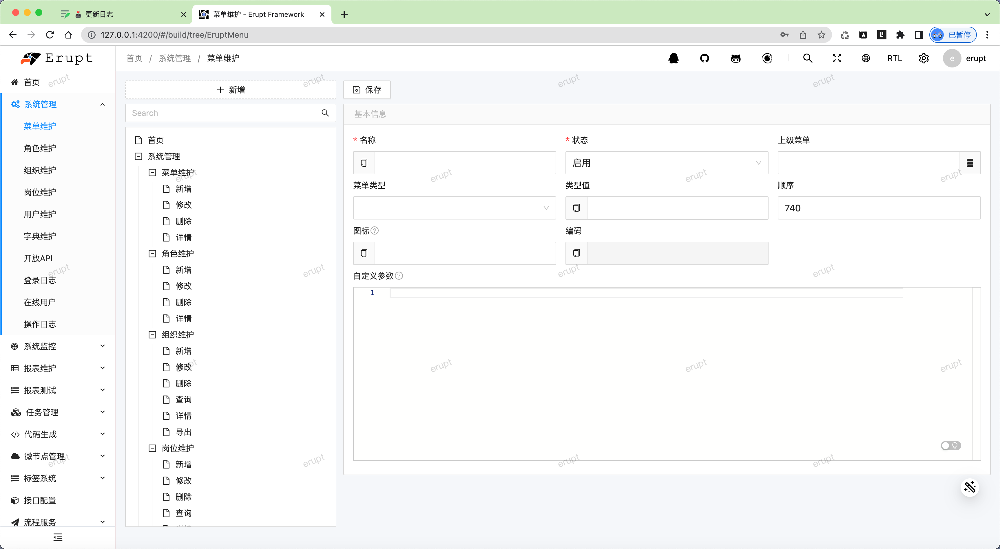
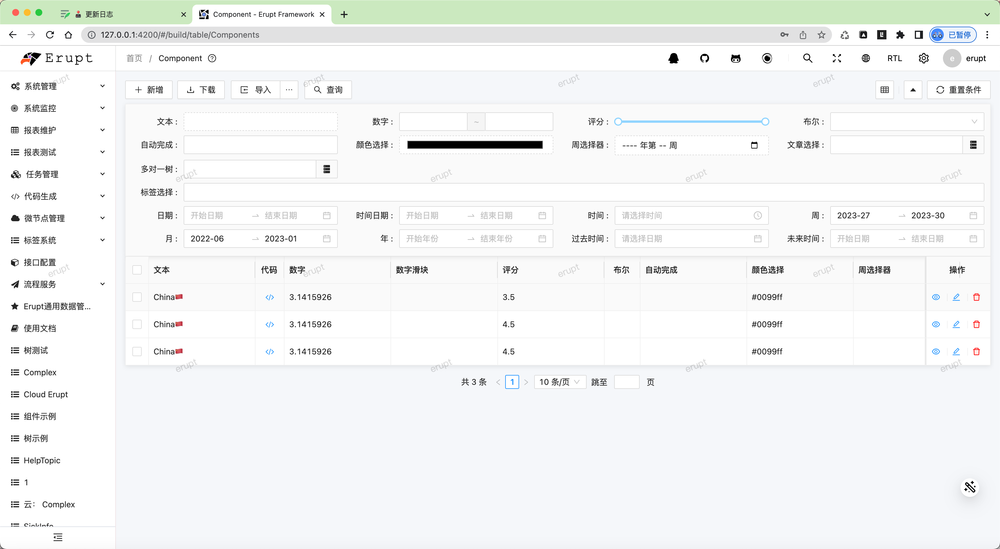
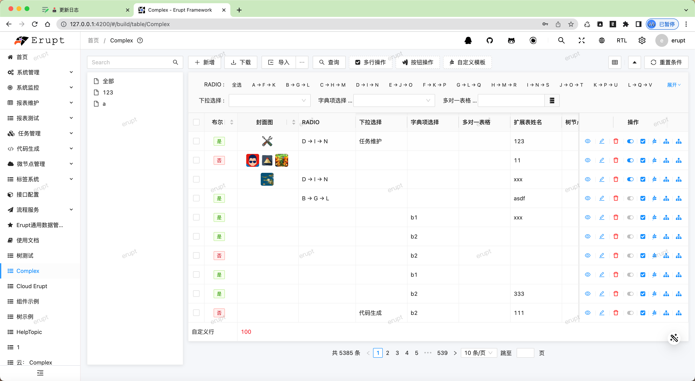
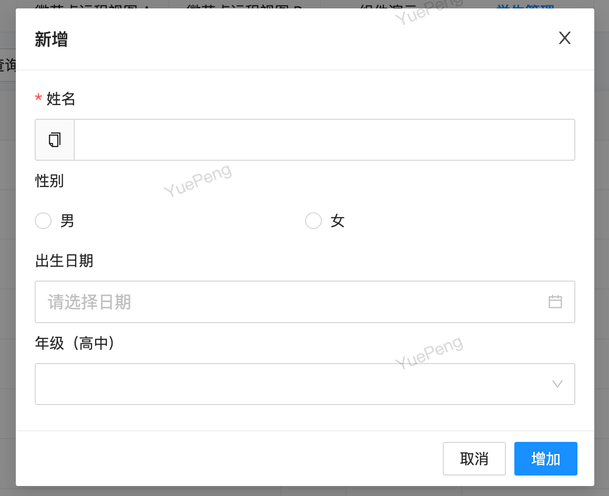

# 🕹 V 1.12.x

### 升级指南
- 不支持IE浏览器，请谨慎升级
- 自定义按钮返回的js如果包含 this.msg.info() 则必须要改为 msg.info() 去掉this
- @RowOperation tplWidth 移动至 @RowOperation → @tpl → width
- 移除erupt-i18n模块，旧版本需要重新适配，新多语言能力详见：[https://www.yuque.com/erupts/erupt/gg3c93](https://www.yuque.com/erupts/erupt/gg3c93)

### 版本效果图

> 原文: <https://www.yuque.com/erupt/glqecvkaofqg5gip>