# Erupt整理笔记(1.10.X版)

> 作者: 白石([https://github.com/wjw465150](https://github.com/wjw465150))


# 开发时注意事项

-  **[X]** 协作开发时最好开启redisSession，登录session的时长设置长一些，这样服务端频繁重启也不会影响前端,前端就可以一直拿一个token测试了!在后端服务重启后前端浏览器点击刷新就能继续 
```yaml
erupt:
  # 开启redis方式存储session，默认false，开启后需在配置文件中添加redis配置
  redisSession: true
  # 登录session时长（redisSession为true时有效）
  upms.expireTimeByLogin: 600
```
 

-  **[X]** 在`application.properties` 中配置 Spring Boot 的Web上下文，以便于开发,部署时访问路径一致,例如： 
```properties
server.servlet.context-path=/wms
```
  

-  **[x]** 在编写实体类(@Entity)的时候,里面的字段一定不要使用基本数据类型,要使用包装类,例如不要使用int而是使用包装类Integer; 
> 因为如果你使用JPA的Simple查询的时候基本数据类型会被赋上缺省值(例如int类型会被缺省赋值成0)

 

# 升级

## 1.9.X升级到1.10.X注意事项

-  移除 `ViaMenuCtr` l类，请用 `ViaMenuValueCtrl` 代替 
-  由于菜单管理支持增删改查在线配置，已配置好的erupt类需要点击修改按钮，动态生成权限树 
-  `SqlChoiceFetchHandler` 更新了包位置：从`xyz.erupt.upms.handler.SqlChoiceFetchHandler` 到 `xyz.erupt.toolkit.handler.SqlChoiceFetchHandler` 
-  用户表里增加了`修改密码时间`字段 
-  登录日志和操作日志也加字段了 
-  覆盖了EruptUser类等Erupt自带的系统类的 ,要对比重新覆盖!!! 

**⚠重要:**  **启动前:** 找到`.erupt`文件夹,删除让Erupt重新加载系统初始数据!!!

**⚠重要:**  **启动后:** 已配置好的自己写的erupt类菜单(注意不是Erupr系统菜单)需要点击修改按钮，动态生成权限树,如下图所示:
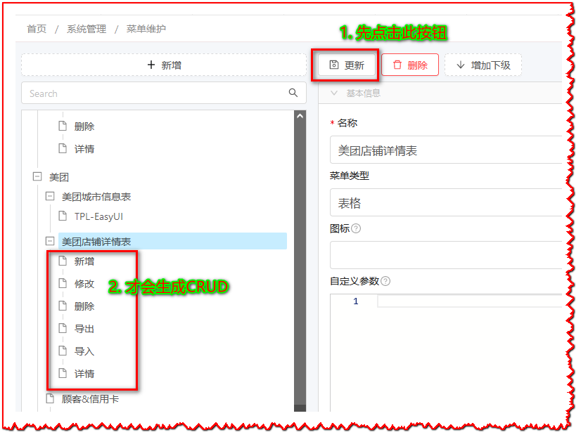

### 需要注意的核心类


#### EruptMenu类

EruptMenu类extends从`HyperModel`改成`MetaModel`

删除字段:

```java
   @EruptField(
               edit = @Edit(
                       title = "权限",
                       type = EditType.TAGS,
                       showBy = @ShowBy(dependField = "type", expr = "value=='tree'||value=='table'"),
                       tagsType = @TagsType(fetchHandler = MenuLimitEnum.MenuLimitFetch.class, allowExtension = false)
               )
       )
       private String powerOff;
```


#### EruptRole类

EruptRole类改动很大!

扩展从 `extends BaseModel`改成`extends HyperModelCreatorVo implements DataProxy<EruptRole>`

删除字段:

```java
    @EruptField(
            views = @View(title = "操作权限", template = "value&&value.replace(/\\|/g,'<span class=\"text-red\"> | </span>')"),
            edit = @Edit(
                    title = "操作权限",
                    type = EditType.TAGS,
                    tagsType = @TagsType(fetchHandler = MenuLimitEnum.MenuLimitFetch.class, allowExtension = false)
            )
    )
    private String powerOff;

    @Transient
    @Resource
    private EruptUserService eruptUserService;
    
    @Override
    public String filter(String condition, String[] params) {
        EruptUser eruptUser = eruptUserService.getCurrentEruptUser();
        if (eruptUser.getIsAdmin()) {
            return null;
        }
        Set<String> roles = eruptUser.getRoles().stream().map(it -> it.getId().toString()).collect(Collectors.toSet());
        return String.format("id in (%s)", String.join(",", roles));
    }
```

过滤数据用`implements DataProxy<EruptRole>`替代了`implements FilterHandler`


#### EruptUser类:

扩展从 `extends HyperModel implements DataProxy<EruptUser>`改成`EruptUser extends LookerSelf`

移去了`@Component`注解

dataProxy从`EruptUser.class`改成`EruptUserDataProxy.class`

添加了`重置密码时间`字段: `resetPwdTime`

删除字段:

```java
@Transient
@Resource
private EruptDao eruptDao;

@Transient
@Resource
private EruptUserService eruptUserService;

@Transient
@Resource
private I18NTranslateService i18NTranslateService;
```


#### EruptUserVo类拆成`EruptUserVo`和`EruptUserPostVo`


### 需要更改的表结构:


#### 更改表: `e_dict`

```
alter table `e_dict` add column `create_by` varchar(255)
alter table `e_dict` add column `update_by` varchar(255)
```


#### 更改表: `e_dict_item`

```
alter table e_dict_item add column `create_by` varchar(255)
alter table e_dict_item add column `update_by` varchar(255)
```


#### 更改表: `e_generator_class`

```
alter table e_generator_class add column `create_by` varchar(255)
alter table e_generator_class add column `update_by` varchar(255)
```


#### 更改表: `e_job`

```
alter table e_job add column `create_by` varchar(255)
alter table e_job add column `update_by` varchar(255)
```


#### 更改表: `e_job_mail`

```
alter table e_job_mail add column `create_by` varchar(255)
alter table e_job_mail add column `error_info` longtext
alter table e_job_mail add column `status` bit
```


#### 更改表: `e_upms_login_log`

```
alter table e_upms_login_log add column `user_name` varchar(255)
```


#### 更改表: `e_upms_menu`

```
alter table e_upms_menu add column `create_by` varchar(255)
alter table e_upms_menu add column `update_by` varchar(255)
```


#### 更改表: `e_upms_operate_log`

```
alter table e_upms_operate_log add column `operate_user` varchar(255)
```


#### 更改表: `e_upms_role`

```
alter table e_upms_role add column `create_time` datetime;
alter table e_upms_role add column `update_time` datetime;
alter table e_upms_role add column `create_user`_id bigint;
alter table e_upms_role add column `update_user`_id bigint;

alter table e_upms_role 
   add constraint `FKad39xpgtpmhq0fp5newnabv1g`
   foreign key (`create_user_id`) 
   references `e_upms_user` (`id`);
   
alter table e_upms_role 
   add constraint `FKbghup2p4f1x9eokeygyg8p658 `
   foreign key (`update_user_id`) 
   references e_upms_user (`id`);
```


#### 更改表: `e_upms_user`

```
alter table e_upms_user add column `reset_pwd_time` datetime
```


#### 更改表: `e_bi`

```
alter table e_bi add column `create_by` varchar(255);
alter table e_bi add column `update_by` varchar(255);
alter table e_bi add column `cache_time` integer;
```


#### 更改表: `e_bi_chart`

```
alter table e_bi_chart add column `create_by` varchar(255);
alter table e_bi_chart add column `update_by` varchar(255);
alter table e_bi_chart add column `cache_time` integer;
alter table e_bi_chart add column `bi_tpl_id` bigint;

alter table e_bi_chart 
   add constraint `FK4jc135g48190nvujmk88q10mw`
   foreign key (bi_tpl_id) 
   references e_bi_tpl (id);
```


#### 更改表: `e_bi_class_handler`

```
alter table e_bi_class_handler add column `create_by` varchar(255);
alter table e_bi_class_handler add column `update_by` varchar(255);
```


#### 更改表: `e_bi_datasource`

```
alter table e_bi_datasource add column `create_by` varchar(255);
alter table e_bi_datasource add column `update_by` varchar(255);
```


#### 更改表: `e_bi_dimension_reference`

```
alter table e_bi_dimension_reference add column `create_by` varchar(255);
alter table e_bi_dimension_reference add column `update_by` varchar(255);
```


#### 更改表: `e_bi_dimension`

```
alter table e_bi_dimension drop index `UK178xcwr6hc4s2q6radi3drlun`;
alter table e_bi_dimension add constraint `UK178xcwr6hc4s2q6radi3drlun` unique (code, bi_id);
```


#### 更改表: `e_bi_function`

```
alter table e_bi_function add column `create_by` varchar(255)
alter table e_bi_function add column `update_b`y varchar(255)

alter table e_bi_function drop index `UKl4tkhdjrgmmkubp454rkxd2gs`
alter table e_bi_function add constraint `UKl4tkhdjrgmmkubp454rkxd2gs` unique (code)
```


#### 更改表: `e_bi_group`

```
alter table e_bi_group add column `create_by` varchar(255)
alter table e_bi_group add column `update_by` varchar(255)
```


#### 更改表: `e_bi_history`

```
alter table e_bi_history add column `operate_by` varchar(255)
```


#### 创建表: `e_bi_tpl`

```
create table e_bi_tpl (
    `id` bigint not null auto_increment,
    `create_by` varchar(255),
    `create_time` datetime,
    `update_by` varchar(255),
    `update_time` datetime,
    `code` varchar(255),
    `name` varchar(255),
    `path` varchar(255),
    `tpl` varchar(255),
    `type` varchar(255),
    primary key (`id`)
) engine=InnoDB;

alter table e_bi_tpl drop index `UKkqhrgyi70vv5d5mrv3h4sdwun`
alter table e_bi_tpl add constraint `UKkqhrgyi70vv5d5mrv3h4sdwun` unique (code)
```


## 1.10.1 (2022年02月21日)

**Spring boot版本：2.6.0**

```
● 🐞 修复erupt-monitor JVM内存占用量，显示不正确的 BUG
● 🐞 修复自定义首页菜单刷新后未重新跳转的 BUG
● 🐞 修复地图组件搜索功能不可用的 BUG
● 🧩 移除菜单管理编码配置，code 列用随机数填充
● 🧩 移除报表管理编码配置，移除图表管理编码配置
● 🧩 登录日志移除用户关联外键，使用当前登录的用户名字符串填充
● 🧩 操作日志移除用户关联外键，使用当前登录的用户名字符串填充
● 🧩 优化 erupt-job 启动速度
● 🌟 全面兼容 JDK 17
● 🌟 使用动态代理的方式重构注解解析
● 🌟 erupt-monitor 增加 erupt 类与模块统计可视化
● 🌟 菜单管理支持erupt类增、删、改、查、导入、导出动态配置
● 🌟 用户管理增加超管用户的配置，非超管用户不可创建管理员用户
● 🌟 非超管用户拥有用户管理菜单时，只能看到当前用户添加的用户
● 🌟 新建用户登录后会弹出重置密码弹窗
● 🌟 解决 erupt-magic-api 页面缓存问题
● 🌟 解决 app.js、app.js、home.html 页面缓存问题
● 🌟 增加 index.html 页面转发功能，使用版本号作为转发依据
● 🌟 erupt-magic-api支持数据源与函数的权限控制
● 🌟 erupt-bi 数据源管理支持驱动自动获取
● 🌟 erupt-bi 支持图表缓存与报表缓存功能
● 🌟 增加 MetaModel 工具类，可不关联用户表的情况下记录当前操作用户
● 🌟 新增 EruptModule 类，用于管理与实现扩展模块
● 🌟 增加字段覆盖功能，子类可覆盖父类的字段，提高复用性，字段用@EruptSmartSkipSerialize修饰
```


## 1.10.2 (2022年02月23日)

**Spring boot版本：2.6.0**

```
● 🐞 修复erupt-magic-api数据源管理权限不足的 BUG
● 🐞 修复自定义按钮组件执行顺序错乱的 BUG
● 🧩 优化使用细节，如用户表为空则会自动删除初始化标识文件（.erupt）重新初始化
● 🌟 erupt-bi 图表查询依赖必填查询项
```


## 1.10.3 (2022年02月26日)

**Spring boot版本：2.6.0**

```
● 🐞 修复自定义按钮组件执行顺序错乱的 BUG
● 🐞 修复 erupt-bi 有查询项不显示图表的 BUG
● 🌟 菜单权限校验不区分大小写
```


## 1.10.4 (2022年03月09日)

**Spring boot版本：2.6.0**

```
● 🐞 修复非管理员用户管理用户出错的 BUG
● 🐞 修复 REFERENCE_TREE、REFERENCE_TABLE 组件权限控制过严格问题
● 🧩 提升启动速度，多数据源运行时动态创建
● 🧩 Looker 包的类不直接实现 DataProxy 而是通过类引用的方式实现
● 🌟 Loading 页增加缓存清除提示
● 🌟 Drill 支持动态 Show配置
● 🌟 RowOperation ifExpr 添加行为控制（ IfExprBehavior → disable、hide ）
```


## 1.10.5 (2022年03月17日)

**Spring boot版本：2.6.0**

```
● 🐞 修复uuid数据类型提示必须为数值类型的 BUG
● 🌟 BI新增数据源支持：达梦、人大金仓、Impala、Clickhouse
● 🌟 BI报表支持不分页配置
● 🌟 BI报表支持列属性配置：排序、宽度
● 🌟 修复注解代理类上下文传递不正确的bug
● 🌟 升级erupt-magic-api至2.0（存在破坏性升级，务必参考：升级指南！）
```


## 1.10.6 (2022年03月28日)

**Spring boot版本：2.6.4**

```
🐞 修复 impala 方言分页BUG
🐞 修复40x页面不展示的BUG
🐞 修复 BI 图表报表共存时显示BUG
🧩 优化 BI 报表的整体间距，提升视觉效果
🌟 增加strictRoleMenuLegal配置，配置化非管理员角色菜单权限
🌟 支持自定义登录页配置，可实现验证码登录与微扫码登录等个性化登录场景
🌟 升级spring boot版本至2.6.4
```


## 1.10.7 (2022年04月17日)

**Spring boot版本：2.6.5**

```
🐞 修复 magic-api 不记录操作人信息的 bug
🐞 修复 Drill 类权限不正确的 bug
🐞 修复 500 条数据分页失效的 bug
🐞 修复手机端搜索框样式 bug
🐞 修复 iframe 高度差展示 bug
🐞 修复 bi 函数单机缓存机制
🐞 修复 auth 授权页面不支持中文参数的 bug
🌟 bi 支持后端配置分页大小与分页选项
🌟 重绘500页面，展示异常信息
```


## 1.10.8 (2022年06月06日)

**Spring boot版本：2.6.5**

```
🐞 修复window系统下本地图片下载失败的bug
🧩 菜单值更新后会重新构建权限
🧩 增加redis-session自动续期配置
🧩 角色管理下可查看角下用户
🧩 EruptRole 表增加排序字段sort
🧩 优化tab_add组件，修改和新增行为可触发dataProxy
🧩 增加时间区间组件快捷选择功能，支持近7天、近30天、本周、上周、本月、上月选择
🧩 Attachment组件支持文件类配置会后绑定UI，仅能选择已配置文件类型
🧩 excel导入配置限定文件类型为xls和xlsx
🌟 开源 erupt-tpl-ui.element-plus
🌟 BI报表支持下钻功能
🔥 开源 erupt-cloud 分布式开发erupt node节点，构建通用云配置中心
```


### 需要更改的表结构:


#### 更改表: `e_upms_role`

```
alter table e_upms_role add column sort integer
```


#### 更改表: `e_bi_column`

```
alter table e_bi_column add column drill_express longtext
alter table e_bi_column add column type varchar(255)
```


# JPA相关

## web请求下的懒加载的 `no Session` 错误

**🏷注意:** `spring.jpa.open-in-view`一定要设置成true!

该配置会注册一个OpenEntityManagerInViewInterceptor。在处理请求时，将 EntityManager 绑定到整个处理流程中（model->dao->service->controller），开启和关闭session。这样一来，就不会出现 no Session 的错误了（可以尝试将该配置的值置为 false, 就会出现懒加载的错误了。）

> 如果是false的话,JPA执行完数据库操作就释放连接，那么就无法通过get方法获取`@XxxToMany`关系对应的实体集合!在Erupt里就会报错.
>  
>  
> 如果想设置成false的话所有的`@XxxToMany`注解必须使用急加载(FetchType.EAGER); 例如: @ManyToMany(fetch=FetchType.EAGER)
>  
> 下面列出关联关系的**FetchType**缺省值:
>  
> `@OneToMany`:  default LAZY;
>  
> `@ManyToMany`: default LAZY;
>  
> `@OneToOne`: default EAGER;
>  
> `@ManyToOne`: default EAGER;
>  
> 想进一步研究open-in-view的拦截器,可以参见spring-boot-autoconfigure模块的JpaBaseConfiguration.java文件

```
org.hibernate.LazyInitializationException: failed to lazily initialize a collection of XXX
```


## 非web请求下的懒加载问题

一些任务处理的，不需要通过 web 请求,就可以直接访问数据库。这种情况下，`spring.jpa.open-in-view` 这个配置就不起作用了，需要通过其它的方式处理懒加载的问题。

**🏷注意:**  `spring.jpa.properties.hibernate.enable_lazy_load_no_trans` 设置成true!

> 这个配置是 hibernate 中的（其它 JPA Provider 中无法使用），当配置的值是 `true` 的时候，允许在没有 transaction 的情况下支持懒加载。


## 自动创建表问题

**☢警告:** 在生产环境里`spring.jpa.hibernate.ddl-auto` 一定要设置成 `none`, 防止JPA在启动时自动执行DDL语句破坏了生产环境里的表结构!

```properties
spring.jpa.generate-ddl=false
spring.jpa.hibernate.ddl-auto=none
```

> `spring.jpa.generate-ddl` 和 `spring.jpa.hibernate.ddl-auto` 都可以控制是否执行`datasource.schema`脚本，来初始化数据库结构，
>  
> 只要有一个为可执行状态就会执行，比如jpa.generate-ddl:true或jpa.generate-ddl:update，并没有相互制约上下级的关系。
>  
> 要想不执行，两者都必须是不可执行状态，比如false和none。


> **💡提示:** 如果你非得使用**spring.jpa.generate-ddl**，或者你看到别人用了他，那么你需要搞清楚：他的默认值是 false，如果你显式设置为true，最后框架会选择 **spring.jpa.hibernate.ddl-auto** 的update方式（从HibernateJpaVendorAdapter的 源码可以看出）。
>  
> 如果两个属性都没有配置，那么系统会判断你使用的是不是内置数据库（hsqldb, h2, derby），如果是的话会选用create-drop策略，其他情况是none策略。


> Hiberate可以根据我们定义的@Entity实体类，来自动生成表结构,在 Spring Boot配合Hibernate使用的时候，可以定义属性来控制这种行为。
>  
> - **create** 表示每次应用启动的时候，都会将之前的表全部drop掉，重新根据实体类生成一遍。
> - **create-drop** 在create的基础上，在应用关闭的时候还会drop一次。
> - **update** 可能是比较常用的，每次启动的时候会看看实体类有什么变化，然后看需不需要更改表结构。
> - **validate** 不会对表进行更改，但是会看看他和实体类是否对应
> - **none** 什么都不做


## `N+1`问题


### 1: 通过在查询中使用 `JOIN FETCH` 的方式

通过在查询中使用`JOIN FETCH`，一次将相关数据查询出来，不会产生 `N+1` 的影响。`JOIN FETCH`中的**fetch**，是可以在单条select语句中，初始化对象中的关联或集合。

例如`EruptUserRepository` 中添加如下方法：

```java
@Repository
public interface EruptUserRepository extends JpaRepository<EruptUser, Long> {
  @Query("from EruptUser u JOIN FETCH u.roles")
  public EruptUser findOne(Long id);
}
```


### 2: 使用`@NamedEntityGraph`注解

首先在实体上面注解`@NamedEntityGraph`，指明`name`供查询方法使用，`attributeNodes` 指明被标注为懒加载的属性节点

```java
@NamedEntityGraph(name = "EruptUser.Graph", attributeNodes = {@NamedAttributeNode("roles")})
public class EruptUser extends HyperModel implements DataProxy<EruptUser>,FilterHandler {
  
    @ManyToMany(fetch = FetchType.LAZY)
    @JoinTable(
            name = "e_upms_user_role",
            joinColumns = @JoinColumn(name = "user_id", referencedColumnName = "id"),
            inverseJoinColumns = @JoinColumn(name = "role_id", referencedColumnName = "id"))
    @EruptField(
            views = @View(title = "所属角色"),
            edit = @Edit(
                    title = "所属角色",
                    type = EditType.CHECKBOX
            )
    )
    private Set<EruptRole> roles;

}
```

在访问的dao的查询方法上面注解`@EntityGraph`，`value`属性值为`@NamedEntityGraph的name`属性值，`type`属性值为`EntityGraph.EntityGraphType.FETCH`;如下所示:

```java
/**
 * The Interface EruptUserRepository.
 */
@Repository
public interface EruptUserRepository extends JpaRepository<EruptUser, Long> {

  /**
   * 解决 懒加载 JPA 典型的 N + 1 问题.
   *
   * @return the list
   */
  @EntityGraph(value = "EruptUser.Graph",  type = EntityGraph.EntityGraphType.FETCH)
  List<EruptUser> findAll();

  @EntityGraph(value = "EruptUser.Graph",  type = EntityGraph.EntityGraphType.FETCH)
  Optional<EruptUser> findById(Long id);
  
}
```


## 让JPA在日志里输出的SQL语句打印出绑定的参数值

在Spring的`application`属性文件里配置上`spring.jpa.show-sql=true` 和 `spring.jpa.properties.hibernate.format_sql=true`,如下所示

> hibernate-core.jar\org\hibernate\cfg\AvailableSettings.java


```yaml
spring:
  datasource:
    driver-class-name: "com.mysql.jdbc.Driver"
    url: "jdbc:mysql://127.0.0.1:3306/mt?useSSL=false&useUnicode=true&characterEncoding=utf-8"
    username: "root"
    password: "XXXXXX"    
    hikari:
      minimum-idle: 5
      maximum-pool-size: 10
  jpa:
    database: mysql
    database-platform: org.hibernate.dialect.MySQL5InnoDBDialect
    open-in-view: true
    show-sql: true
    hibernate.ddl-auto: update
    properties.hibernate.format_sql: true
    properties.hibernate.use_sql_comments: true
```

在logback的配置文件里配置上`<logger name="org.hibernate.type.descriptor.sql.BasicBinder" level="TRACE" />`,如下所示:

```xml
<?xml version="1.0" encoding="UTF-8"?>
<!--scan: 当此属性设置为true时，配置文件如果发生改变，将会被重新加载，默认值为true。
scanPeriod: 设置监测配置文件是否有修改的时间间隔，如果没有给出时间单位，默认单位是毫秒。当scan为true时，此属性生效。默认的时间间隔为1分钟。
debug: 当此属性设置为true时，将打印出logback内部日志信息，实时查看logback运行状态。默认值为false。
configuration 子节点为 appender、logger、root
-->
<configuration scan="true" scanPeriod="60 seconds" debug="false">
  
  ......
  
  <!--myibatis log configure -->
  <logger name="com.apache.ibatis" level="TRACE" />
  <logger name="java.sql.Connection" level="DEBUG" />
  <logger name="java.sql.Statement" level="DEBUG" />
  <logger name="java.sql.PreparedStatement" level="DEBUG" />

  <!--hibernate log configure -->
  <logger name="org.hibernate.SQL" level="DEBUG" />  <!-- 输出生成的SQL语句 -->
  <logger name="org.hibernate.type.descriptor.sql.BasicBinder" level="TRACE" />  <!-- 输出绑定参数值 -->
  <![CDATA[
  <logger name="org.hibernate.type.descriptor.sql.BasicExtractor" level="TRACE" />  <!-- 输出SELECT中获取的值 -->
  ]]>
  <logger name="org.hibernate.engine.QueryParameters" level="DEBUG" />  <!-- 输出查询中命名参数的值 -->
  <logger name="org.hibernate.engine.query.HQLQueryPlan" level="DEBUG" />  <!-- 输出查询中命名参数的值 -->

  <!-- 日志输出级别 -->
  <root level="INFO">
    <appender-ref ref="STDOUT" />
    
    <appender-ref ref="FILE-INFO" />
    <appender-ref ref="FILE-WARN" />
    <appender-ref ref="FILE-ERROR" />
  </root>
  
</configuration>
```


## 多对多关系 - ManyToMany

可以参考`xyz.erupt.upms.model.EruptUser.java` 和 `xyz.erupt.upms.model.EruptRole.java` 文件

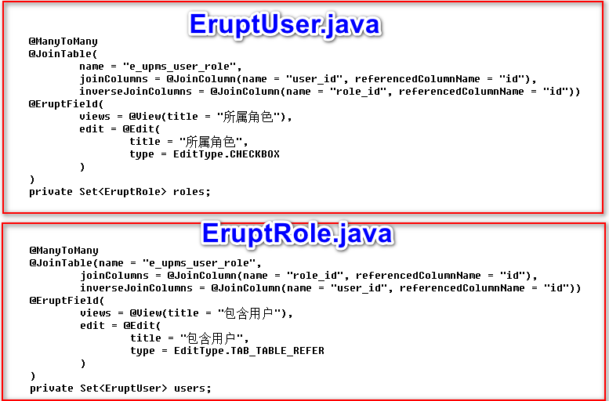

## 多数据源 [@EruptDataSource ](/EruptDataSource ) 

application.yml中增加不同数据源的连接信息

```yaml
---
erupt:
  dbs:
    - datasource:
        name: eroupt1
        driver-class-name: "com.mysql.jdbc.Driver"
        url: "jdbc:mysql://127.0.0.1:3306/db_example?useSSL=false&useUnicode=true&characterEncoding=utf-8"
        username: "root"
        password: "11111111"    
      jpa:
        open-in-view: true
        show-sql: true
        hibernate.ddl-auto: update
        database-platform: org.hibernate.dialect.MySQL5InnoDBDialect
        database: mysql
      scanPackages: org.wjw.mt.entity.mutids
      
    - datasource:
        name: eroupt2
        driver-class-name: "com.mysql.jdbc.Driver"
        url: "jdbc:mysql://127.0.0.1:3306/db_example?useSSL=false&useUnicode=true&characterEncoding=utf-8"
        username: "root"
        password: "11111111"    
      jpa:
        open-in-view: true
        show-sql: true
        hibernate.ddl-auto: update
        database-platform: org.hibernate.dialect.MySQL5InnoDBDialect
        database: mysql
      scanPackages: org.wjw.mt.entity.mutids
```

> **🏷注意:** **scanPackages** 为必填项，该配置在1.7.3及以上版本受支持，该配置必填且注意包扫描不要与主数据源的包扫描位置发生冲突，否则会出现多个数据源建表混乱的问题
>  
> 修改入口类包扫描路径，将多数据源**scanPackages**所配置的包路径添加到**EruptScan**注解中，否则会导致包扫描不到出现404问题
>  
>  
> **⚠重要:** 想要自动建表`erupt.dbs.jpa.generate-ddl=true`才行

```java
//由于包扫描配置发生变化，无法使用缺省值，所以主数据源包路径（com.main.xxx）需显式声明在注解中
@EruptScan({"com.main.xxx", "com.abc.xxx", "com.def.xxx","com.htj.xxx"})
public class EruptDemoApplication {

    public static void main(String[] args) {
        SpringApplication.run(EruptDemoApplication.class, args);
    }

}
```


# 国际化(i18n)

依赖里加上对 `erupt-i18n`模块的依赖:

**maven**

```xml
<dependency>
    <groupId>xyz.erupt</groupId>
    <artifactId>erupt-i18n</artifactId>
    <version>1.9.3</version>
</dependency>
```

**gradle**

```groovy
  implementation "xyz.erupt:erupt-i18n:1.9.3"  //i18n的支持
```


## 菜单国际化

在`public` 目录下的`app.js`文件里加上:

```json
window.eruptI18n = {
	"en-US": {
		"报表查询": "My Report",
		"报表示例": "Report Demo"
	}
};
```


## 实体类国际化

1. 在resource目录下创建名为 i18n 的文件夹
2. 在i18n目录下创建国际化映射文件

> 命名规则：`${名称}_${语言}.properties`


例子：test_en-us.properties

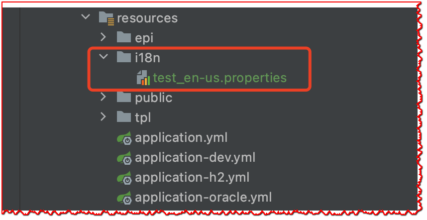
文件内容：

```properties
任务名称=name
任务编码=code
Cron表达式=cron expression

日志=log
执行一次任务=one process
```

3. 为实体类添加`@EruptI18n`注解


### 注解示例

```java
@EruptI18n
@Erupt(
        name = "任务维护",
        dataProxy = EruptJob.class,
        drills = @Drill(code = "list", title = "日志", icon = "fa fa-sliders", link = @Link(linkErupt = EruptJobLog.class, joinColumn = "eruptJob.id")),
        rowOperation = @RowOperation(code = "action", icon = "fa fa-play", title = "执行一次任务", operationHandler = EruptJob.class)
)
@Entity
@Component
@Getter
@Setter
public class EruptJob extends HyperModel implements DataProxy<EruptJob>, OperationHandler<EruptJob, Void> {

    @EruptField(
            views = @View(title = "任务编码"),
            edit = @Edit(title = "任务编码", notNull = true, search = @Search)
    )
    private String code;

    @EruptField(
            views = @View(title = "任务名称"),
            edit = @Edit(title = "任务名称", notNull = true, search = @Search(vague = true))
    )
    private String name;

    @EruptField(
            views = @View(title = "Cron表达式"),
            edit = @Edit(title = "Cron表达式", notNull = true)
    )
    private String cron;
}
```


# erupt-dsl扩展模块

erupt-dsl扩展模块是生成了包含了erupt框架中的实体类里的**Q类**,方便用户开箱即用的使用Querydsl在erupt中做复杂的查询.


## Querydsl简介

Querydsl是一个框架，可用于构造静态类型的类似SQL的查询。可以通过诸如Querydsl之类的流畅API构造查询，而不是将查询编写为内联字符串或将其外部化为XML文件。

例如，与简单字符串相比，使用流利的API的好处是

- 在IDE中使用代码完成；会有代码提示和自动补全，较为高效
- (几乎)语法安全；
- 可以安全地引用域类型和属性；可以直接使用领域模型进行操作，毕竟本质就是面向对象
- 更好地重构域类型的更改
- 跟写SQL一样的方便


## 使用方法


### Maven配置

```xml
<!-- dependencies  配置 -->
<dependency>
  <groupId>com.github.wjw465150</groupId>
  <artifactId>erupt-dsl</artifactId>
  <version>1.7.3</version>
</dependency>
<dependency>
  <groupId>com.querydsl</groupId>
  <artifactId>querydsl-jpa</artifactId>
  <version>4.4.0</version>
</dependency>
<dependency>
  <groupId>com.querydsl</groupId>
  <artifactId>querydsl-apt</artifactId>
  <version>4.4.0</version>
  <scope>provided</scope>
</dependency>


<!-- build → plugins  配置 -->
<plugin>
  <groupId>com.mysema.maven</groupId>
  <artifactId>apt-maven-plugin</artifactId>
  <version>1.1.3</version>
  <executions>
    <execution>
      <goals>
        <goal>process</goal>
      </goals>
      <configuration>
        <outputDirectory>target/generated-sources/java</outputDirectory>  <!-- 设定生成的Q类存放的位置  -->
        <processor>com.querydsl.apt.jpa.JPAAnnotationProcessor</processor>
        <options>
          <querydsl.excludedPackages>xyz.erupt.upms,xyz.erupt.bi</querydsl.excludedPackages>  <!-- 设定QueryDsl要排除的包(逗号来分割) -->
        </options>
      </configuration>
    </execution>
  </executions>
</plugin>
```


### Gradle配置

```groovy
ext {
  erupt = [version : '1.7.3']
  queryDslVersion = '4.4.0'
  querydslGeneratedSourcesDir = file("$projectDir/src/main/generated")
}

//把QueryDSL生成的Q开头的类文件加入到源代码目录中
sourceSets {
  main {
    java {
      srcDirs += [querydslGeneratedSourcesDir]
    }
  }
}

compileJava {
  doFirst {
    //先创建Q类存放的位置目录
    querydslGeneratedSourcesDir.mkdirs()
  }

  options.annotationProcessorGeneratedSourcesDirectory = querydslGeneratedSourcesDir //设定生成的Q类存放的位置
  options.compilerArgs += ["-Aquerydsl.excludedPackages=xyz.erupt.upms,xyz.erupt.bi"]  //设定QueryDsl要排除的包列表(逗号来分割)
  
}

dependencies {
  ...
    
  //erupt-dsl
  implementation group: 'com.github.wjw465150', name: 'erupt-dsl', version: "${erupt.version}"  //erupt QueryDsl模块

  //引入QueryDSL依赖
  implementation("com.querydsl:querydsl-jpa:${queryDslVersion}")
  annotationProcessor("com.querydsl:querydsl-apt:${queryDslVersion}:jpa")
  
}
```


### 使用方式

1.  **配置类** 
```java
package org.wjw.mt;

import javax.persistence.EntityManager;

import org.springframework.context.annotation.Bean;
import org.springframework.context.annotation.Configuration;

import com.querydsl.jpa.impl.JPAQueryFactory;

@Configuration
public class QuerydslConfig {

  //让Spring管理JPAQueryFactory
  @Bean
  public JPAQueryFactory jpaQueryFactory(EntityManager entityManager) {
    return new JPAQueryFactory(entityManager);
  }

}
```
 

2.  **用例** 
```java
package org.wjw.mt.test;

import java.util.List;

import org.junit.jupiter.api.AfterEach;
import org.junit.jupiter.api.BeforeEach;
import org.junit.jupiter.api.Test;
import org.springframework.beans.factory.annotation.Autowired;
import org.springframework.boot.test.context.SpringBootTest;
import org.springframework.test.context.ActiveProfiles;

import com.querydsl.jpa.impl.JPAQueryFactory;

import xyz.erupt.upms.model.EruptUser;
import xyz.erupt.upms.model.QEruptUser;

@SpringBootTest
//@ActiveProfiles("dev") //标明激活那个profile
class QuerydslTest {
  @Autowired
  private JPAQueryFactory jpaQueryFactory; //在QuerydslConfig里创建的

  @BeforeEach
  void setUp() throws Exception {
  }

  @AfterEach
  void tearDown() throws Exception {
  }

  @Test
  public void testA() {
    List<String> qEruptUser = jpaQueryFactory.select(QEruptUser.eruptUser.name)
        .from(QEruptUser.eruptUser)
        .fetch();
    for (String s : qEruptUser) {
      System.out.println(s);
    }
  }

  @Test
  public void testB() {
    List<EruptUser> qEruptUser = jpaQueryFactory.select(QEruptUser.eruptUser)
        .from(QEruptUser.eruptUser)
        .fetch();
    for (EruptUser user : qEruptUser) {
      System.out.println(user);
    }
  }

}
```
 


# 配置依赖包仓库镜像

有时我们通过Maven去下载相关的依赖包时，会发现下载的速度非常慢，简直让人抓狂，而有时又下载不了，没响应。明明网络很好，为什么会这么慢呢，原因是Maven默认连接的远程仓库是国外的。

如何提升下载速度，只要把Maven默认的镜像改换成国内的就行了，如阿里云的中央仓库镜像。

**Maven**

`pom.xml`中配置阿里云镜像

```xml
<project>  
...   
  <repositories>
    <repository>
      <id>nexus-aliyun</id>
      <name>nexus-aliyun</name>
      <url>http://maven.aliyun.com/nexus/content/groups/public/</url>
      <releases>
        <enabled>true</enabled>
      </releases>
      <snapshots>
        <enabled>false</enabled>
      </snapshots>
    </repository>
  </repositories>
...   
</project>
```

**Gradle**

`build.gradle`中配置阿里云镜像

```groovy
/*
使用mavenLocal()时Gradle默认会按以下顺序去查找本地的maven仓库:
USER_HOME/.m2/settings.xml >> M2_HOME/conf/settings.xml >> USER_HOME/.m2/repository.
注意,环境变量要加入M2_HOME, 我们配环境时很多时候都是使用MAVEN_HOME或者直接在path中输入bin路径了,导致mavenLocal无法生效.

另外,如果本地没有相关jar包,gradle会在下载到USER_HOME/.gradle文件夹下,若想让gradle下载到指定文件夹,配置GRADLE_USER_HOME环境变量
例如: 
M2_HOME=c:\WJW_E\WJW_APP\PStart\Java\maven3
GRADLE_USER_HOME=c:\WJW_Z\GRADLE_USER_HOME
*/
repositories {
  mavenLocal()
  maven { url "http://maven.aliyun.com/nexus/content/groups/public/" }  //优先使用阿里的镜像
  mavenCentral()
}
```

> 通过`gradlew`可快速升级Gradle的版本,例如:
>  

```groovy
./gradlew wrapper --gradle-version=7.1.1
```


# 前后端分离注意事项

vue等前端框架有一个入口文件index.html,打包后，用tplAction映射到打包后的index.html路径.

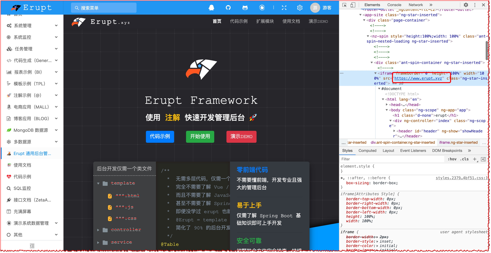
打包后可以通过iframe 获取token: `parent.getAppToken().token`后来做权限控制相关的工作

所有说使用了iframe这个概念，前后端完全分离后，必须配置在erupt中才能正常使用

也就是说，虽然前端单独部署，但是不内嵌到erupt中就无法独立使用

其实我在里面的页面中，是可以获取当前的token的

协作开发时最好开启redisSession，登录session的时长设置为无限，这样前端就可以一直拿一个token测试了

打包前用固定的token做开发

打包后通过嵌套在erupt中获取token


# 使用TPL注意事项


## 静态页面(不需要`@TplAction`来路由的)

"菜单维护"里的"菜单类型"选择`模板`,类型值填入`resources\tpl`目录下的模板文件名,注意只能放在tpl目录下

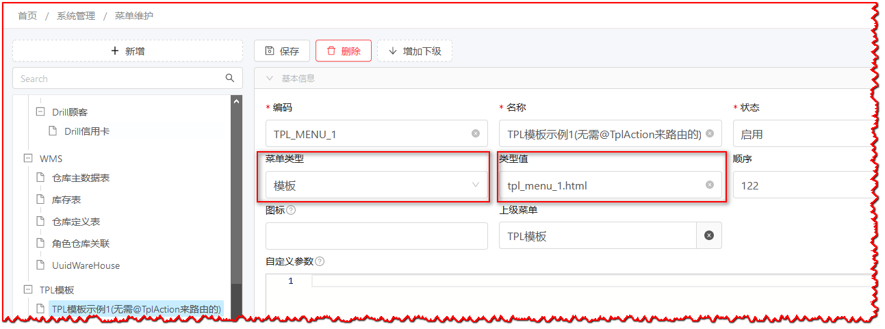
css和js引用需要加上`${base}`来获得上下文路径,例如:

```html
  <link href="${base}/element/element.min.css" rel="stylesheet">

  <script src="${base}/element/vue.min.js"></script>
```


## 模板引擎(需要`@TplAction`来路由的)

先编写一个注解是`@EruptTp`的模板路由类

```java
package org.wjw.mt.action;

import java.util.*;

import org.springframework.beans.factory.annotation.Autowired;
import org.springframework.stereotype.Component;

import xyz.erupt.annotation.sub_erupt.Tpl;
import xyz.erupt.tpl.annotation.EruptTpl;
import xyz.erupt.tpl.annotation.TplAction;
import xyz.erupt.upms.model.EruptUser;
import xyz.erupt.upms.service.EruptUserService;

@EruptTpl(engine = Tpl.Engine.Thymeleaf) //注解值表示要使用的模板引擎
@Component
public class ThymeleafAction {
  @Autowired
  private EruptUserService eruptUserService;

  //@wjw_comment: value值与"菜单维护"里的"类型值"要一致
  //@wjw_comment: path值是你建立的模板文件名,目录名要以`/tpl/`开头,可以有子目录
  //返回值表示要绑定的数据。必须返回 Map<String, Object>
  @TplAction(value="dashboard.html",path="/tpl/thymeleaf/dashboard.html") 
  public Map<String, Object> dashboard() {
    Map<String, Object> map = new HashMap<>();
    
    EruptUser eruptUser = eruptUserService.getCurrentEruptUser();
    
    map.put("user",eruptUser);
    return map;
  }

}
```

"菜单维护"里的"菜单类型"选择`模板`,类型值填入`@TplAction`注解里的value值

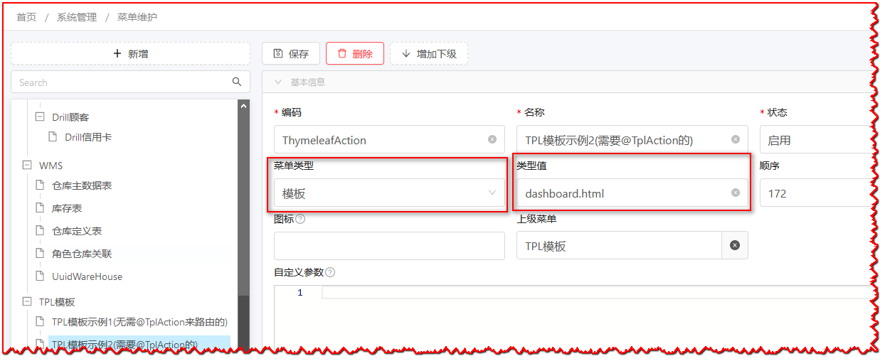
1.6.12以前版本: css和js引用需要加上`th:`前缀, 和  `${request.getContextPath()}`来获得上下文路径,例如:

```
<link rel="stylesheet" th:href="${request.getContextPath()}+'/layui/css/layui.css'" media="all">

<script th:src="${request.getContextPath()}+'/layui/layui.js'" charset="utf-8"></script>
```

> `xyz.erupt.tpl.service.EruptTplService.java`里缺省注入了`request`变量.


1.6.12以后版本: css和js引用需要加上`th:`前缀, 和  `${base}`来获得上下文路径,例如:

```
<link rel="stylesheet" th:href="${base}+'/layui/css/layui.css'" media="all">

<script th:src="${base}+'/layui/layui.js'" charset="utf-8"></script>
```

> `xyz.erupt.tpl.service.EruptTplService.java`里缺省注入了`request`,`response`,`base`变量
>  

```java
		map.put("request", (Object) this.request);
		map.put("response", (Object) this.response);
		map.put("base", this.request.getContextPath());
```


# 如何扩展Erupt里的系统表

可以自己扩展,直接包同路径覆盖,包名,文件名都一样.项目内文件会覆盖依赖的Erupt模块jar内的,这些都是通用的，根据实际项目需求扩展.


# 数据行为代理接口**DataProxy**

[**@Erupt **](/Erupt )** **注解里有这个

```java
    @Transient
    @Comment("数据行为代理接口，对增、删、改、查等行为做逻辑处理")
    Class<? extends DataProxy<?>>[] dataProxy() default {};
```

[**@PreDataProxy **](/PreDataProxy )** **注解里有这个

```java
public @interface PreDataProxy {

    Class<? extends DataProxy<?>> value();

}
```

**DataProxy**代码

`before**方法`修改的字段值会持久化到数据库里,`after**方法`修改字段不会持久化到数据库.

```java
public interface DataProxy<@Comment("Erupt类对象") MODEL> {

    @Comment("增加前")
    default void beforeAdd(MODEL model) {
    }

    @Comment("增加后")
    default void afterAdd(MODEL model) {
    }

    @Comment("修改前")
    default void beforeUpdate(MODEL model) {
    }

    @Comment("修改后")
    default void afterUpdate(MODEL model) {
    }

    @Comment("删除前")
    default void beforeDelete(MODEL model) {
    }

    @Comment("删除后")
    default void afterDelete(MODEL model) {
    }

    @Comment("查询前，返回值为：自定义查询条件hql")
    default String beforeFetch(Class<?> eruptClass) {
        return null;
    }

    @Comment("查询后结果处理")
    default void afterFetch(@Comment("查询结果") Collection<Map<String, Object>> list) {
    }


    @Comment("数据新增行为，可对数据做初始化等操作")
    default void addBehavior(MODEL model) {
    }

    @Comment("数据编辑行为，对待编辑的数据做预处理")
    default void editBehavior(MODEL model) {
    }

    @Comment("excel导出")
    default void excelExport(@Comment("POI文档对象") Workbook wb) {
    }

    @Comment("excel导入")
    @Deprecated
    default void excelImport(MODEL model) {
    }

}
```

例子:

```java
@Service //添加此注解可使用依赖注入相关功能
public class EruptTestDataProxy implements DataProxy<EruptTest>{
    
    @Override
    public void beforeAdd(EruptTest eruptTest) {
        //数据校验
        if("张三".equals(eruptTest.getName())){
      throw new EruptApiErrorTip("名称禁止为张三！");
        }
    }

    @Override
    public void beforeUpdate(EruptTest eruptTest) {
        //动态写数据
        eruptTest.setName(eruptTest.getName() + "xxxxxxx");
    }

    @Override
    public void beforeDelete(EruptTest eruptTest) {
        //TODO 删除前事件处理逻辑
    }
    
    @Override
    public void afterFetch(Collection<Map<String, Object>> list) {
        //TODO 查询结果处理
    }
    
    @Override
    public void addBehavior(EruptTest eruptTest) {
        //TODO 数据初始化逻辑
    }
    
    ......
    依据实际情况重写相关功能的方法
}
```

都是要实现DataProxy接口,有何区别?

> **🏷注意:** @PreDataProxy一般是给父类用的, 如果继承父类就会优先执行父类中的@PreDataProxy!
>  
> 如果@Erupt(dataProxy)和@PreDataProxy两个地方都设置了,都执行,先执行[@PreDataProxy ](/PreDataProxy ) 
>  
> **执行顺序:** 父类preDataProxy → 父类preDataProxy→ 本类的dataProxy[0] →dataProxy[1] →dataProxy[2]


# 用[@Aspect ](/Aspect ) AOP实现Controller日志记录 

首先，加入aop的相关依赖：

1. Maven

```xml
<dependency>
   <groupId>org.springframework.boot</groupId>
   <artifactId>spring-boot-starter-aop</artifactId>
</dependency>
```

2. Gradle

```groovy
dependencies {
  //引入AOP
  implementation "org.springframework.boot:spring-boot-starter-aop"
}
```

切面类的代码

```java
package org.wjw.mt;

import java.util.Arrays;

import javax.servlet.http.HttpServletRequest;

import org.aspectj.lang.JoinPoint;
import org.aspectj.lang.annotation.Aspect;
import org.aspectj.lang.annotation.Before;
import org.aspectj.lang.annotation.Pointcut;
import org.slf4j.Logger;
import org.slf4j.LoggerFactory;
import org.springframework.stereotype.Component;
import org.springframework.web.context.request.RequestAttributes;
import org.springframework.web.context.request.RequestContextHolder;
import org.springframework.web.context.request.ServletRequestAttributes;

/**
 * AOP切面,目的是记录Controller日志.
 * 
 * 注意，由于是动态代理的实现方法，所以不是所有的方法都能拦截得下来，对于JDK代理只有public的方法才能拦截得下来，对于CGLIB只有public和protected的方法才能拦截。
 * 
 * @author White Stone
 *
 *         2021年5月21日
 */
@Aspect
@Component
public class ControllerLogAspect {
  private final Logger logger = LoggerFactory.getLogger(ControllerLogAspect.class);

  @Pointcut("execution(public * xyz.erupt..controller..*.*(..))") //切入点描述 这个是Erupt的Controller的切入点
  public void controllerLog1() {
  } //签名，可以理解成这个切入点的一个名称

  @Pointcut("execution(public * org.wjw.mt.controller..*.*(..))") //切入点描述，这个是自己业务的Controller的切入点
  public void controllerLog2() {
  } //签名，可以理解成这个切入点的一个名称

  @Before("controllerLog1() || controllerLog2()") //在切入点的方法run之前要干的
  public void logBeforeController(JoinPoint joinPoint) {
    RequestAttributes  requestAttributes = RequestContextHolder.getRequestAttributes();                //这个RequestContextHolder是Springmvc提供来获得请求的东西
    HttpServletRequest request           = ((ServletRequestAttributes) requestAttributes).getRequest();

    // 记录下请求内容
    logger.info("Aop_Url: " + request.getRequestURL().toString());
    logger.info("Aop_Method: " + request.getMethod());
    logger.info("Aop_Ip : " + request.getRemoteAddr());
    logger.info("Aop_ControllerArgs: " + Arrays.toString(joinPoint.getArgs()));

    //下面这个getSignature().getDeclaringTypeName()是获取包+类名的   然后后面的joinPoint.getSignature.getName()获取了方法名
    logger.info("Aop_ClassMethod : " + joinPoint.getSignature().getDeclaringTypeName() + "." + joinPoint.getSignature().getName());

    //logger.info("Aop_Target: " + joinPoint.getTarget());//返回的是需要加强的目标类的对象
    //logger.info("Aop_This: " + joinPoint.getThis());//返回的是经过加强后的代理类的对象
  }
}
```


# 怎样获取request和response

一般在service中想要获得request和response，我们一般会直接在controller那里把request或response作为参数传到service，这就很不美观。其实SpringMVC提供了个很强大的类ReqeustContextHolder，通过他你就可以获得request和response。

```java
//下面两个方法在没有使用JSF的项目中是没有区别的
RequestAttributes requestAttributes = RequestContextHolder.currentRequestAttributes();
//                                            RequestContextHolder.getRequestAttributes();
//从session里面获取对应的值
String str = (String) requestAttributes.getAttribute("name",RequestAttributes.SCOPE_SESSION);
 
HttpServletRequest request = ((ServletRequestAttributes)requestAttributes).getRequest();
HttpServletResponse response = ((ServletRequestAttributes)requestAttributes).getResponse();
```


# Erupt里的缓存Cache

Erupt框架里使用了进程内缓存框架`Caffeine`

具体 用法参见`xyz.erupt.upms.handler.SqlChoiceFetchHandler.java` 和 `xyz.erupt.upms.cache.CaffeineEruptCache.java` 文件

**SqlChoiceFetchHandler:**

```java
package xyz.erupt.upms.handler;

import org.springframework.jdbc.core.JdbcTemplate;
import org.springframework.stereotype.Component;
import xyz.erupt.annotation.fun.ChoiceFetchHandler;
import xyz.erupt.annotation.fun.VLModel;
import xyz.erupt.upms.cache.CaffeineEruptCache;
import xyz.erupt.upms.constant.FetchConst;

import javax.annotation.Resource;
import java.util.List;

/**
 * @author YuePeng
 * date 2021/01/03 18:00
 */
@Component
public class SqlChoiceFetchHandler implements ChoiceFetchHandler {

    @Resource
    private JdbcTemplate jdbcTemplate;

    private final String CACHE_SPACE = SqlChoiceFetchHandler.class.getName() + ":";

    private final CaffeineEruptCache<List<VLModel>> sqlCache = new CaffeineEruptCache<>();

    @Override
    public List<VLModel> fetch(String[] params) {
        if (null == params || params.length == 0) {
            throw new RuntimeException("SqlChoiceFetchHandler → params not found");
        }
        long timeout = FetchConst.DEFAULT_CACHE_TIME;
        if (params.length == 2) {
            timeout = Long.parseLong(params[1]);
        }
        sqlCache.init(timeout);
        return sqlCache.get(CACHE_SPACE + params[0], (key) -> jdbcTemplate.query(params[0], (rs, i) -> {
            if (rs.getMetaData().getColumnCount() == 1) {
                return new VLModel(rs.getString(1), rs.getString(1));
            } else {
                return new VLModel(rs.getString(1), rs.getString(2));
            }
        }));
    }

}
```

**CaffeineEruptCache:**

```java
package xyz.erupt.upms.cache;

import com.github.benmanes.caffeine.cache.Cache;
import com.github.benmanes.caffeine.cache.Caffeine;

import java.util.concurrent.TimeUnit;
import java.util.function.Function;

/**
 * @author YuePeng
 * date 2021/3/23 11:31
 */
public class CaffeineEruptCache<V> implements IEruptCache<V> {

    private volatile Cache<String, V> cache;

    public void init(long timeout, TimeUnit timeUnit) {
        if (null == this.cache) {
            synchronized (this) {
                if (null == this.cache) {
                    this.cache = Caffeine.newBuilder().expireAfterWrite(timeout, timeUnit).build();
                }
            }
        }
    }

    public void init(long timeout) {
        this.init(timeout, TimeUnit.MILLISECONDS);
    }

    public CaffeineEruptCache() {
    }

    public CaffeineEruptCache(long timeout) {
        this.init(timeout);
    }

    @Override
    public V get(String key, Function<String, V> function) {
        return cache.get(key, function);
    }
}
```

> 在Spring Boot中引入缓存!
1、添加依赖
implementation 'org.springframework.boot:spring-boot-starter-cache'
implementation 'com.github.ben-manes.caffeine:caffeine'
>  
> 2、在applicationyml文件中添加配置
spring:
cache:
type: caffeine
>  
> 3、添加注解
在有@SpringBootApplication注解的启动类上添加[@EnableCaching ](/EnableCaching ) 


# 使用Thymeleaf注意事项

测试Thymeleaf的包含其他模板页面!发现引入OGNL依赖,后面一定不要加上版本号!!!

```groovy
  //集成thymeleaf模板
  implementation 'org.springframework.boot:spring-boot-starter-thymeleaf'
  //wjw_note: 后面一定不要加上版本号!!!
  implementation group: 'ognl', name: 'ognl'
```


# 获取当前用户下所拥有的菜单

参见: xyz.erupt.upms.controller.EruptUserController类的getMenu方法

```java
  //获取菜单
  @GetMapping("/menu")
  @ResponseBody
  @EruptRouter(verifyType = EruptRouter.VerifyType.LOGIN, authIndex = 0)
  public List<EruptMenuVo> getMenu() {
      return sessionService.get(SessionKey.MENU_VIEW + eruptUserService.getToken(), new TypeToken<List<EruptMenuVo>>() {
      }.getType());
  }
```


# 全局事务管理器

目的是不必在每个要使用事务的方法上再添加@Transactional注解

```java
package org.wjw.mt;

import java.util.Collections;
import java.util.HashMap;
import java.util.Map;

import org.aspectj.lang.annotation.Aspect;
import org.springframework.aop.Advisor;
import org.springframework.aop.aspectj.AspectJExpressionPointcut;
import org.springframework.aop.support.DefaultPointcutAdvisor;
import org.springframework.beans.factory.annotation.Autowired;
import org.springframework.context.annotation.Bean;
import org.springframework.context.annotation.Configuration;
import org.springframework.transaction.TransactionDefinition;
import org.springframework.transaction.TransactionManager;
import org.springframework.transaction.interceptor.NameMatchTransactionAttributeSource;
import org.springframework.transaction.interceptor.RollbackRuleAttribute;
import org.springframework.transaction.interceptor.RuleBasedTransactionAttribute;
import org.springframework.transaction.interceptor.TransactionAttribute;
import org.springframework.transaction.interceptor.TransactionInterceptor;

/**
 * 全局事务管理器 <p/>
 * 注意: 1. 要在启动类里面引入注解@EnableTransactionManagement <p/>
 *       2. 尽量不要再使用@Transactional注解,如果要使用@Transactional注解，推荐配置在方法上，粒度细 <p/>
 *       3. 在使用全局事务的时候，方法命名一定要在下面的规范列表中，切勿出现奇葩命名 <p/>
 * @author White Stone
 *
 * 2021年5月21日
 */
@Aspect
@Configuration
public class TransactionalAopConfig {
  /**
   * 配置方法过期时间，如果是-1表时永不超时
   */
  private final static int METHOD_TIME_OUT = 5*1000;

  /**
   * 配置切入点表达式
   */
  private static final String POINTCUT_EXPRESSION = "execution(* org.wjw.mt.service..*.*(..))";

  /**
   * 容器注入的事务管理器
   */
  @Autowired
  private TransactionManager transactionManager;

  @Bean
  public TransactionInterceptor txAdvice() {
    //只读事务，不做更新操作
    RuleBasedTransactionAttribute readOnly = new RuleBasedTransactionAttribute();
    readOnly.setReadOnly(true);
    readOnly.setPropagationBehavior(TransactionDefinition.PROPAGATION_NOT_SUPPORTED);
    
    //当前存在事务就使用当前事务，当前不存在事务就创建一个新的事务
    RuleBasedTransactionAttribute required = new RuleBasedTransactionAttribute();
    //抛出异常后执行切点回滚,你可以更换异常的类型
    required.setRollbackRules(Collections.singletonList(new RollbackRuleAttribute(Exception.class)));
    //PROPAGATION_REQUIRED:事务隔离性为1，若当前存在事务，则加入该事务；如果当前没有事务，则创建一个新的事务。这是默认值
    required.setPropagationBehavior(TransactionDefinition.PROPAGATION_REQUIRED);
    //设置事务失效时间，如果超过5秒，则回滚事务
    required.setTimeout(METHOD_TIME_OUT);
    
    Map<String, TransactionAttribute> attributesMap = new HashMap<>(30);
    //设置增删改上传等使用事务
    attributesMap.put("save*", required);
    attributesMap.put("remove*", required);
    attributesMap.put("update*", required);
    attributesMap.put("batch*", required);
    attributesMap.put("clear*", required);
    attributesMap.put("add*", required);
    attributesMap.put("append*", required);
    attributesMap.put("modify*", required);
    attributesMap.put("edit*", required);
    attributesMap.put("insert*", required);
    attributesMap.put("delete*", required);
    attributesMap.put("do*", required);
    attributesMap.put("create*", required);
    attributesMap.put("import*", required);
    //查询开启只读
    attributesMap.put("select*", readOnly);
    attributesMap.put("get*", readOnly);
    attributesMap.put("valid*", readOnly);
    attributesMap.put("list*", readOnly);
    attributesMap.put("count*", readOnly);
    attributesMap.put("find*", readOnly);
    attributesMap.put("load*", readOnly);
    attributesMap.put("search*", readOnly);

    //事务管理规则，声明具备事务管理的方法名
    NameMatchTransactionAttributeSource source = new NameMatchTransactionAttributeSource();
    source.setNameMap(attributesMap);
    return new TransactionInterceptor(transactionManager, source);
  }

  /**
   * 设置切面=切点pointcut+通知TxAdvice
   */
  @Bean
  public Advisor txAdviceAdvisor() {
    //声明切点的面：切面就是通知和切入点的结合。通知和切入点共同定义了关于切面的全部内容——它的功能、在何时和何地完成其功能
    AspectJExpressionPointcut pointcut = new AspectJExpressionPointcut();
    //声明和设置需要拦截的方法,用切点语言描写
    pointcut.setExpression(POINTCUT_EXPRESSION);

    //设置切面=切点pointcut+通知TxAdvice
    return new DefaultPointcutAdvisor(pointcut, txAdvice());
  }

}
```


# Entity基础类

**🏷注意:** 实体类一定要实现序列化接口`implements Serializable`,否者复杂实体JSON序列话的时候会报错!

BaseModel 与 HyperModel 的作用

- [ ]  BaseModel 中定义了主键信息，添加了兼容各类数据库自增模式的注解，仅仅为兼容不同数据库而准备 
- [ ]  HyperModel 继承了BaseModel定义了创建时间、更新时间、创建人、更新人，只要继承HyperModel，erupt就可以帮助自动注入这几个字段的值，原理是HyperModel类上存在有 `@PreDataProxy(HyperDataProxy.class)` 注解！ 


## BaseModel

BaseModel的源代码

```java
package xyz.erupt.jpa.model;

import java.io.Serializable;
import javax.persistence.Column;
import javax.persistence.GeneratedValue;
import javax.persistence.Id;
import javax.persistence.MappedSuperclass;
import org.hibernate.annotations.GenericGenerator;
import xyz.erupt.annotation.EruptField;

@MappedSuperclass
public class BaseModel implements Serializable {
	@Id
	@GeneratedValue(generator = "generator")
	@GenericGenerator(name = "generator", strategy = "native")
	@Column(name = "id")
	@EruptField
	private Long id;

	public Long getId() {
		return this.id;
	}

	public void setId(final Long id) {
		this.id = id;
	}
}
```

> 如果想自己控制主键生成方式就不要继承自BaseModel.


## HyperModel

帮你自动向数据库表里插入createTime,updateTime,createUser,updateUser

HyperModel的源码:

```java
package xyz.erupt.upms.model.base;

import com.fasterxml.jackson.annotation.JsonIgnore;
import java.util.Date;
import javax.persistence.FetchType;
import javax.persistence.ManyToOne;
import javax.persistence.MappedSuperclass;
import xyz.erupt.annotation.PreDataProxy;
import xyz.erupt.annotation.config.SkipSerialize;
import xyz.erupt.jpa.model.BaseModel;
import xyz.erupt.upms.model.EruptUserVo;

@MappedSuperclass
@PreDataProxy(HyperDataProxy.class)
public class HyperModel extends BaseModel {
	@SkipSerialize
	private Date createTime;

  @SkipSerialize
	private Date updateTime;
	
  @JsonIgnore
	@SkipSerialize
	@ManyToOne(fetch = FetchType.LAZY)
	private EruptUserVo createUser;
	
  @JsonIgnore
	@SkipSerialize
	@ManyToOne(fetch = FetchType.LAZY)
	private EruptUserVo updateUser;

	public Date getCreateTime() {
		return this.createTime;
	}

	public Date getUpdateTime() {
		return this.updateTime;
	}

	public EruptUserVo getCreateUser() {
		return this.createUser;
	}

	public EruptUserVo getUpdateUser() {
		return this.updateUser;
	}

	public void setCreateTime(final Date createTime) {
		this.createTime = createTime;
	}

	public void setUpdateTime(final Date updateTime) {
		this.updateTime = updateTime;
	}

	@JsonIgnore
	public void setCreateUser(final EruptUserVo createUser) {
		this.createUser = createUser;
	}

	@JsonIgnore
	public void setUpdateUser(final EruptUserVo updateUser) {
		this.updateUser = updateUser;
	}
}
```


## HyperDataProxy

HyperDataProxy的源码:

```java
package xyz.erupt.upms.model.base;

import java.util.Date;
import javax.annotation.Resource;
import org.springframework.stereotype.Service;
import xyz.erupt.annotation.fun.DataProxy;
import xyz.erupt.upms.model.EruptUserVo;
import xyz.erupt.upms.service.EruptUserService;

@Service
public class HyperDataProxy implements DataProxy<HyperModel> {
	@Resource
	private EruptUserService eruptUserService;

	public void beforeAdd(HyperModel hyperModel) {
		hyperModel.setCreateTime(new Date());
		hyperModel.setCreateUser(new EruptUserVo(this.eruptUserService.getCurrentUid()));
	}

	public void beforeUpdate(HyperModel hyperModel) {
		hyperModel.setUpdateTime(new Date());
		hyperModel.setUpdateUser(new EruptUserVo(this.eruptUserService.getCurrentUid()));
	}
}
```


# UUID主键策略

**uuid:** 采用128位的uuid算法生成主键，uuid被编码为一个32位16进制数字的字符串。数据库中的uuid列要定义为varchar(36)类型

```java
  @Id
  @GeneratedValue(generator = "uuid")
  @GenericGenerator(name = "uuid", strategy = "org.hibernate.id.UUIDGenerator")
  @Column(name = "id")
  private String id;
```


## UuidBaseModel

UuidBaseModel的源代码:

```java
package org.xxx.entity.base;

import java.io.Serializable;

import javax.persistence.Column;
import javax.persistence.GeneratedValue;
import javax.persistence.Id;
import javax.persistence.MappedSuperclass;

import org.hibernate.annotations.GenericGenerator;

import xyz.erupt.annotation.EruptField;

@MappedSuperclass
public class UuidBaseModel implements Serializable {
    private static final long serialVersionUID = 1L;
    
    @Id
    @GeneratedValue(generator = "uuid")
    @GenericGenerator(name = "uuid", strategy = "org.hibernate.id.UUIDGenerator")
    @Column(name = "id", length=36)
    @EruptField
    private String id;

    public String getId() {
      return id;
    }

    public void setId(String id) {
      this.id = id;
    }
    
}
```


## UuidHyperModel

帮你自动向数据库表里插入createTime,updateTime,createUser,updateUser

UuidHyperModel的源码:

```java
package org.xxx.entity.base;

import java.util.Date;

import javax.persistence.FetchType;
import javax.persistence.ManyToOne;
import javax.persistence.MappedSuperclass;

import com.fasterxml.jackson.annotation.JsonIgnore;

import xyz.erupt.annotation.PreDataProxy;
import xyz.erupt.annotation.config.EruptSmartSkipSerialize;
import xyz.erupt.upms.model.EruptUserVo;

@MappedSuperclass
@PreDataProxy(UuidHyperDataProxy.class)
public class UuidHyperModel extends UuidBaseModel {
    private static final long serialVersionUID = 1L;

    @EruptSmartSkipSerialize
    private Date createTime;

    @EruptSmartSkipSerialize
    private Date updateTime;

    @JsonIgnore
    @EruptSmartSkipSerialize
    @ManyToOne(fetch = FetchType.LAZY)
    private EruptUserVo createUser;

    @JsonIgnore
    @EruptSmartSkipSerialize
    @ManyToOne(fetch = FetchType.LAZY)
    private EruptUserVo updateUser;

    public Date getCreateTime() {
      return createTime;
    }

    public void setCreateTime(Date createTime) {
      this.createTime = createTime;
    }

    public Date getUpdateTime() {
      return updateTime;
    }

    public void setUpdateTime(Date updateTime) {
      this.updateTime = updateTime;
    }

    public EruptUserVo getCreateUser() {
      return createUser;
    }

    public void setCreateUser(EruptUserVo createUser) {
      this.createUser = createUser;
    }

    public EruptUserVo getUpdateUser() {
      return updateUser;
    }

    public void setUpdateUser(EruptUserVo updateUser) {
      this.updateUser = updateUser;
    }
    
    
}
```


## UuidHyperDataProxy

UuidHyperDataProxy的源码:

```java
package org.xxx.entity.base;

import java.util.Date;

import javax.annotation.Resource;

import org.springframework.stereotype.Service;

import xyz.erupt.annotation.fun.DataProxy;
import xyz.erupt.upms.model.EruptUserVo;
import xyz.erupt.upms.service.EruptUserService;

@Service
public class UuidHyperDataProxy  implements DataProxy<UuidHyperModel> {
  @Resource
  private EruptUserService eruptUserService;

  public void beforeAdd(UuidHyperModel uuidHyperModel) {
    uuidHyperModel.setCreateTime(new Date());
    uuidHyperModel.setCreateUser(new EruptUserVo(eruptUserService.getCurrentUid()));
    uuidHyperModel.setUpdateTime(new Date());
    uuidHyperModel.setUpdateUser(new EruptUserVo(eruptUserService.getCurrentUid()));
    
  }

  public void beforeUpdate(UuidHyperModel uuidHyperModel) {
    uuidHyperModel.setUpdateTime(new Date());
    uuidHyperModel.setUpdateUser(new EruptUserVo(eruptUserService.getCurrentUid()));
    
  }
}
```


# Erupt注解


## filter(数据过滤表达式)

可以在实体类上加上动态过滤条件(JPQL格式),系统判断如果有多个filter(可以是数组)就自动加上and来连接.

参见Erupt自带的在线用户`xyz.erupt.monitor.model.EruptOnline.java`

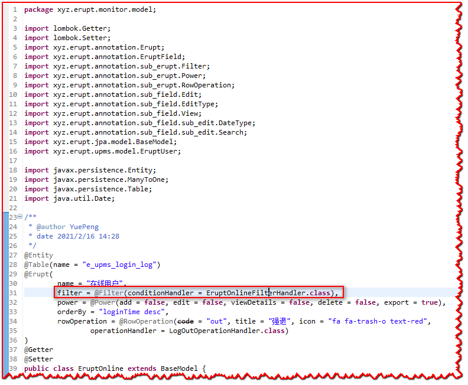
FilterHandler的实现类`xyz.erupt.monitor.model.EruptOnlineFilterHandler`

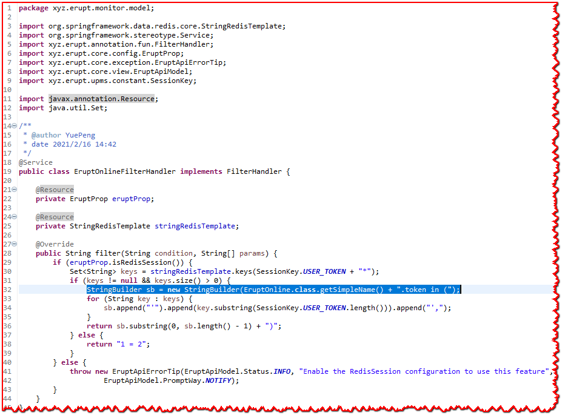
> **🏷注意:** 条件表达式不是原生SQL,而是JPA的面向对象的JPQL
>  
> 对@Filter的处理参见`xyz.erupt.core.util.AnnotationUtil.java`文件里的`switchFilterConditionToStr`方法.


# 跨域调用

修改 `application.yml`配置，关闭`csrf`防御; 使用 redis 管理 session

```yaml
rupt:
  # 关闭 csrf 防御
  csrfInspect: false
  
  # 使用 redis 方式管理 session
  redisSession: true
```

在服务端添加如下代码:

```java
import org.springframework.context.annotation.Bean;
import org.springframework.context.annotation.Configuration;
import org.springframework.web.cors.CorsConfiguration;
import org.springframework.web.cors.UrlBasedCorsConfigurationSource;
import org.springframework.web.filter.CorsFilter;

/**
 * 允许跨域访问配置类
 * 
 * @author White Stone
 *
 * 2021年3月30日
 */
@Configuration
public class CorsConfig {

  @Bean
  public CorsFilter corsFilter() {
    UrlBasedCorsConfigurationSource source = new UrlBasedCorsConfigurationSource();
    CorsConfiguration corsConfiguration = new CorsConfiguration();
    
    //根据实际情况修改如下配置的值
    corsConfiguration.addAllowedOrigin("*"); // 允许访问源地址
    corsConfiguration.addAllowedHeader("*"); // 允许头
    corsConfiguration.addAllowedMethod("*"); // 允许方法
    source.registerCorsConfiguration("/**", corsConfiguration); // 对接口配置跨域设置
    return new CorsFilter(source);
  }

}
```


# Erupt的操作日志

表`e_upms_operate_log`

```sql
CREATE TABLE `e_upms_operate_log` (
  `id` bigint(20) NOT NULL AUTO_INCREMENT,
  `api_name` varchar(255) DEFAULT NULL,
  `create_time` datetime DEFAULT NULL,
  `error_info` longtext,
  `ip` varchar(255) DEFAULT NULL,
  `region` varchar(255) DEFAULT NULL,
  `req_addr` varchar(500) DEFAULT NULL,
  `req_method` varchar(255) DEFAULT NULL,
  `req_param` longtext,
  `status` bit(1) DEFAULT NULL,
  `total_time` bigint(20) DEFAULT NULL,
  `erupt_user_id` bigint(20) DEFAULT NULL,
  PRIMARY KEY (`id`),
  KEY `FK27xepkxthq9snq3yk6k7iad33` (`erupt_user_id`),
  CONSTRAINT `FK27xepkxthq9snq3yk6k7iad33` FOREIGN KEY (`erupt_user_id`) REFERENCES `e_upms_user` (`id`)
) ENGINE=InnoDB AUTO_INCREMENT=25 DEFAULT CHARSET=utf8
```

关键方法在`xyz.erupt.security.interceptor.java`类的`afterCompletion`方法里:

```java
    @Override
    @Transactional
    public void afterCompletion(HttpServletRequest request, HttpServletResponse response, Object handler, Exception ex) {
        if (eruptSecurityProp.isRecordOperateLog()) {
            if (handler instanceof HandlerMethod) {
                HandlerMethod handlerMethod = (HandlerMethod) handler;
                EruptRecordOperate eruptOperate = handlerMethod.getMethodAnnotation(EruptRecordOperate.class);
                if (null != eruptOperate) {
                    EruptRouter eruptRouter = handlerMethod.getMethodAnnotation(EruptRouter.class);
                    EruptOperateLog operate = new EruptOperateLog();
                    if (null != eruptRouter && eruptRouter.verifyType() == EruptRouter.VerifyType.ERUPT) {
                        String eruptName;
                        if (eruptRouter.verifyMethod() == EruptRouter.VerifyMethod.HEADER) {
                            eruptName = request.getHeader(EruptReqHeaderConst.ERUPT_HEADER_KEY);
                        } else {
                            eruptName = request.getParameter(EruptReqHeaderConst.URL_ERUPT_PARAM_KEY);
                        }
                        operate.setApiName(eruptOperate.desc() + " | " + EruptCoreService.getErupt(eruptName).getErupt().name());
                    } else {
                        operate.setApiName(eruptOperate.desc());
                    }
                    operate.setIp(IpUtil.getIpAddr(request));
                    operate.setRegion(IpUtil.getCityInfo(operate.getIp()));
                    operate.setStatus(true);
                    operate.setReqMethod(request.getMethod());
                    operate.setReqAddr(request.getRequestURL().toString());
                    if (null != eruptUserService.getCurrentUid()) {
                        operate.setEruptUser(new EruptUser() {{
                            this.setId(eruptUserService.getCurrentUid());
                        }});
                    }
                    Object param = RequestBodyTL.get().getBody();
                    if (null != param) {
                        operate.setReqParam(param.toString());
                    } else {
                        operate.setReqParam(findRequestParamVal(request));
                    }
                    operate.setCreateTime(new Date());
                    operate.setTotalTime(operate.getCreateTime().getTime() - RequestBodyTL.get().getDate());
                    RequestBodyTL.remove();
                    if (null != ex) {
                        operate.setErrorInfo(ExceptionUtils.getStackTrace(ex));
                        operate.setStatus(false);
                    }
                    entityManager.persist(operate);
                }
            }
        }
    }
```


# MVC-Controller

Erupt里也可写标准的MVC Controller

菜单配置"菜单类型"里选择链接,"类型值"填写相对URL路径:

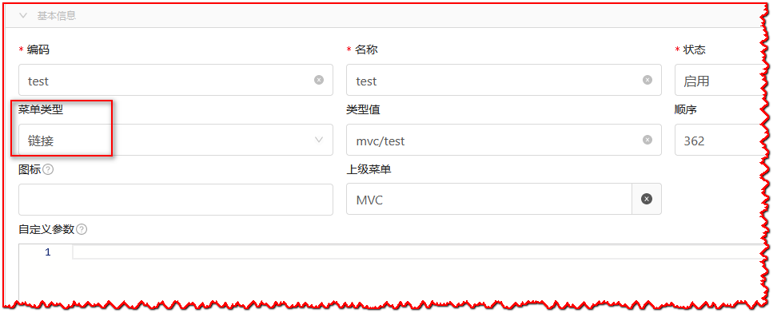
示例源代码:

```java
@Controller
@RequestMapping("/mvc")
public class TestMvcController {
  @GetMapping("/test")
  public ModelAndView test(HttpServletRequest req) {
    ModelAndView mv = new ModelAndView();
    mv.addObject("hello", "HELLO: " + ZonedDateTime.now().format(DateTimeFormatter.ISO_OFFSET_DATE_TIME));
    mv.setViewName("/layui-erupt.html");
    return mv;
  }
}
```


# 数据权限

通过继承下面实体类达到

| 可继承类名称 | 功能说明 |
| --- | --- |
| BaseModel | 管理数据库主键，通用性配置，支持所有主流数据 |
| HyperModel | 自动管理创建人，创建时间，更新人，更新时间字段 |
| HyperModelVo | 自动管理创建人，创建时间，更新人，更新时间字段，且在页面中展示这些数据 |
| HyperModelCreatorVo | 自动管理创建人，创建时间，更新人，更新时间字段，且展示创建人与创建时间 |
|  |  |
| LookerSelf | 只显示当前用户录入的数据**（**管理员登录可看所有数据**）** |
| LookerOrg | 只显示当前用户所属组织的数据**（**需绑定组织**）** |
| LookerPostLevel | 显示当前组织内，职位权重低于登录用户的数据**（**需绑定部门**）** |
| 如果有其他自定义需求，可以通过`@PreDataProxy`
自由定义 |  |


> 代码演示：
>  

```java
@Erupt(name = "只显示当前用户录入的数据")
public class EruptClass extends LookerSelf {
    //TODO 字段定义
}

@Erupt(name = "自动管理创建人，创建时间，更新人，更新时间字段")
public class EruptClass extends HyperModel {
    //TODO 字段定义
}
```


# 接口调用:


## Erupt框架登录接口-login

**Request**

-  Request URL:  `/erupt-api/login?account=${用户名}&pwd=${密码}&verifyCode=null` 
-  Request Method:  `POST` 
-  Request Headers: 
```http
Content-Type: application/json
Accept: application/json, text/plain, */*
```
 

-  Request Body: 
```json
{}
```
 

> **💡提示:** pwd是MD5加上一些参数加密的,看源码是做了2次MD5加密,算法是`MD5(MD5(密码)+当前月份的当前天数+用户名)`
>  
> 参见`xyz.erupt.upms.service.EruptUserService.java`的`public LoginModel login(String account, String pwd, String verifyCode)`方法:
>  
> java示例:
>  
>  
> JS示例:
>  

```java
digestPwd = MD5Utils.digest(eruptUser.getPassword());
String calcPwd = MD5Utils.digest(digestPwd + Calendar.getInstance().get(Calendar.DAY_OF_MONTH) + account);
```
```javascript
//MS5使用了CryptoJS库（https://github.com/brix/crypto-js）
var md5Pwd = CryptoJS.MD5("${password}").toString();
md5Pwd=CryptoJS.MD5(md5Pwd+(new Date()).getDate()+"${username}").toString();
```

**Response**

-  Response Header: 
```http
HTTP/1.1 200
Content-Type: application/json;charset=UTF-8
Transfer-Encoding: chunked
Date: Fri, 05 Feb 2021 10:53:42 GMT
Keep-Alive: timeout=60
Connection: keep-alive
```
 

-  Response Body: 
```json
//失败
{
    "useVerifyCode": true,
	"pass": false,
    "reason": "验证码错误",
	"token": null,
    "expire": null,
	"userName": null,
    "indexMenu": null
}

//成功
{
    "useVerifyCode": false,
	"pass": true,
	"reason": null,
	"token": "asZgM3O446wVRQTm",
	"expire": "2021-04-19 12:40:47",
	"userName": "test",
	"indexMenu": null
}
```
 


## EruptUserController(login,logout)

xyz.erupt.upms.controller.EruptUserController类控制登录,登出等.


## 接口调用RequestMapping

菜单配置"类型值"里不能有路径,只能填写最后的路径值,然后配合authIndex来使用

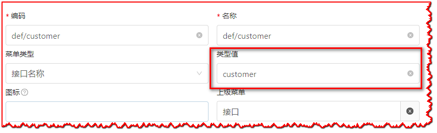
```java
@SuppressWarnings("serial")
  @RequestMapping("/def/customer")
  //请求用户，必须有类型值为：def 的菜单的权限才可调用该接口
  // authIndex 表示请求地址中第几位作为菜单校验的依据，位数通过 '/' 拆分
  @EruptRouter(verifyType = EruptRouter.VerifyType.MENU, authIndex = 2) //配置接口有菜单权限可用
  public TestCustomer test3(String customerId) {
    TestCustomer testCustomer = eruptDao.queryEntity(TestCustomer.class,
        "customerId = :customerId",
        new HashMap<String, Object>(1) {
          {
            this.put("customerId", customerId);
          }
        });
    return testCustomer;
  }
```


## 自定义功能按钮(rowOperation)

参见xyz.erupt.monitor.model.EruptOnline类

```java
@Entity
@Table(name = "e_upms_login_log")
@Erupt(
        name = "在线用户",
        filter = @Filter(conditionHandler = EruptOnlineFilterHandler.class),
        power = @Power(add = false, edit = false, viewDetails = false, delete = false, export = true),
        orderBy = "loginTime desc",
        rowOperation = @RowOperation(code = "out", title = "强退", icon = "fa fa-trash-o text-red",
                operationHandler = LogOutOperationHandler.class)
)
@Getter
@Setter
public class EruptOnline extends BaseModel {
```


### 通过菜单控制按钮的显示与隐藏

```java
    @RowOperation(
        title = "修改-EasyUI" 
        ,code = "TPL-EasyUI"
        ,icon = "fa fa-microchip"
        ,mode = RowOperation.Mode.SINGLE
        ,type = RowOperation.Type.TPL
        ,tpl = @Tpl(
                path = "/tpl/MtCity_EasyUI.html",     //模板文件路径
                tplHandler = MtCityHandlerTplForEasyUI.class,  //数据绑定到模板，可不设置
                engine = Tpl.Engine.Thymeleaf
        )
        ,show = @ExprBool(
           exprHandler = ViaMenuValueCtrl.class, //通过菜单控制按钮显示隐藏实现类
           params = "TPL-EasyUI"  //权限标识
        )

    )
```

添加菜单，将**params**的值填入菜单**类型值**位置，菜单类型选择**按钮**

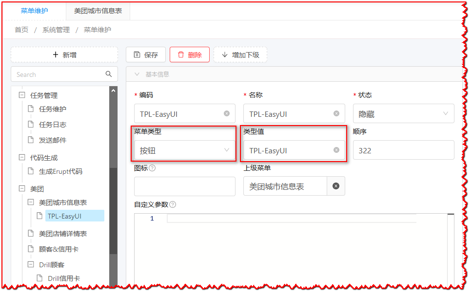
xyz.erupt.core.controller.EruptModifyController类的editEruptData方法里.


## 弹出层取消后,触发Close按钮

```
parent.document.querySelector(".ant-modal-close-x").click()
```


## 弹出层修改后,触发Query按钮

```javascript
parent.document.querySelector(".erupt-btn-item [nztype='primary']").click()
```


# 一对多新增 TAB_TABLE_ADD & 数据钻取 [@Drill ](/Drill ) 

**一对多时建议使用**[**@Drill **](/Drill )** **,因为TAB_TABLE_ADD模式每次都会把主子表的全部数据传递给后台!(JPA的规范就这样)

- [ ] **EditType.TAB_TABLE_ADD:** [https://www.yuque.com/erupts/erupt/uufoth](https://www.yuque.com/erupts/erupt/uufoth)

`EditType.TAB_TABLE_ADD`是OneToMany模式

> **🏷注意:** 1. 在Many方的实体类中关联One方的字段: 1. @Column注解里nullable=true; 2. [@EruptField.edit.show ](/EruptField.edit.show ) 设置成false. 
>  
> 因为被OneToMany关联的外键字段,你就是在界面里填写了不对的值也会在保存时被改成正确的关联值.


- [ ] **数据钻取 **[**@Drill **](/Drill )** **: [https://www.yuque.com/erupts/erupt/uk1to5](https://www.yuque.com/erupts/erupt/uk1to5)

`@Drill`是ManyToOne模式,在配置菜单的时候要把Many一方的实体类建成One一方实体类的子菜单项,并且把状态设置成**隐藏**

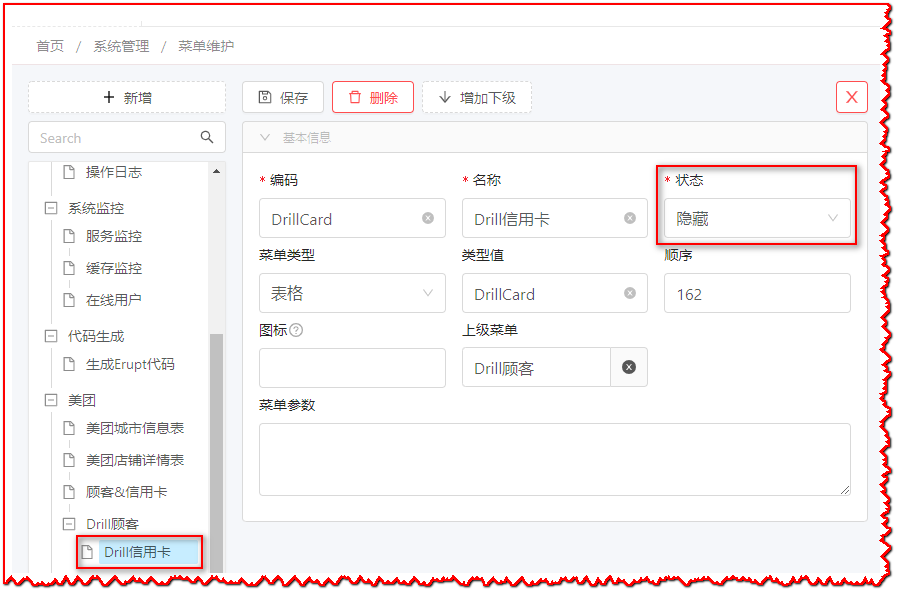

# 树引用 REFERENCE_TREE


### 省市区联动

**🏷注意:** 在区域表里,根节点的pid一定要设置成`NULL`,否则在查看或者编辑的时候后台会报空指针错误!


#### 区域

区域表结构:

```sql
CREATE TABLE `test_district` (
  `id` bigint(20) NOT NULL COMMENT '主键自增',
  `pid` bigint(20) DEFAULT NULL COMMENT '父类id',
  `district_name` varchar(255) DEFAULT NULL COMMENT '城市的名字',
  `type` bigint(20) DEFAULT NULL COMMENT '城市的类型，0是国，1是省，2是市，3是区',
  `hierarchy` bigint(20) DEFAULT NULL COMMENT '地区所处的层级',
  `district_sqe` varchar(255) DEFAULT NULL COMMENT '层级序列',
  PRIMARY KEY (`id`),
  KEY `FKdlvfu74qyf5v8n2krft9vbcjn` (`pid`),
  CONSTRAINT `FKdlvfu74qyf5v8n2krft9vbcjn` FOREIGN KEY (`pid`) REFERENCES `test_district` (`id`)
) ENGINE=InnoDB DEFAULT CHARSET=utf8;
/*!40101 SET character_set_client = @saved_cs_client */;

--
-- Dumping data for table `test_district`
--

LOCK TABLES `test_district` WRITE;
/*!40000 ALTER TABLE `test_district` DISABLE KEYS */;
INSERT INTO `test_district` VALUES (1,NULL,'中国',0,1,'.1.');
INSERT INTO `test_district` VALUES (2,1,'北京',1,2,'.1.2.');
INSERT INTO `test_district` VALUES (3,1,'安徽',1,2,'.1.3.');
INSERT INTO `test_district` VALUES (4,1,'福建',1,2,'.1.4.');
INSERT INTO `test_district` VALUES (5,1,'甘肃',1,2,'.1.5.');
INSERT INTO `test_district` VALUES (6,1,'广东',1,2,'.1.6.');
INSERT INTO `test_district` VALUES (7,1,'广西',1,2,'.1.7.');
INSERT INTO `test_district` VALUES (8,1,'贵州',1,2,'.1.8.');
INSERT INTO `test_district` VALUES (9,1,'海南',1,2,'.1.9.');
INSERT INTO `test_district` VALUES (10,1,'河北',1,2,'.1.10.');
INSERT INTO `test_district` VALUES (11,1,'河南',1,2,'.1.11.');
INSERT INTO `test_district` VALUES (12,1,'黑龙江',1,2,'.1.12.');
INSERT INTO `test_district` VALUES (13,1,'湖北',1,2,'.1.13.');
INSERT INTO `test_district` VALUES (14,1,'湖南',1,2,'.1.14.');
INSERT INTO `test_district` VALUES (15,1,'吉林',1,2,'.1.15.');
INSERT INTO `test_district` VALUES (16,1,'江苏',1,2,'.1.16.');
INSERT INTO `test_district` VALUES (17,1,'江西',1,2,'.1.17.');
INSERT INTO `test_district` VALUES (18,1,'辽宁',1,2,'.1.18.');
INSERT INTO `test_district` VALUES (19,1,'内蒙古',1,2,'.1.19.');
INSERT INTO `test_district` VALUES (20,1,'宁夏',1,2,'.1.20.');
INSERT INTO `test_district` VALUES (21,1,'青海',1,2,'.1.21.');
INSERT INTO `test_district` VALUES (22,1,'山东',1,2,'.1.22.');
INSERT INTO `test_district` VALUES (23,1,'山西',1,2,'.1.23.');
INSERT INTO `test_district` VALUES (24,1,'陕西',1,2,'.1.24.');
INSERT INTO `test_district` VALUES (25,1,'上海',1,2,'.1.25.');
INSERT INTO `test_district` VALUES (26,1,'四川',1,2,'.1.26.');
INSERT INTO `test_district` VALUES (27,1,'天津',1,2,'.1.27.');
INSERT INTO `test_district` VALUES (28,1,'西藏',1,2,'.1.28.');
INSERT INTO `test_district` VALUES (29,1,'新疆',1,2,'.1.29.');
INSERT INTO `test_district` VALUES (30,1,'云南',1,2,'.1.30.');
INSERT INTO `test_district` VALUES (31,1,'浙江',1,2,'.1.31.');
INSERT INTO `test_district` VALUES (32,1,'重庆',1,2,'.1.32.');
INSERT INTO `test_district` VALUES (33,1,'香港',1,2,'.1.33.');
INSERT INTO `test_district` VALUES (34,1,'澳门',1,2,'.1.34.');
INSERT INTO `test_district` VALUES (35,1,'台湾',1,2,'.1.35.');
INSERT INTO `test_district` VALUES (36,3,'安庆',2,3,'.1.3.36.');
INSERT INTO `test_district` VALUES (37,3,'蚌埠',2,3,'.1.3.37.');
INSERT INTO `test_district` VALUES (38,3,'巢湖',2,3,'.1.3.38.');
INSERT INTO `test_district` VALUES (39,3,'池州',2,3,'.1.3.39.');
INSERT INTO `test_district` VALUES (40,3,'滁州',2,3,'.1.3.40.');
INSERT INTO `test_district` VALUES (41,3,'阜阳',2,3,'.1.3.41.');
INSERT INTO `test_district` VALUES (42,3,'淮北',2,3,'.1.3.42.');
INSERT INTO `test_district` VALUES (43,3,'淮南',2,3,'.1.3.43.');
INSERT INTO `test_district` VALUES (44,3,'黄山',2,3,'.1.3.44.');
INSERT INTO `test_district` VALUES (45,3,'六安',2,3,'.1.3.45.');
INSERT INTO `test_district` VALUES (46,3,'马鞍山',2,3,'.1.3.46.');
INSERT INTO `test_district` VALUES (47,3,'宿州',2,3,'.1.3.47.');
INSERT INTO `test_district` VALUES (48,3,'铜陵',2,3,'.1.3.48.');
INSERT INTO `test_district` VALUES (49,3,'芜湖',2,3,'.1.3.49.');
INSERT INTO `test_district` VALUES (50,3,'宣城',2,3,'.1.3.50.');
```

区域表对应的实体类:

```java
package org.wjw.mt.entity.district;

import java.io.Serializable;

import javax.persistence.Column;
import javax.persistence.Entity;
import javax.persistence.GeneratedValue;
import javax.persistence.Id;
import javax.persistence.JoinColumn;
import javax.persistence.ManyToOne;
import javax.persistence.Table;

import org.hibernate.annotations.GenericGenerator;

import xyz.erupt.annotation.Erupt;
import xyz.erupt.annotation.EruptField;
import xyz.erupt.annotation.sub_field.View;

/**
 * @description test_district
 * @author WS
 * @date 2021-04-28
 */
@Erupt(name = "地区表")
@Entity
@Table(name = "test_district")
public class District implements Serializable {
  private static final long serialVersionUID = 1L;

  /**
   * 主键自增
   */
  @Id
  /*@wjw_comment: 自己控制主键生成
  @GeneratedValue(generator = "generator")
  @GenericGenerator(name = "generator",
                    strategy = "native")
  */                  
  @Column(name = "id")
  @EruptField
  private Long id;

  /**
   * 父类id
   */
  @ManyToOne
  @JoinColumn(name = "pid")
  private District pid;

  /**
   * 城市的名字
   */
  @EruptField(views = @View(title = "名称"))
  @Column(name = "district_name")
  private String districtName;

  /**
   * 城市的类型，0是国，1是省，2是市，3是区
   */
  @Column(name = "type",columnDefinition="bigint(20)")
  private Integer type;

  /**
   * 地区所处的层级
   */
  @EruptField(views = @View(title = "层级"))
  @Column(name = "hierarchy",columnDefinition="bigint(20)")
  private Integer hierarchy;

  /**
   * 层级序列
   */
  @Column(name = "district_sqe")
  private String districtSqe;

  public District() {
  }

  public Long getId() {
    return id;
  }

  public void setId(Long id) {
    this.id = id;
  }

  public District getPid() {
    return pid;
  }

  public void setPid(District pid) {
    this.pid = pid;
  }

  public String getDistrictName() {
    return districtName;
  }

  public void setDistrictName(String districtName) {
    this.districtName = districtName;
  }

  public Integer getType() {
    return type;
  }

  public void setType(Integer type) {
    this.type = type;
  }

  public Integer getHierarchy() {
    return hierarchy;
  }

  public void setHierarchy(Integer hierarchy) {
    this.hierarchy = hierarchy;
  }

  public String getDistrictSqe() {
    return districtSqe;
  }

  public void setDistrictSqe(String districtSqe) {
    this.districtSqe = districtSqe;
  }

  @Override
  public String toString() {
    // @formatter:off
    return "TestDistrict [id=" + id + ", pid=" + pid + ", districtName=" + districtName 
           + ", type=" + type + ", hierarchy=" + hierarchy + ", districtSqe=" + districtSqe + "]";
    // @formatter:on
  }

}
```


#### 引用区域的连接

引用区域的连接表结构:

```sql
CREATE TABLE `test_regionlink` (
  `id` bigint(20) NOT NULL AUTO_INCREMENT,
  `area_id` bigint(20) DEFAULT NULL,
  `city_id` bigint(20) DEFAULT NULL,
  `province_id` bigint(20) DEFAULT NULL,
  PRIMARY KEY (`id`),
  KEY `FK5u8qs522mgpjta2cbhrc1qql3` (`area_id`),
  KEY `FKadmnyqj97vlrj4cvnlu85wsyq` (`city_id`),
  KEY `FKedq64x0tuovsxt5hveckjjk0c` (`province_id`),
  CONSTRAINT `FK5u8qs522mgpjta2cbhrc1qql3` FOREIGN KEY (`area_id`) REFERENCES `test_district` (`id`),
  CONSTRAINT `FKadmnyqj97vlrj4cvnlu85wsyq` FOREIGN KEY (`city_id`) REFERENCES `test_district` (`id`),
  CONSTRAINT `FKedq64x0tuovsxt5hveckjjk0c` FOREIGN KEY (`province_id`) REFERENCES `test_district` (`id`)
) ENGINE=InnoDB AUTO_INCREMENT=5 DEFAULT CHARSET=utf8;
```

引用区域的连接表实体类:

```java
package org.wjw.mt.entity.district;

import javax.persistence.Entity;
import javax.persistence.JoinColumn;
import javax.persistence.ManyToOne;
import javax.persistence.Table;

import xyz.erupt.annotation.Erupt;
import xyz.erupt.annotation.EruptField;
import xyz.erupt.annotation.sub_erupt.Filter;
import xyz.erupt.annotation.sub_field.Edit;
import xyz.erupt.annotation.sub_field.EditType;
import xyz.erupt.annotation.sub_field.View;
import xyz.erupt.annotation.sub_field.sub_edit.ReferenceTreeType;
import xyz.erupt.jpa.model.BaseModel;

@Erupt(name = "省市区联动")
@Entity
@Table(name = "test_regionlink")
public class RegionLink extends BaseModel {
  private static final long serialVersionUID = 1L;

  // @formatter:off
  @ManyToOne
  @EruptField(
          views = @View(title = "省份", column = "districtName"),
          edit = @Edit(title = "省份", type = EditType.REFERENCE_TREE, 
                  filter = @Filter("District.hierarchy = 2"),
                  referenceTreeType = @ReferenceTreeType(label="districtName"))
  )
  @JoinColumn(name = "province_id",columnDefinition="bigint(20)")
  private District province;

  @ManyToOne
  @EruptField(
          views = @View(title = "市", column = "districtName"),
          edit = @Edit(title = "市", type = EditType.REFERENCE_TREE,
                  filter = @Filter("District.hierarchy = 3"),
                  referenceTreeType = @ReferenceTreeType(label="districtName", dependField = "province", dependColumn = "pid.id")
          )
  )
  @JoinColumn(name = "city_id",columnDefinition="bigint(20)")
  private District city;

  @ManyToOne
  @EruptField(
          views = @View(title = "区", column = "districtName"),
          edit = @Edit(title = "区", type = EditType.REFERENCE_TREE,
                  filter = @Filter("District.hierarchy = 4"),
                  referenceTreeType = @ReferenceTreeType(label="districtName",dependField = "city", dependColumn = "pid.id")
          )
  )
  @JoinColumn(name = "area_id",columnDefinition="bigint(20)")
  private District area;
  // @formatter:on

  public RegionLink() {
  }

}
```

官方示例URL: [https://www.yuque.com/erupts/erupt/xklx9s](https://www.yuque.com/erupts/erupt/xklx9s)

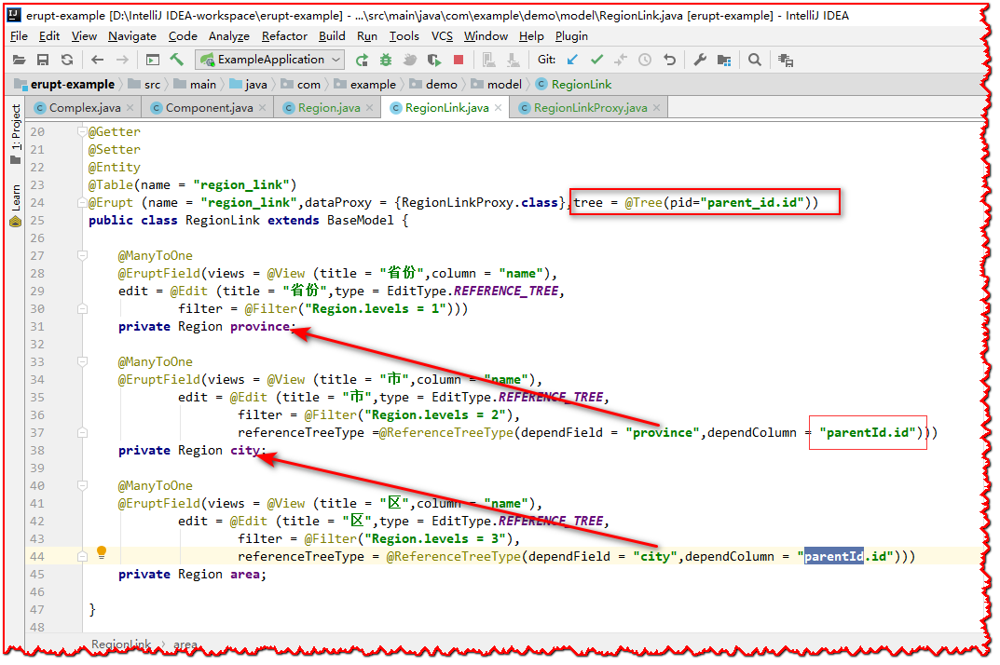

# 动态计算列 - Formula

可以使用`@Formula`注解,注意是原生的SQL片段,如果是原生的SELECT语句,要用双括号包含起来!

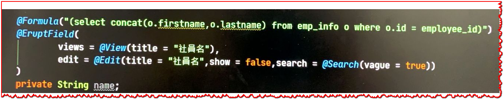
```java
    /**
     * //@wjw_comment: 注意是原生的SQL片段,如果是原生的SELECT语句,要用双括号包含起来! 
     * Defines a formula (derived value) which is a SQL fragment that acts as a @Column alternative in most cases. Represents read-only state. 
     * In certain cases @ColumnTransformer might be a better option, especially as it leaves open the option of still being writable.
     */
    @Formula("concat(name,acronym)") 
    @EruptField(
        views = @View(title = "名称+首字母"),
        edit = @Edit(title = "名称+首字母", readOnly = true)
    )    
    private String nameAndacronym;
```


# 如何在数据库表里保存图片

可以在数据库表的字符串格式的列里保存图片,**但必需是BASE64编码格式的**
实体类定义如下:

```java
@Erupt(name = "FSN表",
       primaryKeyCol = "id",
       orderBy = "fsnFilename, recordNum",
       power = @Power(export = true,
                      importable = true),
       dataProxy = { BfsFsnDataProxy.class })

@Entity
@Table(name = "bfs_fsn")
public class BfsFsn implements Serializable {

  private static final long serialVersionUID = 1L;

  @Id
  @GeneratedValue(strategy = GenerationType.IDENTITY)
  /**
   * 与业务无关的自增主键
   */
  @Column(name = "id")
  @EruptField
  private Long id;
  
  /**
   * 用base64编码后的png格式的冠字号信息的图片
   */
  @Column(name = "img_str")
  @EruptField(
              views = @View(title = "冠字号图片",type = ViewType.IMAGE_BASE64,width = "200px"),
              edit = @Edit(title = "冠字号图片"))
  private String imgStr;
  
  //.........
}
```

然后实现一个`DataProxy<BfsFsn>`接口,在`afterFetch`方法里在每个`imgStr`字段前面加上`data:image/png;base64,`

> **💡提示:** 我这里图片是PNG格式.如果是JPEG格式就是`data:image/jpeg;base64,`


`BfsFsnDataProxy`类代码如下:

```java
@Component
public class BfsFsnDataProxy implements DataProxy<BfsFsn> {
  @Autowired
  private EruptUserService eruptUserService;

  @Autowired
  private EruptContextService eruptContextService;

  @Override
  @Comment(value = "查询后结果处理")
  public void afterFetch(@Comment(value = "查询结果") Collection<Map<String, Object>> list) {
    list.forEach(map -> {
      //base64格式的图片前面要加上`data:image/png;base64,`
      map.put("imgStr", "data:image/png;base64," + map.get("imgStr"));
    });
  }

}
```

效果如下图所示:

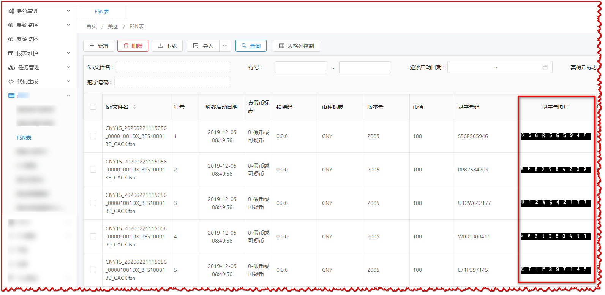

# 逻辑删除

逻辑删除的本质是**修改操作**，所谓的逻辑删除其实并不是真正的删除，而是在表中将对应的是否删除标识（deleted）或者说是状态字段（status）做修改操作。比如0是未删除，1是删除。在逻辑上数据是被删除的，但数据本身依然存在库中。

对应的SQL语句：`update 表名 set deleted = 1 where id = 1`；语句表示，在该表中将id为1的信息进行逻辑删除，那么客户端进行查询id为1的信息，服务器就不会提供信息。倘若想继续为客户端提供该信息，可将 deleted 更改为 0 。


### 代码实现

```java
package org.wjw.mt.entity;

import javax.persistence.Entity;
import javax.persistence.Table;
import javax.persistence.Temporal;
import javax.persistence.TemporalType;

import org.hibernate.annotations.SQLDelete;
import org.springframework.format.annotation.DateTimeFormat;

import com.fasterxml.jackson.annotation.JsonFormat;

import xyz.erupt.annotation.Erupt;
import xyz.erupt.annotation.EruptField;
import xyz.erupt.annotation.sub_erupt.Filter;
import xyz.erupt.annotation.sub_field.Edit;
import xyz.erupt.annotation.sub_field.View;
import xyz.erupt.annotation.sub_field.sub_edit.DateType;
import xyz.erupt.annotation.sub_field.sub_edit.Search;
import xyz.erupt.jpa.model.BaseModel;

@Erupt(name = "逻辑删除",
       filter = @Filter("deleted = false"))  //@wjw_note: 用Erupt的过滤器来过滤(HQL语法),也可以不使用Erupt的filter采用JPA的:@Where(clause = "deleted = 0")
@SQLDelete(sql = "update test_logic_delete set deleted = 1 where id = ?")  //原生SQL
//也可以不使用Erupt的filter采用JPA的: @Where(clause = "deleted = 0")
@Table(name = "test_logic_delete")
@Entity
public class TestLogicDelete extends BaseModel {
  private static final long serialVersionUID = 1L;

  @EruptField(
              views = @View(title = "姓名"),
              edit = @Edit(title = "姓名"))
  private String name;

  @EruptField(
              views = @View(title = "生日"),
              edit = @Edit(title = "生日",
                           search = @Search(vague = true),
                           dateType = @DateType(type = DateType.Type.DATE_TIME)))
  @Temporal(TemporalType.TIMESTAMP)
  @DateTimeFormat(pattern = "yyyy-MM-dd HH:mm:ss") //前端使用Form提交时用
  @JsonFormat(pattern = "yyyy-MM-dd HH:mm:ss",
              timezone = "GMT+8") //转JSON时候用,必须加上时区
  private java.util.Date bdate;

  private Boolean deleted = false;

  public String getName() {
    return name;
  }

  public void setName(String name) {
    this.name = name;
  }

  public java.util.Date getBdate() {
    return bdate;
  }

  public void setBdate(java.util.Date bdate) {
    this.bdate = bdate;
  }

  public Boolean getDeleted() {
    return deleted;
  }

  public void setDeleted(Boolean deleted) {
    this.deleted = deleted;
  }

  public TestLogicDelete() {
  }

  @Override
  public String toString() {
    return "TestLogicDelete [name=" + name + ", bdate=" + bdate + ", deleted=" + deleted + "]";
  }
  
}
```

> 使用`deleted`字段做逻辑删除标识
使用 `@SQLDelete` 注解覆盖原有删除逻辑,当调用delete方法的时候，hibernate将自动执行该语句将实现软删除
使用 @Eriupt的filter做查询过滤,也可以x选择使用@Where注解做过滤


# 全屏


## 基于Erupt的CRUD的全屏

1.  先在菜单管理里新建一个正常的菜单项,菜单类型选择表格, 如下图:
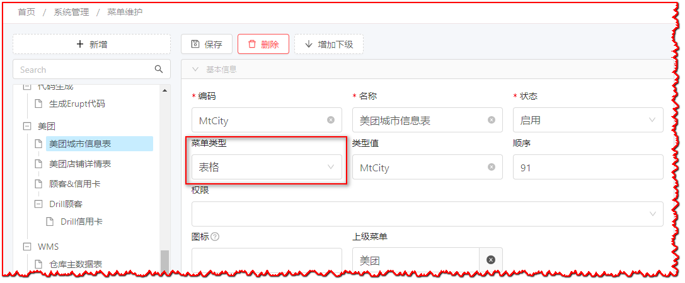
2.  通过打开这个正常的菜单项,在浏览器里查看实际的请求URL.把#号后面的给复制下来: 

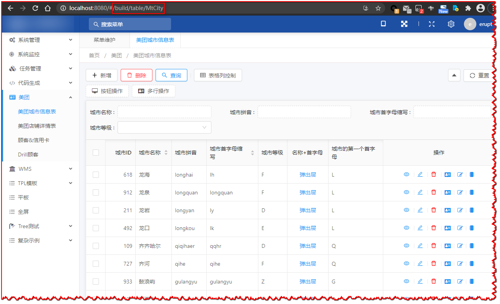

3. 然后再建立一个新的菜单项,在菜单类型里选择充满屏幕,在类型值里填写#号后面的路径值,如下图所示:

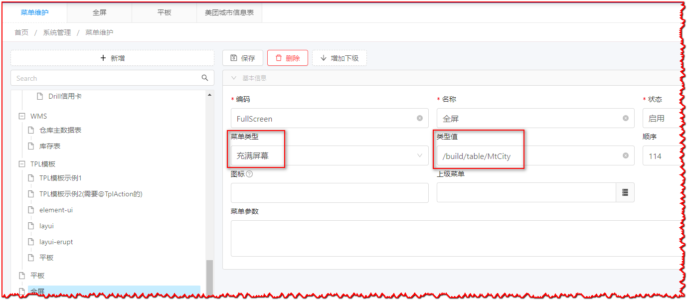


## 基于Erupt的TPL(模板)的全屏

1.  先在菜单管理里新建一个正常的菜单项,菜单类型选择模板, 如下图  :
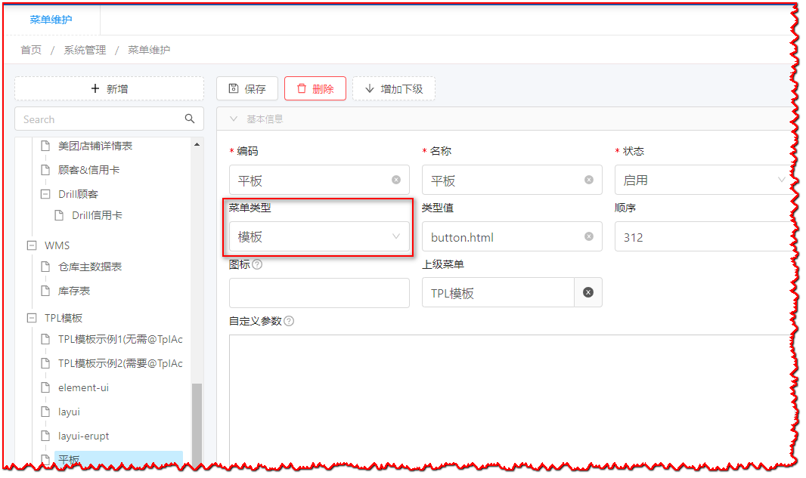
2.  通过打开这个正常的菜单项,在浏览器里查看实际的请求URL.把#号后面的给复制下来:
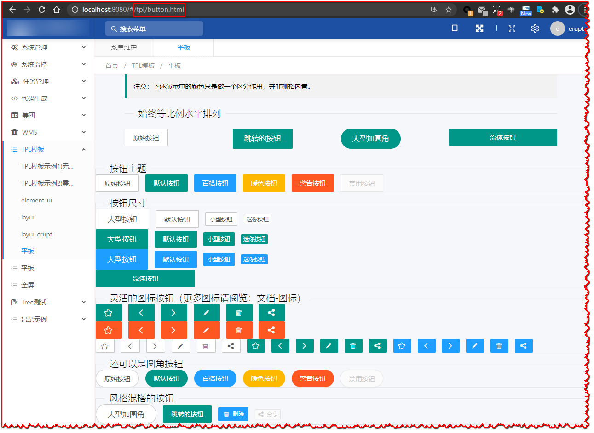
3.  然后再建立一个新的菜单项,在菜单类型里选择充满屏幕,在类型值里填写#号后面的路径值,如下图所示: 

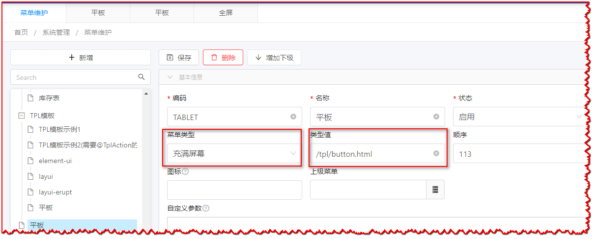

## 在URL路径里加fill的方式来全屏

在正常菜单项的URL的#号后面加上fill表示需要全屏显示!


### 例子1:

例如正常的URL是这样的: `http://localhost:8080/#/build/table/MtCity`

在`#`号后面加上`fill`,让页面全屏显示: `http://localhost:8080/#/fill/build/table/MtCity`


### 例子2:

例如正常的URL是这样的: `http://localhost:8080/#/tpl/button.html`

在`#`号后面加上`fill`,让页面全屏显示: `http://localhost:8080/#/fill/tpl/button.html`


# 自定义按钮


## 1. 通过菜单控制按钮的显示与隐藏

`exprHandler`里填写`ViaMenuValueCtrl.class`,如下面所示:

```java
@Erupt(
        name = "使用菜单控制按钮权限",
        rowOperation = {
                @RowOperation(
                        code = "btn", 
                        title = "使用菜单控制按钮权限",
                        operationHandler = OperationHandlerImpl.class,
                        show = @ExprBool(
                                exprHandler = ViaMenuValueCtrl.class, //通过菜单控制按钮显示隐藏实现类
                                params = "testBtn"  //权限标识
                        )
                )
        }
)
@Entity
@Getter
public class TestErupt extends BaseModel {
    
    @EruptField(
            views = @View(title = "名称"),
            edit = @Edit(title = "名称")
    )
    private String name;
    
}
```

添加菜单，将`params`的值填入菜单编码位置,"状态"选择`隐藏`,菜单类型"和"菜单值"都设置为`空`,
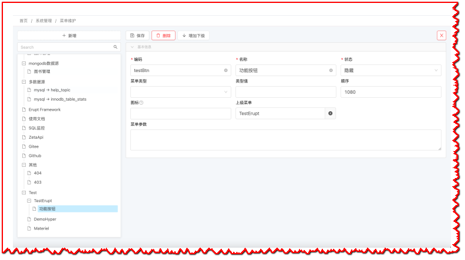

然后在角色维护里,把有此按钮使用权限的角色勾选上.

有按钮权限效果:
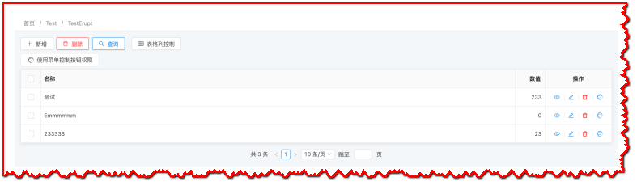

无按钮权限效果:
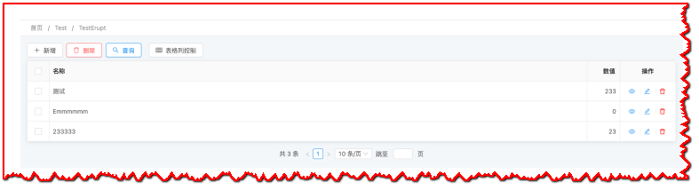

> 当然你也可以自定义功能按钮的显示与隐藏逻辑，仅需实现 show 参数对应的`xyz.erupt.annotation.expr.ExprBool`接口的`exprHandler`方法即可！


## 2. PowerHandler

**"单行按钮"**操作:  后台可以得到当前行数据
**"多行按钮"**操作:  在行里的多行按钮,后台只能得到最后被选中行点击的多行按钮的一条数据,在ToolsBar里的可以
**"普通按钮"**操作: 后台得不到数据

```java
/**
 *  @Erupt注解修饰在类上，@EruptField注解修饰在字段上
 *  其他注解均为Jpa注解
*/
@Erupt(name = "美团城市信息表",
rowOperation = {
    @RowOperation(
        title = "单行操作", 
        code = "SINGLE", 
        icon = "fa fa-address-book",
        mode = RowOperation.Mode.SINGLE, 
        operationHandler = MtCityOperationHandlerImpl.class,        // <1> 
        /**
         * 控制按钮显示与隐藏（JS表达式）
         * 参考变量 → item 当前实体类的实例对象
         * 例如status值1时显示操作按钮则可以为：item.status == 1
         */
        ifExpr="item.rank == 'A'"                                  // <2>
        ),
    @RowOperation(
        title = "多行操作",
        code = "MULTI", 
        icon = "fa fa-address-card",
        operationHandler = MtCityOperationHandlerImpl.class),
    @RowOperation( 
        title = "按钮操作", 
        code = "BUTTON", 
        icon = "fa fa-desktop",
        operationHandler = MtCityOperationHandlerImpl.class,
        mode = RowOperation.Mode.BUTTON, 
        tip = "不依赖任何数据即可执行"),
}
)
@Entity
@Table(name="mt_city")
public class MtCity implements Serializable {
......
}
```

> **<1>** MtCityOperationHandlerImpl实现`xyz.erupt.annotation.fun.OperationHandler`方法来定义自定义按钮功能
>  
> **<2>** ifExpr是前端UI级的, 通过JS表达式, 控制按钮显示与隐藏
>  
> 例子:


```java
import java.util.List;

import javax.annotation.Resource;

import org.springframework.beans.factory.annotation.Autowired;
import org.springframework.stereotype.Component;
import org.wjw.mt.entity.MtCity;

import xyz.erupt.annotation.fun.OperationHandler;
import xyz.erupt.core.exception.EruptWebApiRuntimeException;
import xyz.erupt.jpa.dao.EruptDao;
import xyz.erupt.upms.model.EruptUser;
import xyz.erupt.upms.service.EruptUserService;

@Component //如果你想使用依赖注入相关功能，直接加入 @Service, @Component 等相关注解即可
public class MtCityOperationHandlerImpl implements OperationHandler<MtCity, Void> {
  @Autowired
  private EruptUserService eruptUserService;

  @Resource
  private EruptDao eruptDao;

  @Override
  public void exec(List<MtCity> data, Void vo, String[] param) {
    System.out.println("data: "+data.toString());
    EruptUser eruptUser = eruptUserService.getCurrentEruptUser();
    if (eruptUser.getIsAdmin()) {
      //
    } else {
      throw new EruptWebApiRuntimeException("才功能只有admin才能使用");
    }
    
  }
}
```


# 用Layui来自定义CRUD页面

**配置:** 把下载下来的压缩文件`layui-v2.5.7.zip`里的`layui`文件夹复制到`\src\main\resources\static\`目录下,入下图所示:
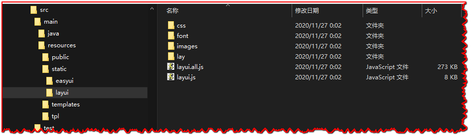

**CRUD界面:**
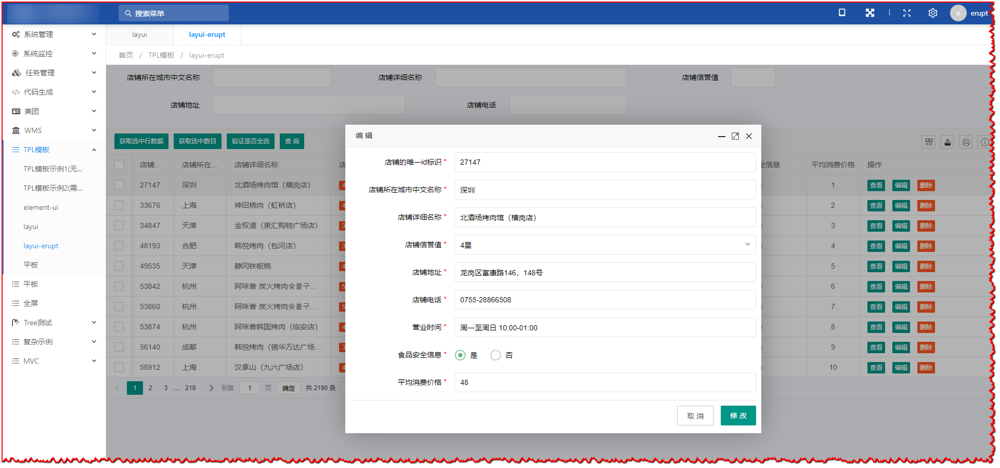

**关键点说明:** table组件获取@Erupt注解的实体类数据接口需要配置的参数,参见下图:
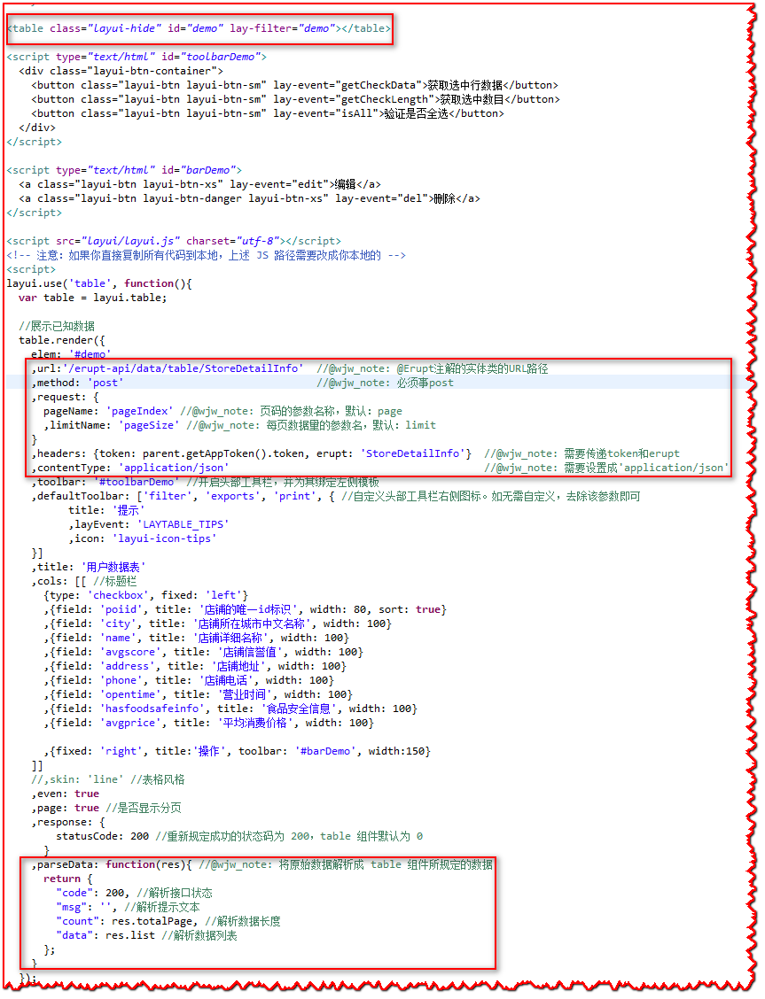


# Data数据接口


## 单表

打开会有2次请求.第一次请求表的元数据,第二次请求表的数据


### 元数据请求

**Request**

-  Request URL:  `/erupt-api/build/${实体类名}` 
-  Request Method:    `GET` 
-  Request Headers: 
```http
Accept: application/json, text/plain, */*
erupt: ${实体类名}
eruptParent: 
token: pSeGre3GgSRavZMI
```
 

**Response**

-  Response Header: 
```http
Content-Type: application/json;charset=UTF-8
```
 

-  Response Body: 
```json
{
  "eruptModel": {
    "eruptName": "MtCity",    //实体类名
    "eruptJson": {
      "tree": {
        "id": "id",
        "label": "name",
        "pid": ""
      },
      "primaryKeyCol": "id"  //主键字段名
    },
    "eruptFieldModels": [{
      "fieldName": "id",
      "eruptFieldJson": {
        "edit": {
          "type": "NUMBER",
          "search": {
            "value": false,
            "vague": false,
            "notNull": false
          },
          "readOnly": false,
          "desc": "",
          "show": true,
          "notNull": true,
          "title": "城市ID",
          "numberType": {
            "min": -2147483647,
            "max": 2147483647
          },
          "placeHolder": ""
        },
        "views": [{
          "viewType": "NUMBER",
          "className": "",
          "desc": "",
          "show": true,
        "sortable": false,
          "column": "",
          "title": "城市ID",
          "template": ""
        }]
      },
      "value": null,
      "choiceList": null,
      "tagList": null
    }
    ...
    ]
  },
  "tabErupts": null,
  "combineErupts": null,
  "operationErupts": null,
  "power": {
    "add": true,
    "delete": true,
    "edit": true,
    "query": true,
    "viewDetails": true,
    "export": false,
    "importable": false
  }
}
```
 


### Grid数据请求

**Request**

-  Request URL:  `/erupt-api/data/table/${实体类名}` 
-  Request Method:  `POST` 
-  Request Headers: 
```http
Content-Type: application/json
Accept: application/json, text/plain, */*
erupt: ${实体类名}
token: pSeGre3GgSRavZMI
```
 

-  Request Body: 
```json
{
  "pageIndex": 1,
  "pageSize": 10,
  "sort": ""
}
```
 

-  如果有查询条件是这样的: 
```json
{
  "pageIndex": 1,
  "pageSize": 10,
  "condition": [{
    "key": "city",
    "value": "北京"
  }],
  "sort": ""
}
```
 

-  完整的一个查询请求: 
```json
{
  "pageIndex": 1,
  "pageSize": 10,
  "condition": [{
    "key": "acronym",
    "value": "W"
  }],
  "sort": "acronym asc,name asc"
}
```
 

**Response**

-  Response Header: 
```http
Accept: application/json, text/plain, */*
Accept-Encoding: gzip, deflate, br
Accept-Language: zh-CN,zh;q=0.9
Cache-Control: no-cache
Connection: keep-alive
Content-Length: 39
Content-Type: application/json
DNT: 1
erupt: MtCity
Host: 127.0.0.1:8080
Origin: http://127.0.0.1:8080
Pragma: no-cache
Referer: http://127.0.0.1:8080/
sec-ch-ua: "Google Chrome";v="89", "Chromium";v="89", ";Not A   Brand";v="99"
sec-ch-ua-mobile: ?0
Sec-Fetch-Dest: empty
Sec-Fetch-Mode: cors
Sec-Fetch-Site: same-origin
token: pSeGre3GgSRavZMI
```
 

-  Response Body: 
```json
{
  "pageIndex": 1,
  "pageSize": 10,
  "totalPage": 121,
  "total": "1204",
  "sort": "",
  "list": [{
    "name": "北京",
    "rank": "S",
    "firstchar": "B",
    "pinyin": "beijing",
    "id": 1,
    "acronym": "bj"
  }
  ...
  ]
}
```
   


### 查看/修改详情页

**Request**

-  Request URL:  `/erupt-api/data/${实体类名}/${ID}` 
-  Request Method:    `GET` 
-  Request Headers: 
```http
Accept: application/json, text/plain, */*
erupt: ${实体类名}
token: pSeGre3GgSRavZMI
```
 

**Response**

-  Response Header: 
```http
Content-Type: application/json;charset=UTF-8
Keep-Alive: timeout=60
Transfer-Encoding: chunked
```
 

-  Response Body: 
```json
{
  "firstchar": "S",
  "pinyin": "shanghai",
  "acronym": "sh",
  "name": "上海",
  "rank": "S",
  "id": 10
}
```
 


### 详情页-保存

**🏷注意:** **保存**成功后会再发出一次[Grid数据请求](#28____Grid数据请求)请求来刷新table.

**Request**

-  Request URL:  `/erupt-api/data/modify/${实体类名}` 
-  Request Method:    `PUT` 
-  Request Headers: 
```http
Accept: application/json, text/plain, */*
Content-Type: application/json
erupt: ${实体类名}
token: CXukR6QFEOUXEcQY
```
 

-  Request Body: 
```json
{
"id": 1,
"name": "北京",
"pinyin": "beijing",
"acronym": "bj",
"rank": "S",
"firstchar": "B"
}
```
 

**Response**

-  Response Header: 
```http
Content-Type: application/json;charset=UTF-8
Transfer-Encoding: chunked
```
 

-  Response Body: 
```json
{
  "status": "SUCCESS",
  "promptWay": "MESSAGE",
  "message": null,
  "data": null,
  "errorIntercept": true
}
```
 


### 删除操作

**🏷注意:** **删除**成功后会再发出一次请求来刷新table.

**Request**

-  Request URL:  `/erupt-api/data/modify/${实体类名}/${ID}` 
-  Request Method:    DELETE 
-  Request Headers: 
```http
Accept: application/json, text/plain, */*
erupt: ${实体类名}
token: CXukR6QFEOUXEcQY
```
 

**Response**

-  Response Header: 
```http
Content-Type: application/json;charset=UTF-8
Keep-Alive: timeout=60
Transfer-Encoding: chunked
```
 

-  Response Body: 
```json
{
    "status": "SUCCESS",
	"promptWay": "MESSAGE",
	"message": null,
	"data": null,
	"errorIntercept": true
}
```
 


## Tree表


### 元数据请求

**Request**

-  Request URL:  `/erupt-api/build/${实体类名}` 
-  Request Method:    `GET` 
-  Request Headers: 
```http
Accept: application/json, text/plain, */*
erupt: ${实体类名}
eruptParent: 
token: pSeGre3GgSRavZMI
```
 

**Response**

-  Response Header: 
```http
Content-Type: application/json;charset=UTF-8
```
 

-  Response Body: 
```json
{
  "eruptModel": {
    "eruptName": "OpsServerGroup",  //实体类名
    "eruptJson": {
      "tree": {
        "id": "id",
        "label": "name",
        "pid": "parent.id"
      },
      "primaryKeyCol": "id"    //主键字段名
    },
    "eruptFieldModels": [{
      "fieldName": "code",
      "eruptFieldJson": {
        "edit": {
          "type": "INPUT",
          "search": {
            "value": false,
            "vague": false,
            "notNull": false
          },
          "readOnly": false,
          "desc": "",
          "show": true,
          "notNull": true,
          "title": "编码",
          "inputType": {
            "prefix": [],
            "type": "text",
            "length": 255,
            "fullSpan": false,
            "suffix": []
          },
          "placeHolder": ""
        },
        "views": [{
          "viewType": "TEXT",
          "className": "",
          "desc": "",
          "width": "",
          "show": true,
          "sortable": false,
          "template": "",
          "column": "",
          "title": "编码"
        }]
      },
      "value": null,
      "choiceList": null,
      "tagList": null
    }, {
      "fieldName": "name",
      "eruptFieldJson": {
        "edit": {
          "type": "INPUT",
          "search": {
            "value": false,
            "vague": false,
            "notNull": false
          },
          "readOnly": false,
          "desc": "",
          "show": true,
          "notNull": true,
          "title": "名称",
          "inputType": {
            "prefix": [],
            "type": "text",
            "length": 255,
            "fullSpan": false,
            "suffix": []
          },
          "placeHolder": ""
        },
        "views": [{
          "viewType": "TEXT",
          "className": "",
          "desc": "",
          "width": "",
          "show": true,
          "sortable": false,
          "template": "",
          "column": "",
          "title": "名称"
        }]
      },
      "value": null,
      "choiceList": null,
      "tagList": null
    }, {
      "fieldName": "parent",
      "eruptFieldJson": {
        "edit": {
          "type": "REFERENCE_TREE",
          "search": {
            "value": false,
            "vague": false,
            "notNull": false
          },
          "readOnly": false,
          "desc": "",
          "show": true,
          "referenceTreeType": {
            "id": "id",
            "dependField": "",
            "label": "name",
            "pid": "parent.id"
          },
          "notNull": false,
          "title": "上级组别",
          "placeHolder": ""
        },
        "views": []
      },
      "value": null,
      "choiceList": null,
      "tagList": null
    }, {
      "fieldName": "sort",
      "eruptFieldJson": {
        "edit": {
          "type": "NUMBER",
          "search": {
            "value": false,
            "vague": false,
            "notNull": false
          },
          "readOnly": false,
          "desc": "",
          "show": true,
          "notNull": false,
          "title": "显示顺序",
          "numberType": {
            "min": -2147483647,
            "max": 2147483647
          },
          "placeHolder": ""
        },
        "views": [{
          "viewType": "NUMBER",
          "className": "",
          "desc": "",
          "width": "",
          "show": true,
          "sortable": false,
          "template": "",
          "column": "",
          "title": "显示顺序"
        }]
      },
      "value": null,
      "choiceList": null,
      "tagList": null
    }, {
      "fieldName": "remark",
      "eruptFieldJson": {
        "edit": {
          "type": "TEXTAREA",
          "search": {
            "value": false,
            "vague": false,
            "notNull": false
          },
          "readOnly": false,
          "desc": "",
          "show": true,
          "notNull": false,
          "title": "备注",
          "placeHolder": ""
        },
        "views": [{
          "viewType": "TEXT",
          "className": "",
          "desc": "",
          "width": "",
          "show": true,
          "sortable": false,
          "template": "",
          "column": "",
          "title": "备注"
        }]
      },
      "value": null,
      "choiceList": null,
      "tagList": null
    }, {
      "fieldName": "id",
      "eruptFieldJson": {
        "edit": {
          "type": "AUTO",
          "search": {
            "value": false,
            "vague": false,
            "notNull": false
          },
          "readOnly": false,
          "desc": "",
          "show": true,
          "notNull": false,
          "title": "",
          "placeHolder": ""
        },
        "views": []
      },
      "value": null,
      "choiceList": null,
      "tagList": null
    }]
  },
  "tabErupts": null,
  "combineErupts": null,
  "operationErupts": null,
  "power": {
    "add": true,
    "delete": true,
    "edit": true,
    "query": true,
    "viewDetails": true,
    "export": false,
    "importable": false
  }
}
```
 


### Tree数据请求

**Request**

-  Request URL:  `/erupt-api/data/tree/${实体类名}` 
-  Request Method:  `GET` 
-  Request Headers: 
```http
Accept: application/json, text/plain, */*
erupt: ${实体类名}
token: pSeGre3GgSRavZMI
```
 

**Response**

-  Response Header: 
```http
Content-Type: application/json;charset=UTF-8
```
 

-  Response Body: 
```json
[{
  "children": [{
    "children": null,
    "id": "3",
    "label": "centos",
    "pid": "1",
    "root": false
  }],
  "id": "1",
  "label": "Linux",
  "pid": null,
  "root": true
}, {
  "children": null,
  "id": "2",
  "label": "windows",
  "pid": null,
  "root": true
}, {
  "children": null,
  "id": "4",
  "label": "Mac OS",
  "pid": null,
  "root": true
}]
```
 


### 新增

**Request**

-  Request URL:  `/erupt-api/data/init-value/${实体类名}` 
-  Request Method:    `GET` 
-  Request Headers: 
```http
Accept: application/json, text/plain, */*
erupt: ${实体类名}
eruptParent:
token: q0hTJE0bC76chuUf
```
 

**Response**

-  Response Header: 
```http
Content-Type: application/json;charset=UTF-8
Keep-Alive: timeout=60
Transfer-Encoding: chunked
```
 

-  Response Body: 
```json
//如果没有初始化数据返回: {}

//如果有初始化数据()
{"sort":382,"status":1}
```
 


### 单条查询

**Request**

-  Request URL:  `/erupt-api/data/${实体类名}/${ID}` 
-  Request Method:    `GET` 
-  Request Headers: 
```http
Accept: application/json, text/plain, */*
erupt: ${实体类名}
token: pSeGre3GgSRavZMI
```
 

**Response**

-  Response Header: 
```http
Content-Type: application/json;charset=UTF-8
Keep-Alive: timeout=60
Transfer-Encoding: chunked
```
 

-  Response Body: 
```json
{
	"code": "EruptRole",
	"name": "角色维护",
	"sort": 20,
	"id": "3",
	"type": "table",
	"value": "EruptRole",
	"parentMenu": {
		"name": "系统管理",
		"id": "1"
	},
	"status": 1
}
```
 


### 保存请求

**🏷注意:** **保存**成功后会再发出一次[Tree数据请求](#34____Tree数据请求)来刷新table.

**Request**

-  Request URL:  `/erupt-api/data/modify/${实体类名}` 
-  Request Method:    `POST` 
-  Request Headers: 
```http
Accept: application/json, text/plain, */*
Content-Type: application/json
erupt: ${实体类名}
token: CXukR6QFEOUXEcQY
```
 

-  Request Body: 
```json
{
    "code": "qaz",
    "name": "win3.1",
    "parent": {
        "id": 2,
        "name": "windows"
    }
}
```
 

**Response**

-  Response Header: 
```http
Content-Type: application/json;charset=UTF-8
Transfer-Encoding: chunked
```
 

-  Response Body: 
```json
{
  "status": "SUCCESS",
  "promptWay": "MESSAGE",
  "message": null,
  "data": null,
  "errorIntercept": true
}
```
 


### 删除操作

**🏷注意:** **删除**成功后会再发出一次[Tree数据请求](#34____Tree数据请求)来刷新table.

**Request**

-  Request URL:  `/erupt-api/data/modify/${实体类名}/${ID}` 
-  Request Method:    `DELETE` 
-  Request Headers: 
```http
Accept: application/json, text/plain, */*
erupt: ${实体类名}
token: CXukR6QFEOUXEcQY
```
 

**Response**

-  Response Header: 
```http
Content-Type: application/json;charset=UTF-8
Keep-Alive: timeout=60
Transfer-Encoding: chunked
```
 

-  Response Body: 
```json
{
  "status": "SUCCESS",
	"promptWay": "MESSAGE",
	"message": null,
	"data": null,
	"errorIntercept": true
}
```
 


> 原文: <https://www.yuque.com/erupt/xg261c>