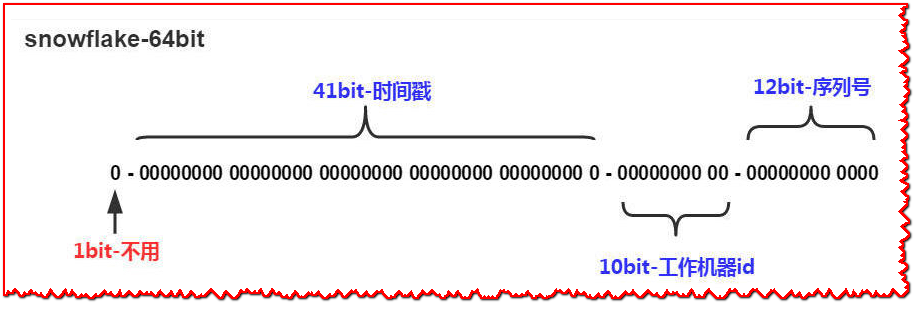

# JPA自定义雪花算法ID生成器详解

> 作者: 白石([https://github.com/wjw465150](https://github.com/wjw465150))

本文分享下Spring boot项目下使用JPA操作数据库时关于雪花ID生成器的相关实现代码。

**SnowFlake 算法（雪花算法）**，是 Twitter 开源的分布式 id 生成算法。其核心思想就是：使用一个 64 bit 的 long 型的数字作为全局唯一 id。在分布式系统中的应用十分广泛，且ID 引入了时间戳，基本上保持自增。


在JPA中一个数据表必须要有主键，主键类型一般是推荐使用Long类型，那么在分布式微服务下需要保证ID的唯一性，此时往往需要自定义主键生成策略。

首先实现一个实体类的基类，在基类中定义ID的生成策略，子类继承其实现，这样就不用每个实体类都去写一遍了。


## 实体类的基类`AbstractBaseEntity`

```java
package org.wjw.jpa.snowflake;

import java.io.Serializable;

import javax.persistence.Column;
import javax.persistence.GeneratedValue;
import javax.persistence.Id;
import javax.persistence.MappedSuperclass;

import org.hibernate.annotations.GenericGenerator;

@MappedSuperclass
public abstract class AbstractBaseEntity implements Serializable {
  @Id
  @GenericGenerator(name = "snowFlakeIdGenerator", strategy = "org.wjw.jpa.snowflake.SnowFlakeIdGenerator")
  @GeneratedValue(generator = "snowFlakeIdGenerator")
  @Column(name = "id")
  protected Long id;

  /**
   * 获取主键id
   * 
   * @return id 前端js能处理的长度低于Java，防止精度丢失
   */
  public Long getId() {
    return id;
  }

  /**
   * 设置主键id
   * 
   * @param id 主键id
   */
  public void setId(Long id) {
    this.id = id;
  }
}
```

> `strategy` 表示生成策略实现类的全路径名。


使用雪花算法要注意的是，保证机器的时钟是一直增加的，也就是说不可以将时钟往前调，不然就不能保证ID的自增，并且有可能发生ID冲突（产生了重复的ID）。因此，上面的代码中，在检查到时钟异常时会抛出异常。


## 雪花算法类`SnowFlake`:

```java
package org.wjw.jpa.snowflake;

import javax.annotation.PostConstruct;

import org.hibernate.HibernateException;
import org.hibernate.internal.CoreLogging;
import org.hibernate.internal.CoreMessageLogger;
import org.springframework.beans.BeansException;
import org.springframework.beans.factory.annotation.Value;
import org.springframework.context.ApplicationContext;
import org.springframework.context.ApplicationContextAware;
import org.springframework.stereotype.Component;

/**
 * 雪花算法
 */
@Component
public class SnowFlake implements ApplicationContextAware {
  private static final CoreMessageLogger LOG = CoreLogging.messageLogger(SnowFlake.class);

  private static ApplicationContext _applicationContext;

  @Override
  public void setApplicationContext(ApplicationContext applicationContext) throws BeansException {
    SnowFlake._applicationContext = applicationContext;
  }
  
  public static SnowFlake getBean() {
    return _applicationContext.getBean(SnowFlake.class);
  }
  
  /**
   * 起始的时间戳
   */
  private final long twepoch = 1557825652094L;

  /**
   * 每一部分占用的位数
   */
  private final long workerIdBits = 5L;
  private final long datacenterIdBits = 5L;
  private final long sequenceBits = 12L;

  /**
   * 每一部分的最大值
   */
  private final long maxWorkerId = -1L ^ (-1L << workerIdBits);
  private final long maxDatacenterId = -1L ^ (-1L << datacenterIdBits);
  private final long maxSequence = -1L ^ (-1L << sequenceBits);

  /**
   * 每一部分向左的位移
   */
  private final long workerIdShift = sequenceBits;
  private final long datacenterIdShift = sequenceBits + workerIdBits;
  private final long timestampShift = sequenceBits + workerIdBits + datacenterIdBits;

  @Value("${snowflake.datacenter-id:1}")
  private long datacenterId; // 数据中心ID

  @Value("${snowflake.worker-id:0}")
  private long workerId; // 机器ID

  private long sequence = 0L; // 序列号
  private long lastTimestamp = -1L; // 上一次时间戳
  
  @PostConstruct
  public void init() {
    String msg;
    if (workerId > maxWorkerId || workerId < 0) {
      msg = String.format("worker Id can't be greater than %d or less than 0", maxWorkerId);
      LOG.unsuccessful(msg);
    }
    if (datacenterId > maxDatacenterId || datacenterId < 0) {
      msg = String.format("datacenter Id can't be greater than %d or less than 0", maxDatacenterId);
      LOG.unsuccessful(msg);
    }
  }

  public synchronized long nextId() {
    long timestamp = timeGen();
    if (timestamp < lastTimestamp) {
      throw new HibernateException(String.format("Clock moved backwards.  Refusing to generate id for %d milliseconds", lastTimestamp - timestamp));
    }
    if (timestamp == lastTimestamp) {
      sequence = (sequence + 1) & maxSequence;
      if (sequence == 0L) {
        timestamp = tilNextMillis();
      }
    } else {
      sequence = 0L;
    }
    lastTimestamp = timestamp;

    return (timestamp - twepoch) << timestampShift // 时间戳部分
        | datacenterId << datacenterIdShift // 数据中心部分
        | workerId << workerIdShift // 机器标识部分
        | sequence; // 序列号部分
  }

  private long tilNextMillis() {
    long timestamp = timeGen();
    while (timestamp <= lastTimestamp) {
      timestamp = timeGen();
    }
    return timestamp;
  }

  private long timeGen() {
    return System.currentTimeMillis();
  }

}
```

> 代码中使用**_@Value("_**{snowflake.datacenter-id:1}"***%E5%92%8C***%40Value(%22#card=math&code=%7Bsnowflake.datacenter-id%3A1%7D%22%29%2A%2A%2A%E5%92%8C%2A%2A%2A%40Value%28%22&id=jw8QG)**_{snowflake.worker-id:0}")_**注解从环境配置中读取当前的数据中心id机器id。


## 集成JPA配置SnowFlakeIdGenerator

```java
package org.wjw.jpa.snowflake;

import java.io.Serializable;
import java.util.Properties;

import org.hibernate.HibernateException;
import org.hibernate.MappingException;
import org.hibernate.engine.spi.SharedSessionContractImplementor;
import org.hibernate.id.Configurable;
import org.hibernate.id.IdentifierGenerator;
import org.hibernate.service.ServiceRegistry;
import org.hibernate.type.Type;

/**
 * JPA 雪花算法ID生成器
 */
public class SnowFlakeIdGenerator implements IdentifierGenerator, Configurable {

  @Override
  public Serializable generate(SharedSessionContractImplementor session, Object o) throws HibernateException {
    return SnowFlake.getBean().nextId();
  }

  @Override
  public void configure(Type type, Properties params, ServiceRegistry serviceRegistry) throws MappingException {
  }
}
```


## 测试


### 创建一个 `@Entity`

好的，接下来就是正常实体类继承基类就可以了，如下`User`实体类：

```java
package org.wjw.jpa.entity;

import javax.persistence.Entity;

import org.wjw.jpa.snowflake.AbstractBaseEntity;

@Entity
public class User extends AbstractBaseEntity {
  private String name;

  private String email;

  public String getName() {
    return name;
  }

  public void setName(String name) {
    this.name = name;
  }

  public String getEmail() {
    return email;
  }

  public void setEmail(String email) {
    this.email = email;
  }

  @Override
  public String toString() {
    return "User [id=" + id + ", name=" + name + ", email=" + email + "]";
  }
  
}
```


### 创建一个 Repository

仓库类`UserJpaRepository`:

```java
package org.wjw.jpa.repository;

import org.springframework.data.jpa.repository.JpaRepository;
import org.wjw.jpa.entity.User;

public interface UserJpaRepository extends JpaRepository<User,Long> {
}
```


### 进行单元测试

单元测试代码:

```java
package org.wjw.jpa;

import org.junit.jupiter.api.Test;
import org.springframework.beans.factory.annotation.Autowired;
import org.springframework.boot.test.context.SpringBootTest;
import org.wjw.jpa.entity.User;
import org.wjw.jpa.repository.UserJpaRepository;

@SpringBootTest
public class MyTests {
  @Autowired
  private UserJpaRepository userRepository;
  
  @Test
  public void testAddNewUser() {
    User n = new User();
    n.setName("Querydsl");
    n.setEmail("Querydsl@gamil.com");
    userRepository.save(n);
  }
}
```


> 原文: <https://www.yuque.com/erupt/fzwgx8>