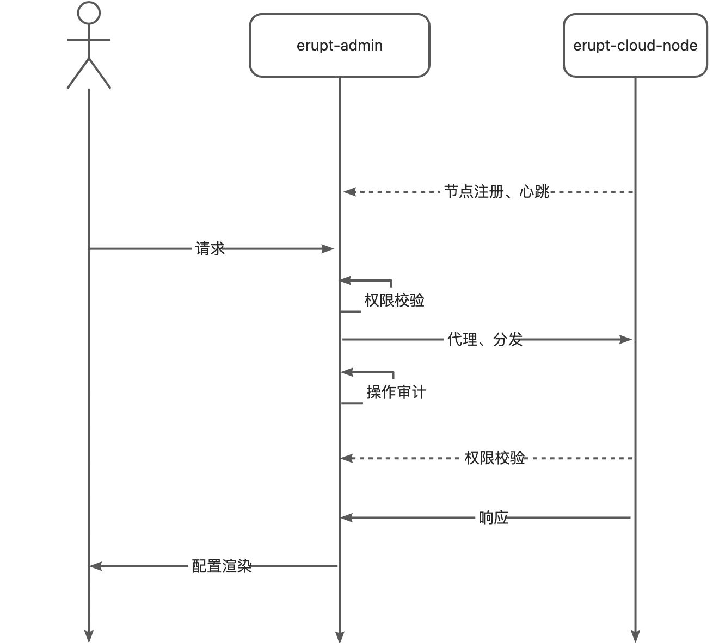
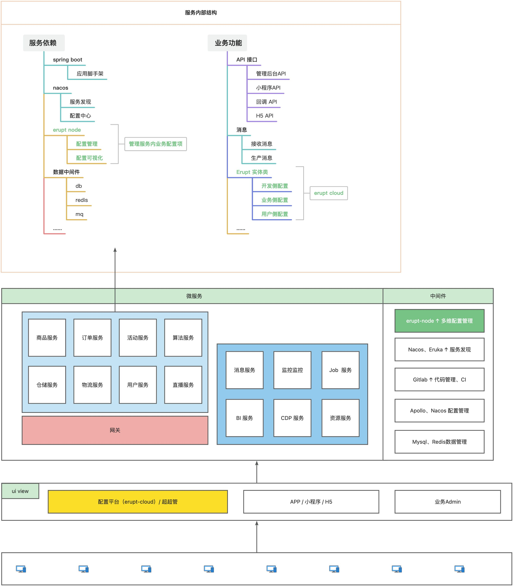
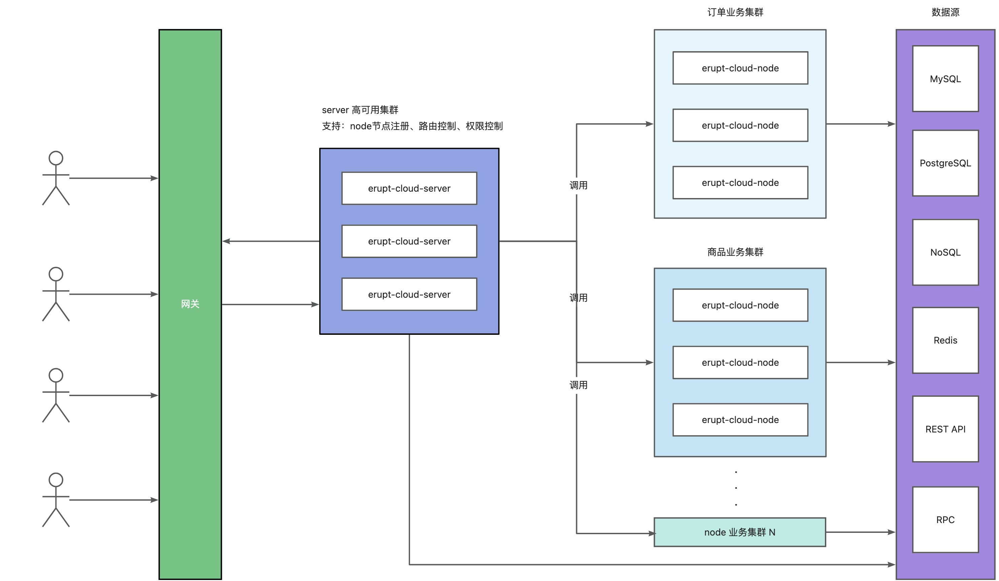

# 入门：通用云配置管理中台

> **分布式架构中使用 erupt 数据管理能力，构建通用云配中心，管理集群内任意服务！**
> **0 前端代码，纯注解实现不同微服务的配置管理，无需前端对接与接口暴漏**

## ⭐️ 应用场景
> 无需关注上层 erupt 架构，天然实现数据库隔离，资源隔离
> 分布式架构中，根据微服务能力不同，管理不同的配置，

- **通知服务**：提供通知模板配置、通道配置、发送规则配置等
- **APP服务**：提供 APP 各个版本的配置，如更新文件，更新方式，版本号、更新内容等。
- **网关服务**：提供不同服务的网关配置，如：超时时间，转发路径，限流规则等
- **埋点服务**：管理埋点事件，埋点策略，埋点方式等，埋点路径等
- **消息服务**：管理 topic 的创建与监听，推送策略等配置
- **算法服务**：管理 GPT 智能体的 prompt，算法模糊匹配规则等
- **快递服务**：管理外部物流服务商信息，如：快递公司名称，接口对接方式，密钥，功能列表等
- **数据服务**：指标管理，数据模型管理，数据关系配置等

## 与 Erupt Admin 的区别
|  | Erupt-Admin | Erupt-Cloud |
| --- | --- | --- |
| 应用场景 | 单机 | 分布式集群 |
| 架构优势 | 开发简单，单机部署 | 资源隔离，业务隔离适合中大型团队协作开发 |
| 数据库依赖 | 用户、角色、菜单相关业务表 | 无表依赖 |
| 内部依赖 | 依赖 erupt-upmserupt-securityerupt-web 等 | 仅需依赖 erupt-node 即可，轻量级使用 erupt |
| 能力 | 全部 erupt 能力 | 拥有 erupt 所有能力，包括权限控制，操作审计，自定义按钮，DataProxy，国际化等 |

## 与传统分布式后台的区别
|  | 传统管理后台 | Erupt Cloud |
| --- | --- | --- |
| 开发方式 | 接口开发+前端对接+网关请求 | 注册节点+无需关注网关 |
| 前端对接 | 绘制界面 UI，接口联调，权限配置等 | 无需前端对接，配置菜单权限即可 |
| 权限控制 | 额外的权限控制代码，或网关整体控制 | erupt-cloud-server 自带完整的权限体系，权限可以在菜单中自由管理与扩展 |
| 数据安全 | 通过网关或前端控制，服务内部可能通过 token 控制 | 支持：表、行、列、按钮等层级的数据隔离控制 |

## 与配置中心的能力差异
| 
 | Nacos / Applo / SpringConfig | Erupt Cloud |
| --- | --- | --- |
| 管理数据的方式 | 配置型描述文件，适合管理基础格式的数据 | 有行列关系，适合更加复杂的多行数据 |
| 数据回溯 | 基于版本，可任意回退 | 基于审计，任何操作都会在平台中留下痕迹 |
| 权限控制 | 用户角色的权限控制 | 用户角色权限控制，可精细到行、列、按钮 |
| 面相群体 | 研发 | 研发、运营、产品 |
| 关注点 | 基于 yml / json / prop 等格式的编译时配置或运行时配置 | 基于数据表运行时配置 |
| 应用场景与关注点不同，所以可以与 nacos、applo 等中间件同时存在，各司其职 |  |  |

## 整体架构
> 优势：打包体积小，低侵入性，平滑升级，业务隔离，快速启动，适合大规模团队的开发协作
> 部署：不依赖 Nacos 不依赖 Eruka 方便部署非常简单
> 容器：对 k8s 友好，支持 ip 漂移、k8s svc 映射
> 资源隔离：数据库连接池隔离，代码逻辑隔离

### 调用时序图

### 集群架构图
:::danger
集群内任意服务都可[接入erupt-node](https://www.yuque.com/erupts/erupt/av6gdn)实现该服务内部的配置管理，可做到多维配置，实时变更，协作管理，权限检查等
:::

### 高可用架构图
下图每个node都可以理解为是一个服务，他接入了erupt-node来管理本服务内配置信息

> 原文: <https://www.yuque.com/erupt/ggbcv9>