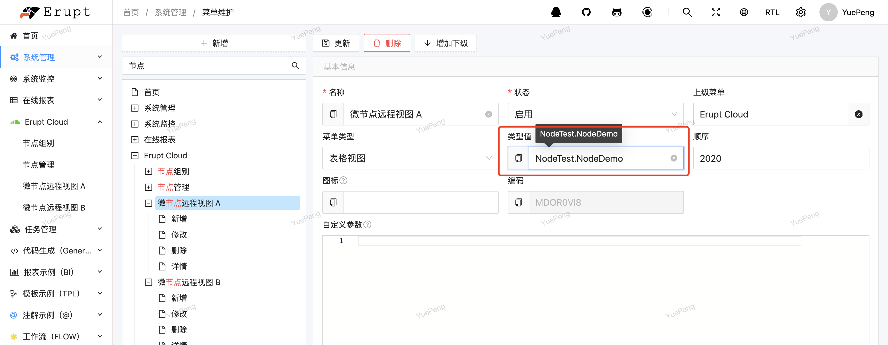
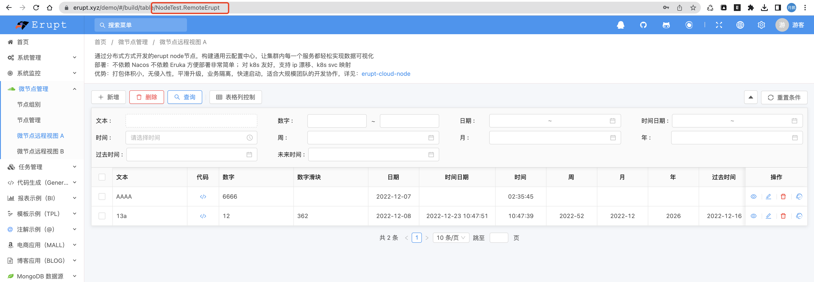

# 开发：配置 node 节点，可视化集群内任意服务


### 在node节点创建带有erupt注解的类
```java
package xyz.erupt.example.model;

import org.hibernate.annotations.GenericGenerator;
import xyz.erupt.annotation.Erupt;
import xyz.erupt.annotation.EruptField;
import xyz.erupt.annotation.sub_field.Edit;
import xyz.erupt.annotation.sub_field.View;

import javax.persistence.*;


/*
*	@Erupt注解修饰在类上，@EruptField注解修饰在字段上
*	其他注解均为Jpa注解
*/
@Erupt(name = "简单的例子")
@Table(name = "node_demo")
@Entity
public class NodeDemo extends BaseModel {
    
    //文本输入
    @EruptField(
        views = @View(title = "文本"),
        edit = @Edit(title = "文本")
    )
    private String input;
    
    //数值输入
    @EruptField(
        views = @View(title = "数值"),
        edit = @Edit(title = "数值")
    )
    private Integer number = 100;  //默认值100

    ....
    
}
```
注：获取上下文，自动写入当前操作用户等操作详见：[https://www.yuque.com/erupts/erupt/plk783](https://www.yuque.com/erupts/erupt/plk783)

### 在 server 端菜单管理中关联 node erupt实体

1. 前往系统管理 → 菜单维护 → 新增
2. 类型值：**xxx.NodeDemo**（格式：节点名.类名）
> 如果NodeDemo类所在节点名为NodeTest，则类型值应该填：**NodeTest.NodeDemo**



### 刷新页面即可看到在node节点配置的页面



> 原文: <https://www.yuque.com/erupt/tkmt4rkmuh7o5y9b>