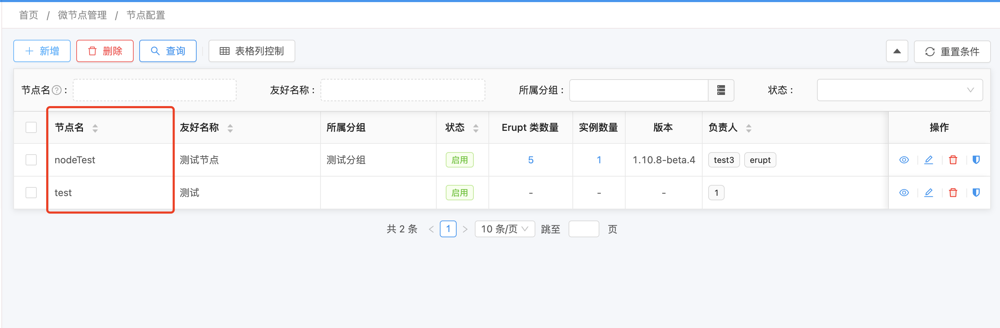
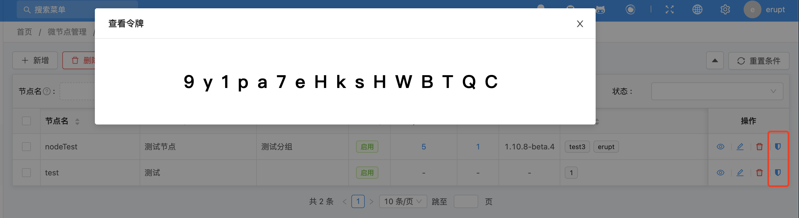
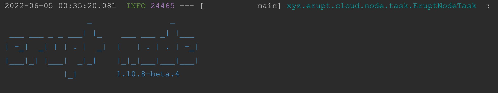
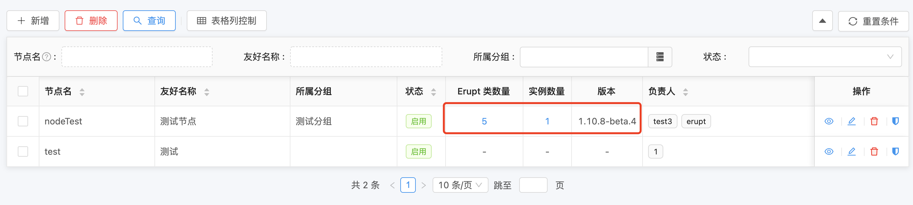

# 部署：erupt-cloud-node（微节点）


## 环境要求
- Java 版本 **1.8.0** 及以上（支持 **GraalVM）**
- Spring Boot 版本 **2.0** 及其以上，**3.0**以下

## 部署Node节点

1. **创建Spring Boot项目 → **[**Spring Initializr，**](https://start.spring.io)目录结构如下：
```basic
demo -- 项目名称
├── src
     └── main
     			├── java -- 代码文件目录
                └── com.example.demo -- 包名
											└── DemoApplication -- 入口类
				  └── resources -- 资源文件目录
								└── application.properties -- 配置文件
├── ......
└── pom.xml -- Maven依赖配置
```

2. **添加erupt-node依赖**
```xml
<!--cloud node 核心依赖-->
<dependency>
  <groupId>xyz.erupt</groupId>
  <artifactId>erupt-cloud-node</artifactId>
  <version>${erupt.version}</version>
</dependency>
```
${erupt.version} **版本号详见：**[🕹 更新日志](https://www.yuque.com/erupts/erupt/wdic2w?view=doc_embed)
注意：微节点无需依赖 **erupt-upms** 和 **erupt-security** !!!

3. **配置**
```yaml
erupt:
  cloud-node:
    # 必填: erupt-cloud-server 端部署地址
    server-addresses: ['http://localhost:9999']
    # 必填：从 server 端获取 access-token
    access-token: 9y1pa7eHksHWBTQC
    # 必填：应用名从 server 端获取，要与server端配置的一致
    node-name: nodeTest
    
    
    # 可选：当前node节点地址（非必填），如果网络环境复杂无法准确的发现node节点则需要配置此项
    host-address: ['xxx']
    # 可选：是否开启服务注册，默认值 true
    enable-register: true
    # 可选：心跳时间（毫秒），默认值 15000
    heartbeat-time: 15000

```
前往server端手动添加节点

获取access token （如果看不到该按钮则说明未分配令牌查看权限）


4. **在Spring Boot入口类增加@EruptScan注解**
```java
@SpringBootApplication
@EruptScan
public class DemoApplication {
    public static void main(String[] args) {
        SpringApplication.run(DemoApplication.class, args);
    }
}
```

5. **启动**


启动成功后 server 端会显示当前node节点实例数、erupt类数量，版本等信息


6. **node 节点开发**

[开发：配置 node 节点，可视化集群内任意服务](https://www.yuque.com/erupts/erupt/tkmt4rkmuh7o5y9b?view=doc_embed)

## 

## 连接数据库使用JPA管理Erupt对象

1. 添加必要依赖
```xml
<!--JPA 数据源实现-->
<dependency>
  <groupId>xyz.erupt</groupId>
  <artifactId>erupt-cloud-node-jpa</artifactId>
  <version>${erupt.version}</version>
</dependency>
<dependency>
  <groupId>mysql</groupId>
  <artifactId>mysql-connector-java</artifactId>
  <scope>runtime</scope>
</dependency>
```

2. 添加数据库配置
```yaml
spring:
  datasource:
    url: jdbc:mysql://127.0.0.1:3306/erupt?useUnicode=true&characterEncoding=UTF-8&serverTimezone=Asia/Shanghai
    username: root
    password: 123456
  jpa:
    show-sql: true
    generate-ddl: true
    database: mysql
```


## 附：在 node 节点获取 server 节点配置
```java
@Component
public class Fetch{
    
    @Resource
    private ServerRemoteService serverRemoteService;
    
    public void test(){
        // 获取当前登录用户数据
        MetaUserinfo metaUserinfo= erverRemoteService.getRemoteUserInfo();
        // 获取Node节点配置，配置位置：主节点 → 节点管理 → 节点配置
        String config = erverRemoteService.getNodeConfig();
        // 获取节点组配置，配置位置：主节点 → 节点组别 → 分组配置
        String groupConfig = erverRemoteService.getNodeGroupConfig();
    }
    
}
```


> 原文: <https://www.yuque.com/erupt/av6gdn>