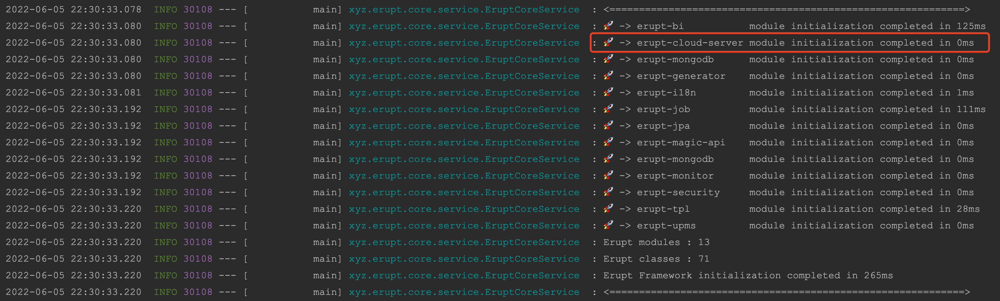
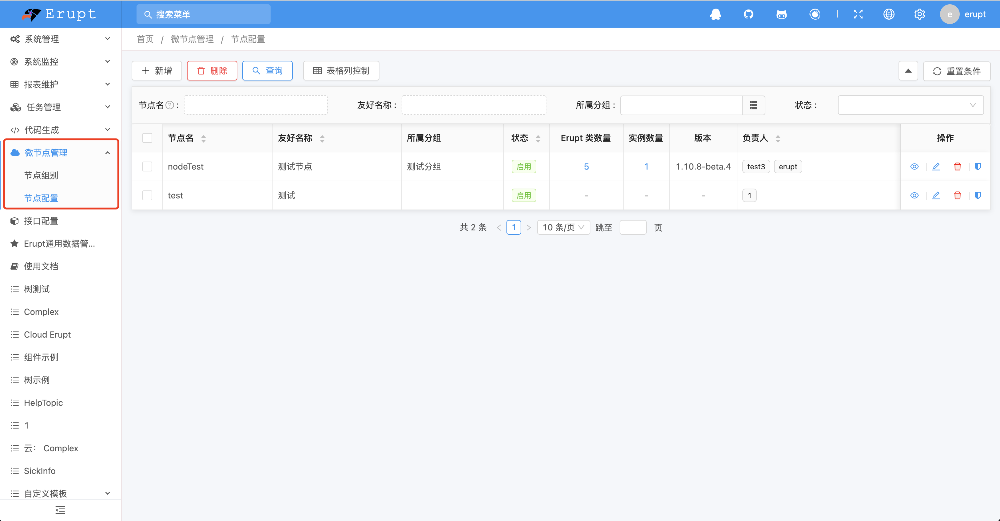

# 部署：erupt-cloud-server（服务端）

:::info
用于管理node节点，负责服务注册中心，请求调度与负载分发
:::

## 使用方法

### 1. 创建erupt项目
[🌋 快速开始](https://www.yuque.com/erupts/erupt/tpq1l9?view=doc_embed)

### 2. 添加maven依赖
```xml
<dependency>
  <groupId>xyz.erupt</groupId>
  <artifactId>erupt-cloud-server</artifactId>
  <version>${erupt.version}</version>
</dependency>
```

### 3. 增加redis配置，开启redis-session
```yaml
spring:
  redis:
    database: 0
    timeout: 10000
    host: 127.0.0.1
erupt:
	redis-session: true
```

### 4. 启动项目

登录后会出现如下菜单

**部署成功  🎉**


### * 可选配置
```yaml
erupt:
  cloud-server:
    # cloud key 命名空间(可选配置)
    cloud-name-space: 'erupt-cloud:'
    # node节点持久化时长，单位：ms (可选配置)
    node-expire-time: 60000
    # node节点存活检查周期，单位：ms (可选配置)
    node-survive-check-time: 120000
    # 是否校验 node 节点 access-token，默认值 true，1.11.4及以上版本支持
    validate-access-token: true
```


> 原文: <https://www.yuque.com/erupt/cthlzp>