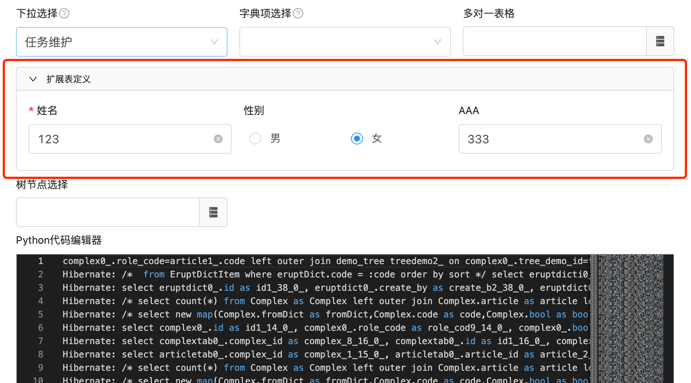
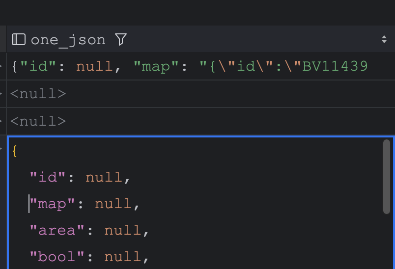

# 一对一新增 COMBINE （支持 JSON 字段存储）


## 基础使用
注：1.11.4及以上版本支持
```java
//注意：JoinColumn 咱不支持 referencedColumnName 配置
@OneToOne(cascade = CascadeType.ALL)
@JoinColumn
@EruptField(
    views = @View(title = "扩展表姓名", column = "name"),
    edit = @Edit(title = "扩展表定义", type = EditType.COMBINE)
)
private DemoExt ext;
```
```java
@Erupt(name = "一对一扩展表")
@Table(name = "demo_ext")
@Entity
public class DemoExt extends BaseMdoel {

    @EruptField(
            views = @View(title = "姓名"),
            edit = @Edit(title = "姓名", notNull = true)
    )
    private String name;

    @EruptField(
            views = @View(title = "性别"),
            edit = @Edit(title = "性别",
                    boolType = @BoolType(trueText = "男", falseText = "女"))
    )
    private Boolean sex;

}

```
:::success
效果展示
:::



## 一对一对象存储到 JSON 字段

1. 添加 POM 依赖
```java
<dependency>
    <groupId>com.vladmihalcea</groupId>
    <artifactId>hibernate-types-52</artifactId>
    <version>2.21.1</version>
</dependency>
```

2. 增加类注解：@TypeDef，增加字段注解@Type@Column
```java
@Entity
@Table(name = "test")
@Erupt(name = "一对一存储到 JSON 字段")
@TypeDef(name = "json", typeClass = JsonStringType.class)
public class Test extends BaseModel {

    @Type(type = "json")
    @Column(columnDefinition = "json", name = "one_json")
    @EruptField(
        // 注意：json 场景暂不支持 view 注解定义，建议用虚拟列的方式解决
        // views = @View(title = "扩展表姓名", column = "name"),
        edit = @Edit(title = "扩展表定义", type = EditType.COMBINE)
    )
    private DemoExt ext;

}

```

3. 入库效果




> 原文: <https://www.yuque.com/erupt/cde84803z0yn9o6i>