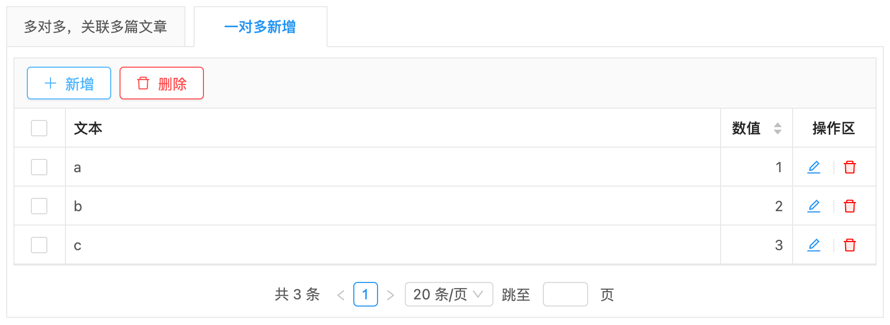
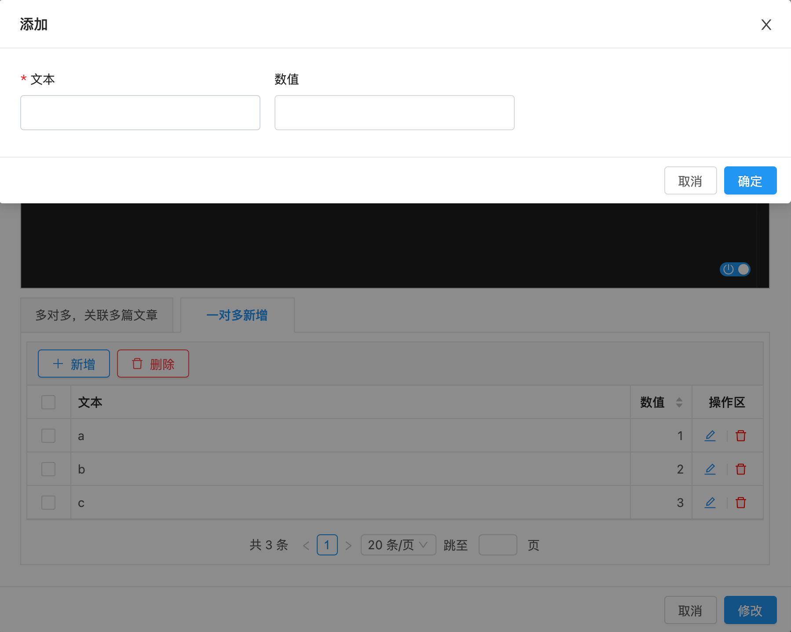
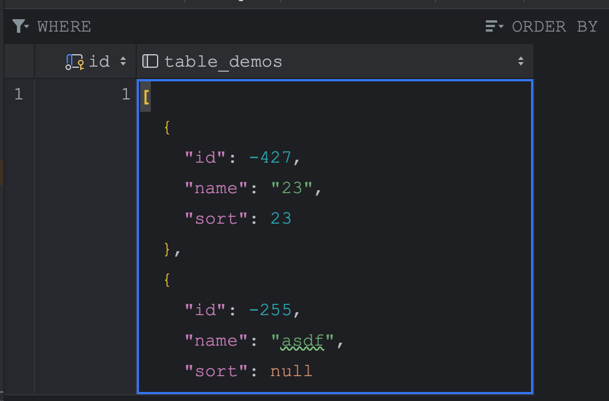

# 一对多新增 TAB_TABLE_ADD （支持 JSON 字段存储）


## 使用方法
```java
// 注：orphanRemoval 配置在 1.6.4 版本以后开始支持
@OneToMany(cascade = CascadeType.ALL, orphanRemoval = true) //一对多，且开启级联
@JoinColumn(name = "this_id") //this表示当前的表名，如：order_id子表会自动创建该列来标识与主表的关系
@OrderBy //排序
@EruptField(
    edit = @Edit(title = "添加多条表格数据", type = EditType.TAB_TABLE_ADD)
)
private Set<Table> tables; //Table对象定义如下👇
```
```java
@Entity
@Table(name = "TABLE")
@Erupt(name = "表格")
public class Table extends BaseModel {
    
    @EruptField(
            views = @View(title = "顺序"),
            edit = @Edit(title = "顺序")
    )
    private Integer sort;

    @EruptField(
            views = @View(title = "名称"),
            edit = @Edit(title = "名称")
    )
    private String name;
    
}
```

## 效果演示




## 一对多内容存储到 JSON 字段

1. 添加依赖
```xml
<dependency>
    <groupId>com.vladmihalcea</groupId>
    <artifactId>hibernate-types-52</artifactId>
    <version>2.21.1</version>
</dependency>
```

2. 增加类注解：@TypeDef，增加字段注解@Type@Column
```csharp
@Entity
@Table(name = "many_json")
@Erupt(name = "一对多内容存储到 JSON 字段")
@TypeDef(name = "json", typeClass = JsonStringType.class)
public class ManyJson extends BaseModel {

    @Type(type = "json")
    @Column(columnDefinition = "json" )
    @EruptField(
            edit = @Edit(
                    title = "json",
                    type = EditType.TAB_TABLE_ADD
            )
    )
    private Set<Table> tables; //Table对象定义参考上面
}

```

3. 入库效果




> 原文: <https://www.yuque.com/erupt/uufoth>