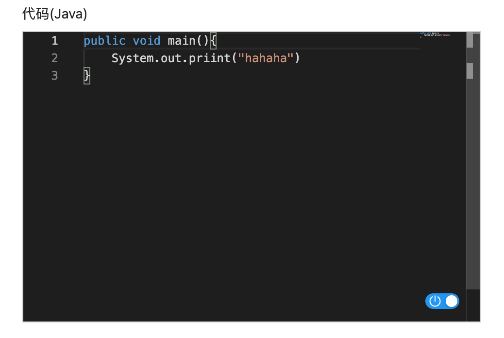
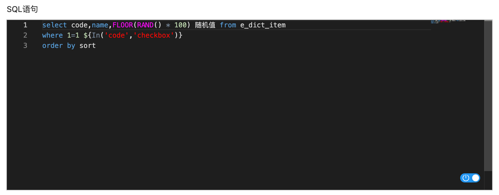

# 代码编辑器 CODE_EDITOR


## 使用方法
```java
@Lob
@EruptField(
    views = @View(title = "代码编辑器"),
    edit = @Edit(title = "代码编辑器", 
                 type = EditType.CODE_EDITOR,
                 codeEditType = @CodeEditorType(language = "java"))
)
private String code;
```

## 配置项注解定义
```java
public @interface CodeEditorType {
    String language();  //编程语言，支持市面上所有主流编程语言，详见 `monaco editor` 
}
```


## 效果演示




> 原文: <https://www.yuque.com/erupt/lhhquo>