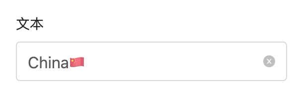

# 单行文本框 INPUT

通过鼠标或键盘输入内容


## 使用方法
```java
@EruptField(
    edit = @Edit(title = "输入框", inputType = @InputType)
)
private String input;
```


## 配置项注解定义
```java
public @interface InputType {
    
    int length() default DataLength.TEXT_LENGTH;  //最大长度

    String type() default "text"; //可选值，详见type类型说明

    boolean fullSpan() default false; //是否跨整行显示

    String regex() default ""; //输入内容正则匹配

    VL[] prefix() default {};  //左侧下拉选择框

    VL[] suffix() default {};  //右侧下拉选择框

    boolean autoTrim default true; //是否自动对输入值trim，1.12.10 及以上版本支持
    
}
```


## 代码演示

#### 密码输入
```java
@EruptField(
    edit = @Edit(title = "密码输入", inputType = @InputType(type = "password"))
)
private String password;
```

#### 颜色选择
```java
@EruptField(
    edit = @Edit(title = "颜色选择", inputType = @InputType(type = "color"))
)
private String color;
```


## InputType → type配置说明
type值会映射为H5 <input> 标签 type 属性

| **type值** | **表现形式** | **备注** |
| --- | --- | --- |
| text | 文本输入框 | 默认值 |
| password | 密码输入框 |  |
| color | 颜色选择框 | 需浏览器支持 |
| date | 日期选择 | 需浏览器支持 |
| datetime | 时间日期选择 | 需浏览器支持 |
| month | 月选择 | 需浏览器支持 |
| week | 周选择 | 需浏览器支持 |
| time | 时间选择 | 需浏览器支持 |
| email | 电子邮箱 | 需浏览器支持 |
| range | 数字滑块 | 需浏览器支持 |
| ...... |  | 更多表现形式点击[这里](https://www.w3school.com.cn/html5/att_input_type.asp)查看 |


## 效果演示



> 原文: <https://www.yuque.com/erupt/cqgoo9>