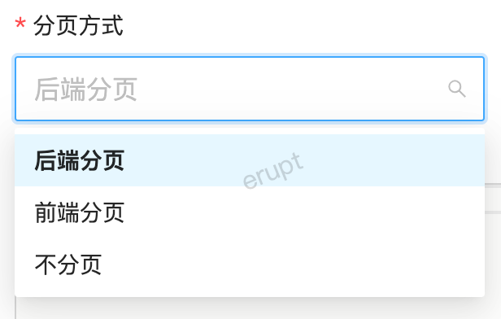
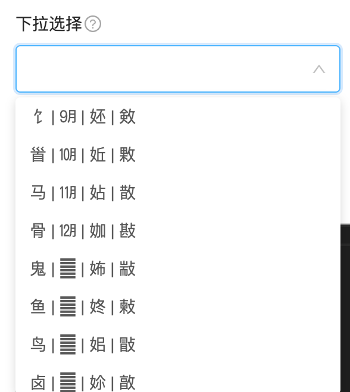
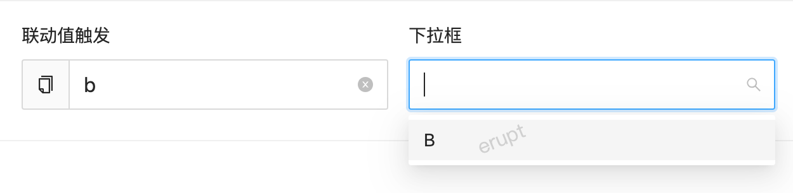

# 单选框 CHOICE


## 效果演示


## 使用方法
```java
@EruptField(
    edit = @Edit(title = "选择器", type = EditType.CHOICE,
                 choiceType = @ChoiceType(
                 	vl = {
                        @VL(label = "字母A", value = "A"),
                        @VL(label = "字母B", value = "B", disable = true),
                        @VL(label = "字母C", value = "C"),
                        @VL(label = "字母D", value = "D"),
                     }
                 ))
)
private String choice;
```


## 配置项注解定义
```java
public @interface ChoiceType {

    @Comment("ui style")
    Type type() default Type.SELECT;
    
    @Comment("开启后在编辑等操作时会重新获取下拉列表")
    boolean anewFetch() default false;

    @Transient
    @Comment("手动配置选择项")
    VL[] vl() default {};

    @Transient
    @Comment("可被fetchHandler接口获取到")
    String[] fetchHandlerParams() default {};

    @Transient
    @Comment("动态获取选择项")
    Class<? extends ChoiceFetchHandler>[] fetchHandler() default {};

    @Comment("开启后在编辑等操作时会重新获取下拉列表")
    boolean anewFetch() default false; //1.6.10及以上版本支持

    @Comment("联动能力，依赖字段名")
    String dependField() default "";

    @Comment("联动过滤表达式，支持变量：")
    @Comment("dependValue:依赖字段的值")
    @Comment("vl.value: 下拉列表项的值")
    @Comment("vl.label: 下拉列表项中文名称")
    String dependExpr() default "false";

    enum Type {
        SELECT,  //下拉选择
        RADIO,   //单选框
    }
}
```
```java
public @interface VL {

    String value();  //后台存储值

    String label();  //实际展示名称
    
    boolean disable() default false;  //是否禁用，1.6.10及以上版本支持

    String desc() default "";
}

```

## 代码演示

#### 通过sql语句获取下拉列表
```java
/* 
 * 仅需将 fetchHandler 定义为 SqlChoiceFetchHandler 即可
 * fetchHandlerParams 参数值为 SQL 语句
 */
@EruptField(
    views = @View(title = "通过SQL获取下拉列表"),
    edit = @Edit(
        search = @Search,
        title = "通过SQL获取下拉列表",
        type = EditType.CHOICE,
        choiceType = @ChoiceType(
            fetchHandler = SqlChoiceFetchHandler.class,
            //参数一必填，表示sql语句
            //参数二可不填，表示缓存时间，默认为3000毫秒，1.6.10及以上版本支持
            fetchHandlerParams = {"select id, name from e_upms_menu", "5000"}
        ))
)
private String choice;
```

#### 

#### 通过字典编码获取字典项列表（存储 ID）
```java
@EruptField(
    views = @View(title = "字典项"),
    edit = @Edit(
        title = "字典项", 
        type = EditType.CHOICE,
        choiceType = @ChoiceType(
            fetchHandler = DictChoiceFetchHandler.class,
            //参数一必填，需替换成实际的字典编码
            //参数二可不填，表示缓存时间，默认为3000毫秒
            fetchHandlerParams = {"code", "5000"} 
        ))
)
private Long dict;
```


#### 通过字典编码获取字典项列表（存储 Code 编码）
```java
@EruptField(
    views = @View(title = "字典项"),
    edit = @Edit(
        title = "字典项", 
        type = EditType.CHOICE,
        choiceType = @ChoiceType(
            fetchHandler = DictCodeChoiceFetchHandler.class,
            //参数一必填，需替换成实际的字典编码
            //参数二可不填，表示缓存时间，默认为3000毫秒
            fetchHandlerParams = {"code", "5000"} 
        ))
)
private String dict;  //与DictChoiceFetchHandler不同的是存储编码，所以用String修饰
```

#### 通过枚举创建下拉列表
```java
@EruptField(
    edit = @Edit(
        title = "枚举下拉框", type = EditType.CHOICE,
        choiceType = @ChoiceType(
            fetchHandler = StatusHandler.class //枚举定义如下 ↓
        ))
)
private String orderStatus;  
```
```java
public class StatusHandler implements ChoiceFetchHandler {

    @Override
    public List<VLModel> fetch(String[] params) {
        List<VLModel> list = new ArrayList<>();
        for (Enum value : Enum.values()) {
            list.add(new VLModel(value.name(), value.getTitle()));
        }
        return list;
    }

    @AllArgsConstructor
    @Getter
    public enum Enum {
        DEFAULT("提交"),
        CANCEL("取消"),
        FINAL("完成");

        private final String title;
        
    }

}
```


## 数据联动
> 1.12.2 及以上版本支持

通过配置dependField + dependExpr实现联动能力，dependField的字段可以为任意类型的表单组件

- dependValue 依赖组件dependField的值
- vl.value 注解 vl 的值（动态列表也可以通过 VL 变量获取），由前端实现数据过滤
```java
@EruptField(
        edit = @Edit(
                title = "联动值触发",
                search = @Search,
                type = EditType.INPUT
        )
)
private String input;

@EruptField(
        edit = @Edit(
                title = "下拉框",
                type = EditType.CHOICE,
                search = @Search,
                choiceType = @ChoiceType(
                        dependField = "input",
                        dependExpr = "dependValue == vl.value",
                        vl = {
                                @VL(value = "a", label = "A"),
                                @VL(value = "b", label = "B"),
                                @VL(value = "c", label = "C")
                        })
        )
)
private String choice;
```



## 自定义下拉列表
```java
@EruptField(
    edit = @Edit(title = "选择器", type = EditType.CHOICE,
                 choiceType = @ChoiceType(
                 	fetchHandler = FetchHandlerImpl.class,
                    fetchHandlerParams = {"α", "β", "γ"}, //该值可被FetchHandlerImpl → fetch方法params参数获取到 
                 )
           )
)
private String choice;
```
```java
@Component  //如果你想使用依赖注入相关功能，直接加入 @Service, @Component 等相关注解即可
public class FetchHandlerImpl implements ChoiceFetchHandler {
    
    @Override
    public List<VLModel> fetch(String[] params) {
        List<VLModel> list = new ArrayList<>();
        for (String param : params) {
        	list.add(new VLModel(param, param));
        }
        list.add(new VLModel("a", "A"));
        list.add(new VLModel("b", "B"));
        list.add(new VLModel("c", "C"));
        list.add(new VLModel("d", "D"));
        return list;
    }

}
```
下拉框渲染结果
```basic
├── α
├── β
├── γ
├── A
├── B
├── C
└── D
```

## 


> 原文: <https://www.yuque.com/erupt/pd5xn9>