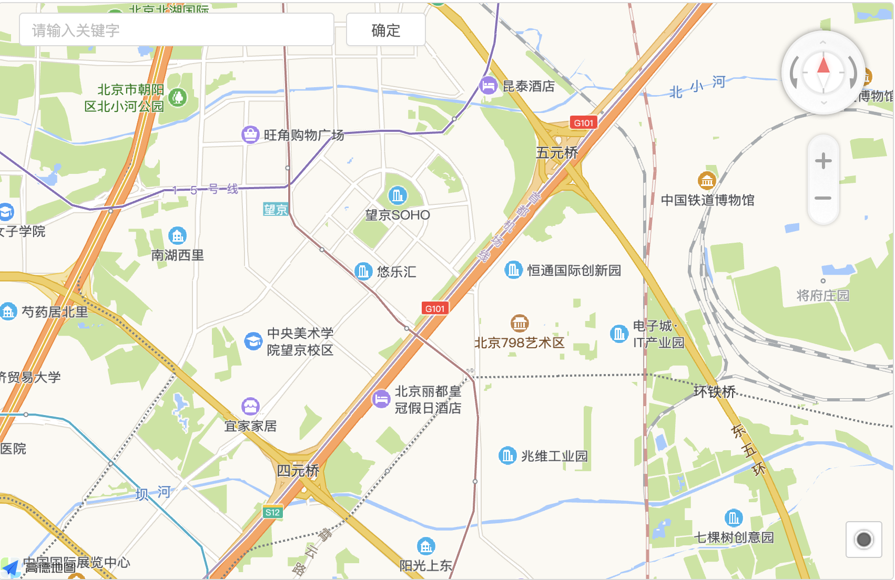
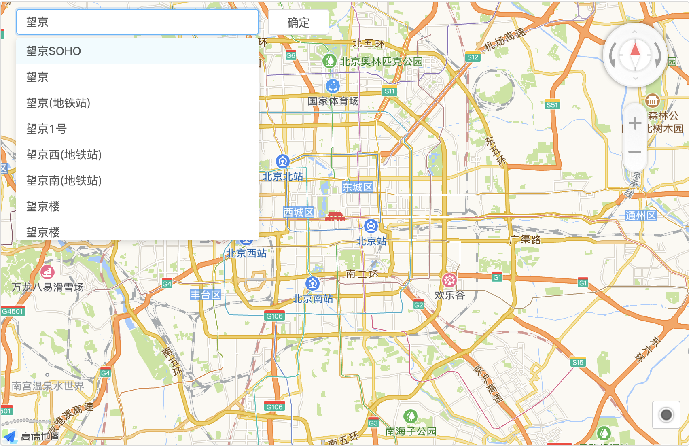
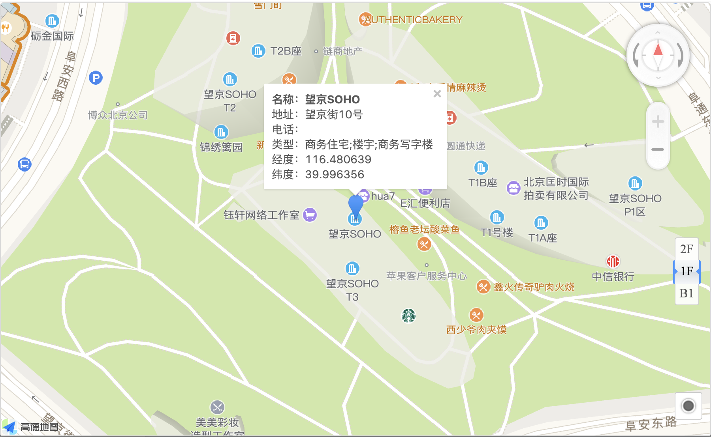

# 地理位置选择 MAP


## 使用方法
```java
@EruptField(
    views = @View(title = "地图"),
    edit = @Edit(title = "地图", type = EditType.MAP)
)
private String map;
```
在resources/public/app.js中配置[高德地图key](https://lbs.amap.com/)
```javascript
window.eruptSiteConfig = {
  amapKey: "高德地图 key",
  amapSecurityJsCode: "高德地图 SecurityJsCode",
  // ....其他配置项
};


/**
 * 高德地图官方不建议直接配置 _AMapSecurityConfig，建议采用nginx代理方式替换下面的写法
 * 详见：https://lbs.amap.com/api/javascript-api/guide/abc/prepare
*/
window._AMapSecurityConfig = {
  securityJsCode:'您申请的安全密钥',
}
```


## 效果演示





> 原文: <https://www.yuque.com/erupt/ispzl2>