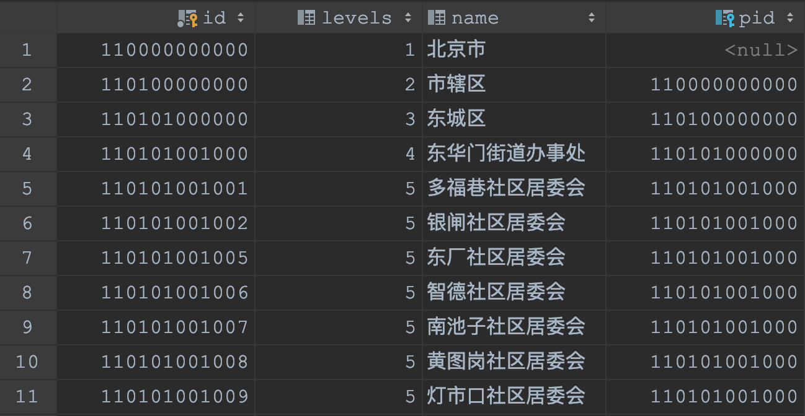

# 多对一树引用 REFERENCE_TREE（联动）


## 使用方法
```java
@ManyToOne //多对一
@JoinColumn(name = "tree_id")
@EruptField(
    edit = @Edit(
         title = "树引用", 
         type = EditType.REFERENCE_TREE,
         referenceTreeType = @ReferenceTreeType(
             id = "id", label = "name", 
             pid = "parent.id" //如果不填pid，展示方式为列表
         )
    )
)
private Tree tree;  //Tree对象为另一个被erupt管理的实体类，定义如下👇
```
```java
@Entity
@Table(name = "TREE")
@Erupt(
        name = "树",
        tree = @Tree(pid = "parent.id")
)
public class Tree extends BaseModel {

    @EruptField(
            views = @View(title = "名称"),
            edit = @Edit(title = "名称")
    )
    private String name;

    @ManyToOne
    @JoinColumn(name = "parent")
    @EruptField(
            edit = @Edit(
                    title = "上级树节点",
                    type = EditType.REFERENCE_TREE,
                    referenceTreeType = @ReferenceTreeType(pid = "parent.id")
            )
    )
    private Tree parent;

}
```

## 配置项注解定义
```java
public @interface ReferenceTreeType {
    String id() default "id";  	   //多对一表中做存储的列

    String label() default "name"; //多对一表中做展示的列

    String pid() default "";       //上级id字段，如果不填，展示方式为列表

    /**
     * 如果上级节点id为null，erupt会认为是根节点，开始渲染树
     * 如果您想要改变这个规则就需要实现@Expr动态返回一个根节点的id
     * 建议与filter配合使用，要不然有可能返回给前端一些不需要渲染的值，导致数据泄露！
     */
    Expr rootPid() default @Expr;
    
    /**
     * 展开层级，如果待渲染的数据量过大建议调低展开层级，可快速渲染几十万的树节点
     */
    int expandLevel() default 999;

    String dependField() default ""; // 依赖字段名称

    //获取dependField所指定字段的值与id列做匹配，获取匹配结果，如：dependField的值 = dependColumn列
    String dependColumn() default "id"; 
}
```


## 代码演示

### 省市区联动
1、先定义Region对象
```java
@Entity
@Table(name = "demo_region")
@Erupt(
        name = "地区"
)
public class Region extends BaseModel {

    @EruptField(views = @View(title = "名称"))
    private String name;

    @EruptField(views = @View(title = "层级"))
    private Integer levels;

    @ManyToOne
    @JoinColumn(name = "pid")
    private Region pid;

}
```
表结构如下：

2、使用 REFERENCE_TREE 或者 REFERENCE_TABLE 实现省市区联动代码
```java
@Erupt(name = "test")
@Table(name = "demo_test")
@Entity
public class RegionLink extends BaseModel {
    
    @ManyToOne
    @JoinColumn(name = "province")
    @EruptField(
            views = @View(title = "省份", column = "name"),
            edit = @Edit(title = "省份", type = EditType.REFERENCE_TREE, filter = @Filter("Region.levels = 1"))
    )
    private Region province;

    @ManyToOne
    @JoinColumn(name = "city")
    @EruptField(
            views = @View(title = "市", column = "name"),
            edit = @Edit(title = "市", type = EditType.REFERENCE_TREE,
                    filter = @Filter("Region.levels = 2"),
                    referenceTreeType = @ReferenceTreeType(dependField = "province", dependColumn = "pid.id")
            )
    )
    private Region city;

    @ManyToOne
    @JoinColumn(name = "area")
    @EruptField(
            views = @View(title = "区", column = "name"),
            edit = @Edit(title = "区", type = EditType.REFERENCE_TREE,
                    filter = @Filter("Region.levels = 3"),
                    referenceTreeType = @ReferenceTreeType(dependField = "city", dependColumn = "pid.id")
            )
    )
    private Region area;
}
```
3、效果展示


### 省市区数据库表sql文件
数据截止于2020年7月21日，数据可能不全，请根据实际项目，酌情下载
[附件: district.sql](./attachments/8O1i73LyCCwKw9eQ/district.sql)


> 原文: <https://www.yuque.com/erupt/xklx9s>