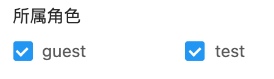

# 多对多复选框 CHECKBOX


## 使用方法
```java
@ManyToMany  //多对多
@JoinTable(
    name = "e_table_tag", //中间表表名，如下为中间表的定义，详见hibernate ManyToMany
    joinColumns = @JoinColumn(name = "table_id", referencedColumnName = "id"),
    inverseJoinColumns = @JoinColumn(name = "tag_id", referencedColumnName = "id"))
@EruptField(
    edit = @Edit(
        title = "复选框",
        type = EditType.CHECKBOX,
        checkboxType = @CheckboxType
    )
)
private Set<Tag> tags; //Tag对象定义如下👇
```
```java
@Entity
@Table(name = "tag")
@Erupt(
        name = "标签表"
)
public class Tag extends BaseModel {

    @EruptField(
            views = @View(title = "名称"),
            edit = @Edit(title = "名称")
    )
    private String name;

    @EruptField(
            views = @View(title = "备注"),
            edit = @Edit(title = "备注")
    )
    private String remark;

}
```

## 配置项注解定义
```java
public @interface CheckboxType {

    //数据列
    String id() default "id";

    //标题展示列
    String label() default "name";

    //备注信息展示列，1.12.3及以上版本支持
    String remark() default "";

}
```

## 效果演示



> 原文: <https://www.yuque.com/erupt/uehx0y>