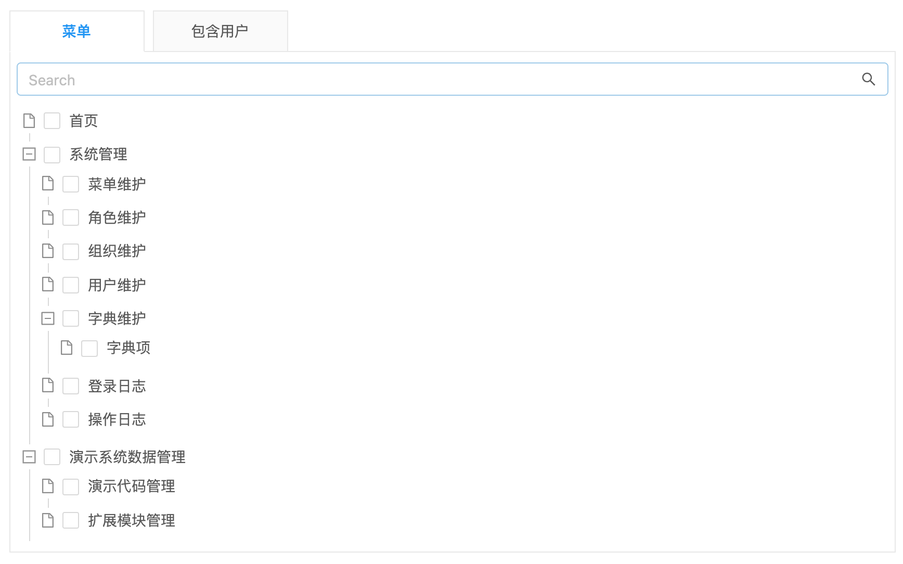

# 多对多树引用 TAB_TREE


## 使用方法
```java
@ManyToMany  //多对多
@JoinTable(
    name = "e_table_tree", //中间表表名，如下为中间表的定义，详见hibernate ManyToMany
    joinColumns = @JoinColumn(name = "table_id", referencedColumnName = "id"),
    inverseJoinColumns = @JoinColumn(name = "tree_id", referencedColumnName = "id"))
@EruptField(
    edit = @Edit(
        title = "多选树",
        type = EditType.TAB_TREE
    )
)
private Set<Tree> treeSet; //Tree对象定义如下👇
```
```java
@Entity
@Table(name = "TREE")
@Erupt(
        name = "树",
        tree = @Tree(id = "id", label = "name", pid = "parent.id")
)
public class Tree extends BaseModel {

    @EruptField(
            views = @View(title = "名称"),
            edit = @Edit(title = "名称")
    )
    private String name;

    @ManyToOne
    @EruptField(
            edit = @Edit(
                    title = "上级树节点",
                    type = EditType.REFERENCE_TREE,
                    referenceTreeType = @ReferenceTreeType(pid = "parent.id")
            )
    )
    private Tree parent;

}
```

## 效果演示



> 原文: <https://www.yuque.com/erupt/nevxl8>