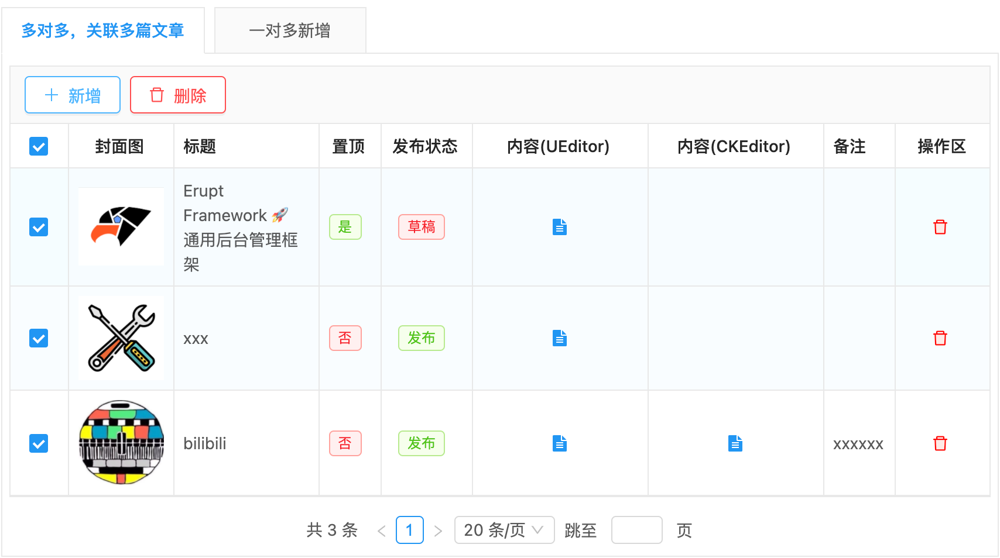
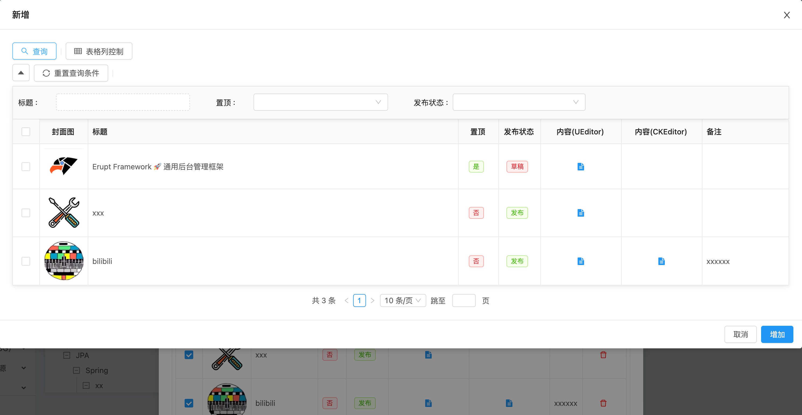

# 多对多表引用  TAB_TABLE_REFER


## 代码演示
```java
@ManyToMany //多对多
@JoinTable(name = "e_this_table", //定义多对多中间表
           joinColumns = @JoinColumn(name = "this_id", referencedColumnName = "id"),
           inverseJoinColumns = @JoinColumn(name = "table_id", referencedColumnName = "id"))
@EruptField(
    edit = @Edit(
        title = "多对多，关联多条数据",
        type = EditType.TAB_TABLE_REFER
    )
)
private Set<Table> tables; //Table对象定义如下👇
```
```java
@Entity
@Table(name = "TABLE")
@Erupt(name = "表格")
public class Table extends BaseModel {
    
    @EruptField(
            views = @View(title = "顺序"),
            edit = @Edit(title = "顺序")
    )
    private Integer sort;

    @EruptField(
            views = @View(title = "名称"),
            edit = @Edit(title = "名称")
    )
    private String name;
    
}
```
注： 一对多的 **Table **表不要使用**Lombok**的 **@Data **注解，该注解会导致set集合去重失效


## 效果演示




> 原文: <https://www.yuque.com/erupt/am01mt>