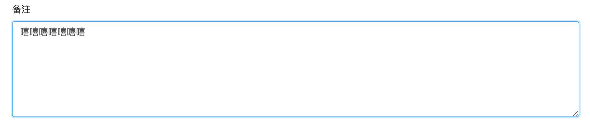

# 多行文本框 TEXTAREA 


## 使用方法
```java
@Lob  //定义数据库类为大文本类型，支持存入更多的数据
@EruptField(
    views = @View(title = "多行文本框"),
    edit = @Edit(title = "多行文本框", type = EditType.TEXTAREA)
)
private String textarea;
```

## 效果演示



> 原文: <https://www.yuque.com/erupt/rug0gy>