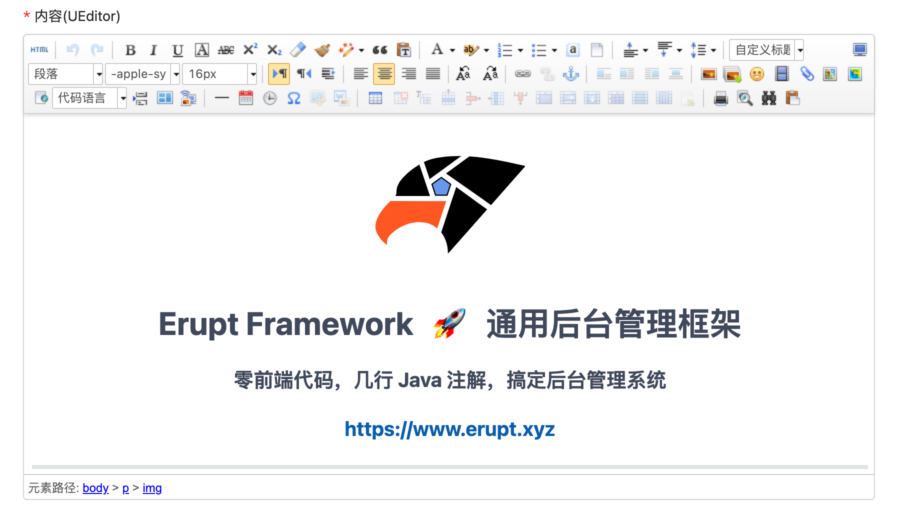

# 富文本编辑器 HTML_EDITOR


## 使用方法
```java
@Lob  //富文本编辑器所产生的文本量较大，所以设置为长字符串类型在数据库中存储
@EruptField(
    edit = @Edit(title = "内容(UEditor)", 
                 type = EditType.HTML_EDITOR, 
                 htmlEditorType = @HtmlEditorType(HtmlEditorType.Type.UEDITOR))
)
private String content;
```

## 配置项注解定义
```java
public @interface HtmlEditorType {

    Type value(); //富文本文本编辑器类别

    enum Type {
        CKEDITOR,   // https://ckeditor.com/ckeditor-5/
        UEDITOR     // http://fex.baidu.com/ueditor/
    }
}
```

## 效果演示
UEditor

CkEditor


> 原文: <https://www.yuque.com/erupt/gebgnr>