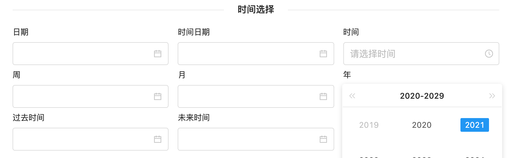

# 日期选择 DATE

输入或选择日期的控件


## 使用方法
如果字段类型为Date可自动推测出组件类型type为DATE
```java
@EruptField(
    edit = @Edit(title = "日期选择")
)
private Date date;
```

## 配置项注解定义
```java
public @interface DateType {

    Type type() default Type.DATE; //展示方式

    PickerMode pickerMode() default PickerMode.ALL;  //选择框使用模式

    enum Type {
        DATE,      //时间
        TIME,      //日期
        DATE_TIME, //日期时间
        MONTH, 	   //月
        WEEK,      //周
        YEAR       //年
    }

    /**
     * 选择器使用模式
     */
    enum PickerMode {
        ALL,     //可选任意时间
        FUTURE,  //仅可选择未来时间
        HISTORY  //仅可选择历史时间
    }
}
```


## 代码演示

#### 日期
```java
@EruptField(
    views = @View(title = "日期"),
    edit = @Edit(title = "日期", type = EditType.DATE, dateType = @DateType(type = DateType.Type.DATE))
)
private Date date;
```

#### 时间
```java
@EruptField(
    views = @View(title = "时间"),
    edit = @Edit(title = "时间", type = EditType.DATE, dateType = @DateType(type = DateType.Type.TIME))
)
private String time;
```

#### 时间日期
```java
@EruptField(
    views = @View(title = "时间日期"),
    edit = @Edit(title = "时间日期", type = EditType.DATE, dateType = @DateType(type = DateType.Type.DATE_TIME))
)
private Date dateTime;
```

#### 周
```java

@EruptField(
    views = @View(title = "周"),
    edit = @Edit(title = "周", type = EditType.DATE, dateType = @DateType(type = DateType.Type.WEEK))
)
private String week;
```

#### 月
```java
@EruptField(
    views = @View(title = "月"),
    edit = @Edit(title = "月", type = EditType.DATE, dateType = @DateType(type = DateType.Type.MONTH))
)
private String month;
```

#### 年
```java

@EruptField(
    views = @View(title = "年"),
    edit = @Edit(title = "年", type = EditType.DATE, dateType = @DateType(type = DateType.Type.YEAR))
)
private String year;

```

#### 过去时间
```java

@EruptField(
    views = @View(title = "过去时间"),
    edit = @Edit(title = "过去时间", type = EditType.DATE, dateType = @DateType(pickerMode = DateType.PickerMode.HISTORY))
)
private String history;
```

#### 未来时间
```java
@EruptField(
    views = @View(title = "未来时间"),
    edit = @Edit(title = "未来时间", type = EditType.DATE, dateType = @DateType(pickerMode = DateType.PickerMode.FUTURE))
)
private String feature;
```


## 效果演示



> 原文: <https://www.yuque.com/erupt/pctxhn>