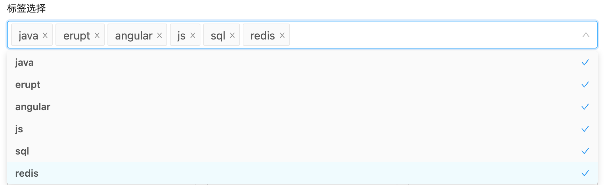

# 标签选择 TAGS


## 使用方法
```java
@EruptField(
    edit = @Edit(title = "标签选择器", 
                 type = EditType.TAGS,
                 tagsType = @TagsType(
                     tags = {"A", "B", "C"}
                 ))
)
private String tags;
```

## 配置项注解定义
```java
public @interface TagsType {

    String joinSeparator() default "|";    //多标签分割标识符

    boolean allowExtension() default true; //是否允许自定义扩展可选值

    String[] tags() default {};   //预定可选值

    String[] fetchHandlerParams() default {}; //可在TagsFetchHandler中获取

    Class<? extends TagsFetchHandler>[] fetchHandler() default {}; //动态获取标签可选值
    
}
```

## 代码演示

#### 动态获取标签选择器可选值
```java
@EruptField(
    edit = @Edit(title = "选择器", 
                 type = EditType.TAGS,
                 tagsType = @TagsType(
                     fetchHandlerParams = {"α", "β", "γ"},
                     fetchHandler = TagsFetchHandlerImpl.class
                 ))
)
private String tags;
```
```java
public class TagsFetchHandlerImpl implements TagsFetchHandler {
    
    /**
     * @param param 注解回传参数
     */
    @Override
    public List<String> fetchTags(String[] params) {
        List<String> list = new ArrayList<>();
        for (String param : params) {
            list.add(param);
        }
        list.add("A");
        list.add("B");
        list.add("C");
        return list;
    }
    
}
```
标签可选值
```basic
├── α
├── β
├── γ
├── A
├── B
└── C
```


## 效果演示



> 原文: <https://www.yuque.com/erupt/ouabbd>