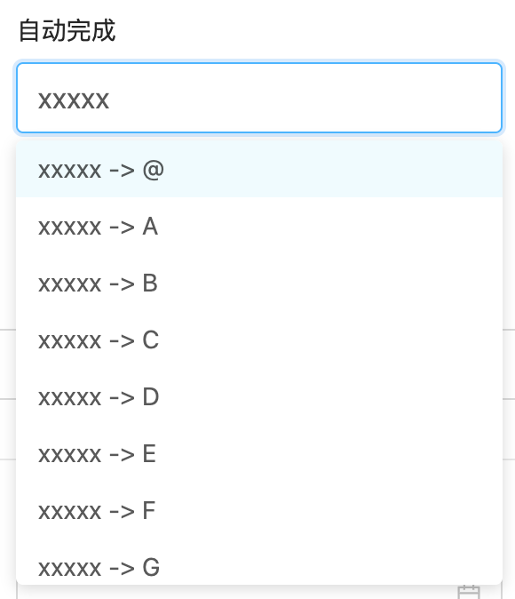

# 自动完成 AUTO_COMPLETE （多组件联动）

**输入框自动联想功能**


## 使用方法
```java
@EruptField(
    edit = @Edit(title = "自动完成",
                 type = EditType.AUTO_COMPLETE,
                 autoCompleteType = @AutoCompleteType(handler = AutoCompleteHandlerImpl.class))
)
private String autoComplete;
```
```java
public class AutoCompleteHandlerImpl implements AutoCompleteHandler{
    
    /**
     * 1.10.11以下版本写法
     * @param val   前端输入值
     * @param param 注解回传参数
     */
	@Override
    public List<Object> completeHandler(String val, String[] param) {
        List<Object> list = new ArrayList<>();
        for (int i = 0; i < 26; i++) {
            list.add(val + " -> " + (char) (i + 64));
        }
        return list;
    }

    /**
     * 1.10.11及以上版本写法
     * @param formData 前端其他组件表单对象值（多组件联动）
     * @param val      前端输入值
     * @param param    注解回传参数
     */
	@Override
    public List<Object> completeHandler(Map<String,Object> formData, String val, String[] param) {
        List<Object> list = new ArrayList<>();
        for (int i = 0; i < 26; i++) {
            list.add(val + " -> " + (char) (i + 64));
        }
        return list;
    }
    
}
```

## 配置项注解定义
```java
public @interface AutoCompleteType {

    Class<? extends AutoCompleteHandler> handler();  //自动完成所触发的方法

    String[] param() default {};   //可被AutoCompleteHandler实现方法接收到

    int triggerLength() default 1; //自动联想触发字符数
}

```


## 效果演示



> 原文: <https://www.yuque.com/erupt/zmosga>