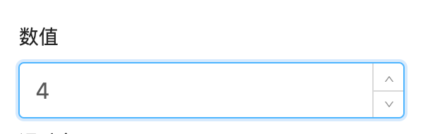

# 计数器 NUMBER

通过鼠标或键盘，输入范围内的数值。


## 使用方法
erupt可用过字段类型自动推测是数值输入框
```java
@EruptField(
    edit = @Edit(title = "数字输入", numberType = @NumberType)
)
private Integer number;
```


## 配置项注解定义
```java
public @interface NumberType {
    long max() default Integer.MAX_VALUE; //可输入最大值

    long min() default -Integer.MAX_VALUE; //可输入的最小值
}
```


## 代码演示

#### 正整数输入
```java
@EruptField(
    edit = @Edit(title = "数字输入", numberType = @NumberType(min = 0))
)
private Integer number;
```

#### 浮点型输入
```java
@EruptField(
    edit = @Edit(title = "数字输入", numberType = @NumberType)
)
private Float number;
```

## 效果演示



> 原文: <https://www.yuque.com/erupt/afc7vc>