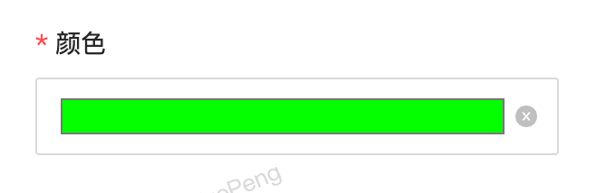
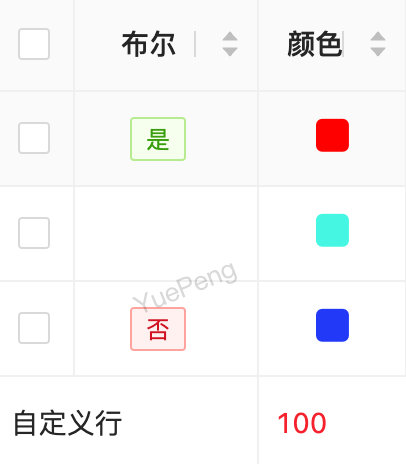

# 颜色选择 COLOR

> 1.12.12 及以上版本支持


## 使用方法
```java
@EruptField(
        views = @View(title = "颜色"),
        edit = @Edit(title = "颜色", type = EditType.COLOR)
)
private String color;
```

**效果演示**




## 


> 原文: <https://www.yuque.com/erupt/bgcqxkvhzoh3nz8h>