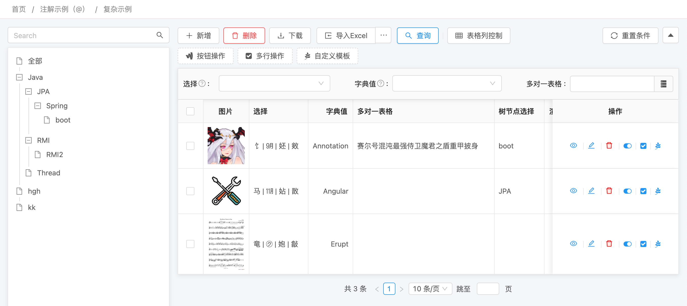

# 左树右表 @LinkTree


## 使用方法
```java
@Erupt(
       name = "Erupt",
       linkTree = @LinkTree(field = "tree") //field 的值为类中支持树组件字段
)
public class EruptTest extends BaseModel {
    
    @ManyToOne
    @JoinColumn(name = "parent")
    //如果 linkTree 配置中 dependNode 值为 true 可以不声明 @EruptField 新增时会自动填充当前选择的树节点
    @EruptField(
        views =  @View(title = "树节点选择", column = "name"),
        edit = @Edit(
            title = "树节点选择", type = EditType.REFERENCE_TREE,
            referenceTreeType = @ReferenceTreeType(pid = "parent.id", expandLevel = 1)
        )
    )
    private Tree tree;
    
}
```
```java
@Erupt(
       name = "Tree",
       tree = @Tree(id = "id", label = "name",pid = "parent.id")
)
public class Tree extends BaseModel {
    
    @EruptField(
            views = @View(title = "名称"),
            edit = @Edit(title = "名称")
    )
    private String name;

    @ManyToOne
    @EruptField(
            edit = @Edit(
                    title = "上级树节点",
                    type = EditType.REFERENCE_TREE,
                    referenceTreeType = @ReferenceTreeType(pid = "parent.id")
            )
    )
    private Tree parent;
    
}
```


## 效果演示



## 配置项注解定义
```java
public @interface LinkTree {

    /**
     * 定义树规则节点的字段名
     * 如果该字段定义了REFERENCE_TREE组件则以该字段的配置来生成树
     * 如果该字段未定义树规则，则根据字段所属类型的erupt配置来生成树
     */
    String field();

    //是否必须通过树节点来获取数据
    //如果设置为true则不会显示全部选项，添加数据时可自动填充树节点的值
    boolean dependNode() default false;

}
```


> 原文: <https://www.yuque.com/erupt/alnepe>