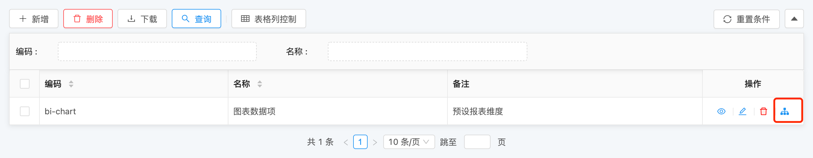
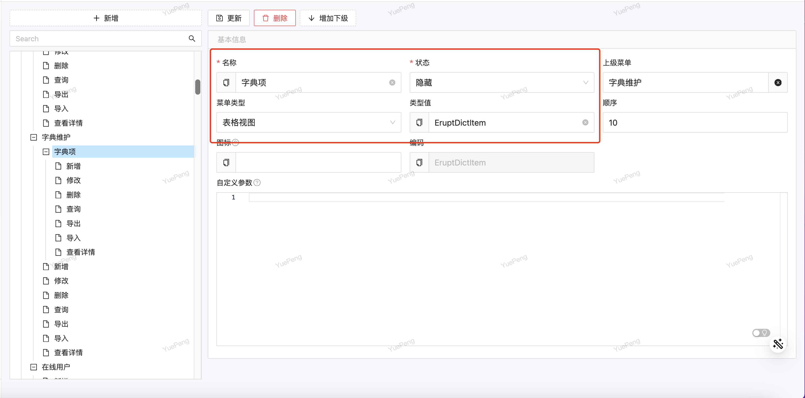

# 数据钻取 @Drill （无需外键，低耦合一对多）

通过一条数据获取其他表与之关联的数据，可做**无限级**表关联使用


## 使用方法
```java
@Erupt(
       name = "TestDrill",
       drills = {
                @Drill(code = "drill", 
                       title = "数据钻取",
                       //最终生成的表达式为：EruptTest.id = DrillErupt.eruptTestId
                       link = @Link(column = "id",                // 当前表关联列
                                    linkErupt = DrillErupt.class, // 目标关联表
                                    joinColumn = "eruptTestId"))  // 目标表关联列
       }
)
@Entity
@Table
public class EruptTest extends BaseModel {
    
}
```
```java
@Erupt(name = "下钻类")
@Entity
@Table
public class DrillErupt extends BaseModel {
    
    // EruptTest 表的主键
    private Long eruptTestId;
    
    @EruptField(
            views = @View(title = "文本"),
            edit = @Edit(title = "文本", notNull = true)
    )
    private String input;
    
    ....
    
}
```
注意：DrillErupt 需要增加菜单权限否则会报 403 错误



## 下钻菜单权限配置（下钻提示 403）
如：字典可下钻到字典项
需将字典项的类名称添加到菜单，类型：表格视图，状态：隐藏



## 注解配置项说明
```java
public @interface Drill {

    //编码，下钻的唯一标识
    String code();

    //名称
    String title();
    
	//图标，请参考font awesome
    String icon() default "fa fa-sitemap";
    
    //动态控制按钮显示，详见：https://www.yuque.com/erupts/erupt/gaing7#HaZs4
    ExprBool show() default @ExprBool;

    Link link(); //Link注解定义如下 👇
    
}
```
```java
public @interface Link {
    
    //关联的erupt类
    Class<?> linkErupt();

    //关联的erupt类中的关联字段
    String joinColumn();
    
    //原始类中的关联字段
    String column() default "id";

    //关联时额外条件
    String linkCondition() default "";

    //结果预览：this.column = linkErupt.joinColumn [ and {linkCondition}]

}
```


> 原文: <https://www.yuque.com/erupt/uk1to5>