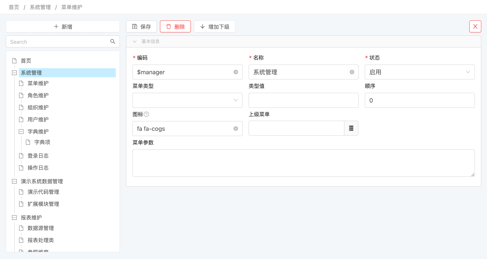

# 树形展示 @Tree


## 使用方法
```java
@Erupt(
       name = "Tree",
       tree = @Tree(id = "id", label = "name", pid = "parent.id", expandLevel = 1)
)
public class Tree extends BaseModel {
    
    @EruptField(
            views = @View(title = "名称"),
            edit = @Edit(title = "名称")
    )
    private String name;

    @ManyToOne
    @JoinColumn(name = "parent")
    @EruptField(
            edit = @Edit(
                    title = "上级树节点",
                    type = EditType.REFERENCE_TREE,
                    referenceTreeType = @ReferenceTreeType(pid = "parent.id")
            )
    )
    private Tree parent;
    
}
```
配置完成后启动项目，前往 系统管理 → 菜单维护 → 新增 → 菜单类型选择为树，类型值为类名称即可使用树视图！


## 配置项注解定义
```java
public @interface Tree {

    String id() default "id"; //存储的列

    String label() default "label"; //展示列

    String pid() default ""; //为空则以列表方式渲染
    
    /**
     * 展开层级，如果待渲染的数据量过大建议调低展开层级，可快速渲染几十万的树节点
     */
    int expandLevel() default 999;

    /**
     * 如果上级节点id为null，erupt会认为是根节点，开始渲染树
     * 如果您想要改变这个规则就需要实现@Expr动态返回一个根节点的id
     * 建议与filter配合使用，要不然有可能返回给前端一些不需要渲染的值，导致数据泄露！
     */
    Expr rootPid() default @Expr;

}
```

## 效果展示



> 原文: <https://www.yuque.com/erupt/rz3beg>