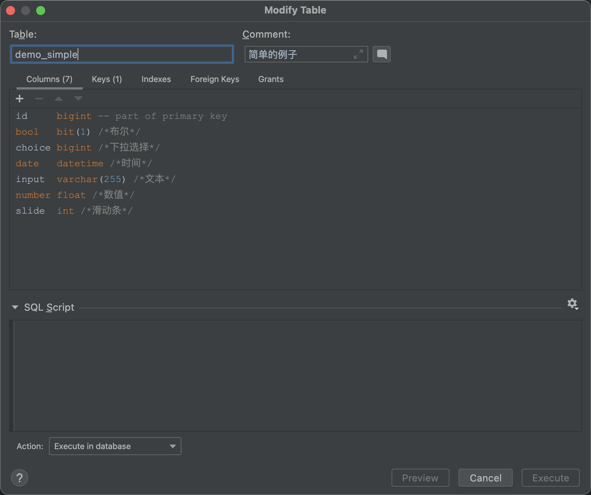

# 🌈 入门示例

**使用 erupt 创建后台管理页面的方式十分简单，一个Java类文件就可以办到，Java类代码如下：**
```java
package xyz.erupt.example.model;

import org.hibernate.annotations.GenericGenerator;
import xyz.erupt.annotation.Erupt;
import xyz.erupt.annotation.EruptField;
import xyz.erupt.annotation.sub_field.Edit;
import xyz.erupt.annotation.sub_field.View;

import javax.persistence.*;


/*
 *	@Erupt注解修饰在类上，@EruptField注解修饰在字段上
 *	其他注解均为Jpa注解
 */
@Erupt(name = "简单的例子")
@Table(name = "demo_simple")
@Entity
public class Simple {

    //主键
    @Id
    @GeneratedValue(generator = "generator")
    @GenericGenerator(name = "generator", strategy = "native")
    @Column(name = "id")
    @EruptField
    private Long id; //如果继承BaseModel不要再重复声明id

    //文本输入
    @EruptField(
            views = @View(title = "文本"),
            edit = @Edit(title = "文本")
    )
    private String input;
    
    //数值输入
    @EruptField(
            views = @View(title = "数值"),
            edit = @Edit(title = "数值")
    )
    private Integer number = 100;  //默认值100

    //布尔选择
    @EruptField(
            views = @View(title = "布尔"),
            edit = @Edit(title = "布尔")
    )
    private Boolean bool;

    //时间选择
    @EruptField(
            views = @View(title = "时间"),
            edit = @Edit(title = "时间")
    )
    private Date date;

}
```

**启动项目将类绑定到菜单即可，**步骤如下：
操作说明：登录后前往系统管理 → 菜单维护界面，点击新增按钮，**菜单类型选择表格，类型值为Simple** 点击保存，刷新后访问该菜单即可。

**_数据库__表__与__注释__都会自动生成_**


## 

**更多示例代码请前往：**[**https://www.erupt.xyz/#!/contrast**](https://www.erupt.xyz/#!/contrast)

**Erupt支持的**[**组件**](https://www.yuque.com/erupts/erupt/cqgoo9)**多达23类，可根据实际需求灵活的配置**

**实际开发中仅需了解 **[**@Erupt**](https://www.yuque.com/erupts/erupt/mzi9ry)** 注解配置与 **[**@EruptFIeld**](https://www.yuque.com/erupts/erupt/mzi9ry)** 注解配置即可。**


> 原文: <https://www.yuque.com/erupt/waztcb>