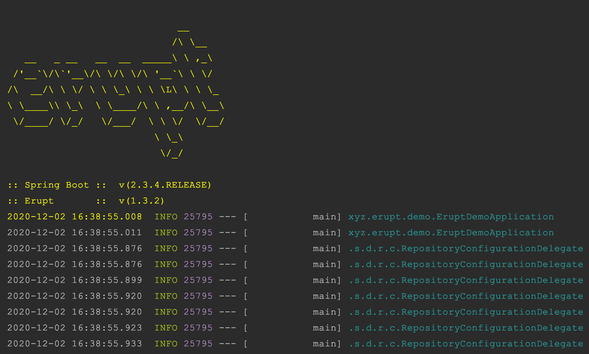
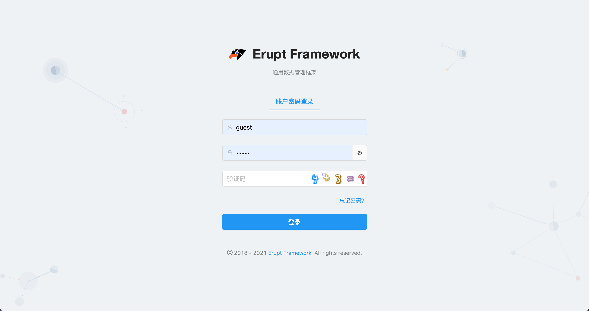
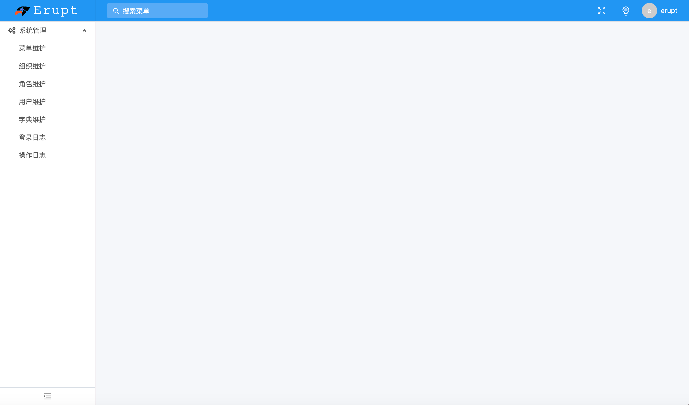
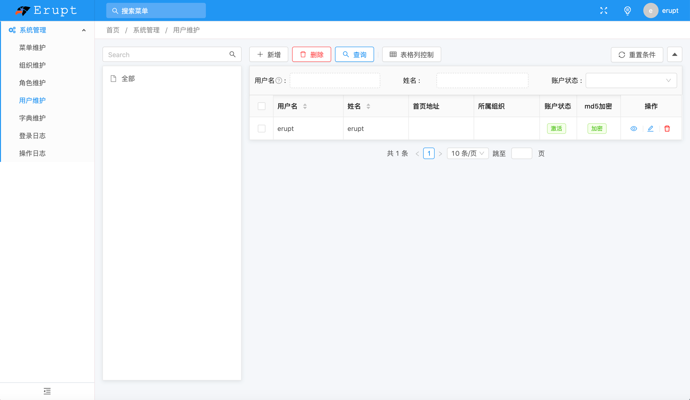
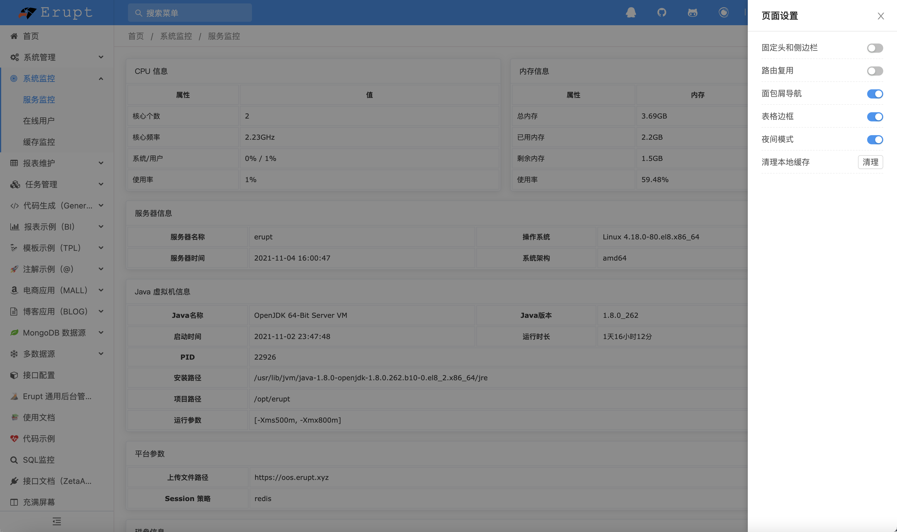

# 🌋 快速部署


### 环境要求
- Java 版本 **1.8.0** 及以上（支持 **GraalVM）**
- Spring Boot 版本 **2.X** （暂不支持Spring Boot 3）
- 浏览器要求** IE11** 以上，或其他现代浏览器
- 服务器配置 1核、1G 即可


### 前置知识

- Java、[Tomcat](https://tomcat.apache.org/)、[Maven](https://maven.apache.org)
- [Spring Boot](https://spring.io)、JPA
- Database：SQL +  MySQL / PostgreSQL / SQL Server / H2 / Oracle


### 开始部署
> **如果你觉得麻烦，可在如下仓库中拉取已配置好的演示代码**
> 码云：   [https://gitee.com/erupt/erupt-example](https://gitee.com/erupt/erupt-example)
> Github：[https://github.com/erupts/erupt-example](https://github.com/erupts/erupt-example)
> 注：不兼容 spring-boot-devtools，请勿添加此依赖


1. **创建Spring Boot项目 → **[**Spring Initializr，**](https://start.spring.io)目录结构如下：
> 暂不支持 spring boot 3.0 请使用 2.7版本

```basic
demo -- 项目名称
├── src
     └── main
     			├── java -- 代码文件目录
                └── com.example.demo -- 包名
											└── DemoApplication -- 入口类
				  └── resources -- 资源文件目录
								└── application.properties -- 配置文件
├── ......
└── pom.xml -- Maven依赖配置
```

2. **在pom.xml添加erupt依赖包，版本号详见：**[🕹 更新日志](https://www.yuque.com/erupts/erupt/wdic2w?view=doc_embed)
```xml
<!--后端权限逻辑-->
<dependency>
  <groupId>xyz.erupt</groupId>
  <artifactId>erupt-admin</artifactId>
  <version>${erupt.version}</version>
</dependency>
<!--后台WEB界面-->
<dependency>
  <groupId>xyz.erupt</groupId>
  <artifactId>erupt-web</artifactId>
  <version>${erupt.version}</version>
</dependency>
```
${erupt.version} 参考版本号如下：(注意：spring boot版本号最好与erupt要求版本一致)[
](https://www.yuque.com/yuepeng/erupt/wdic2w)
[🕹 更新日志](https://www.yuque.com/erupts/erupt/wdic2w?view=doc_embed)

3. **在资源目录下创建如下配置文件**
| 文件位置 | 功能说明 | 详细配置 |
| --- | --- | --- |
| resources/public/app.js | 前端配置文件，可修改标题、Logo，页面生命周期函数等。 | [#](https://www.yuque.com/erupts/erupt/gtp7iw#eqee9) |
| resources/public/app.css | 前端样式文件**（可不创建）** | [#](https://www.yuque.com/erupts/erupt/gtp7iw#ZrSVa) |
| resources/public/home.html | 前端首页布局**（不创建，首页会出现404）** | [#](https://www.yuque.com/erupts/erupt/gtp7iw#RiQJO) |

4. **在 application.yml / application.properties 中添加数据库配置与JPA配置**

示例数据库为mysql，其他数据库请参考：[💾 数据源支持](https://www.yuque.com/erupts/erupt/ku7vx4?view=doc_embed)
```r
spring.datasource.url=jdbc:mysql://127.0.0.1:3306/erupt?useUnicode=true&characterEncoding=UTF-8&serverTimezone=Asia/Shanghai
spring.datasource.username=root
spring.datasource.password=123456
spring.jpa.show-sql=true
spring.jpa.generate-ddl=true
spring.jpa.database=mysql
```
```yaml
spring:
  datasource:
    url: jdbc:mysql://127.0.0.1:3306/erupt?useUnicode=true&characterEncoding=UTF-8&serverTimezone=Asia/Shanghai
    username: root
    password: 123456
  jpa:
    show-sql: true
    generate-ddl: true
    database: mysql
```
注：空库即可，表结构会自动创建

5. **pom.xml中添加对应数据库驱动包，如下为Mysql示例，其他数据库驱动添加对应的pom依赖即可**
```xml
<dependency>
  <groupId>mysql</groupId>
  <artifactId>mysql-connector-java</artifactId>
  <version>8.0.16</version>
  <scope>runtime</scope>
</dependency>
```

6. Spring Boot入口类添加** @EntityScan**、**@EruptScan **注解
```java
package com.example.demo;

@SpringBootApplication
@EntityScan
@EruptScan
public class DemoApplication {
    public static void main(String[] args) {
        SpringApplication.run(DemoApplication.class, args);
    }
}
```

7. **启动项目**



8. 启动成功后浏览器访问：[http://localhost:8080](http://localhost:8080/)

默认用户名密码：erupt / erupt （为了您的系统安全请尽快修改默认密码）
[](https://www.erupt.xyz/demo)
[](https://www.erupt.xyz/demo)



### 启动成功后无法登陆
如果默认密码无法登陆，请前往数据库查看是否有用户数据，如果表为空，在项目中找到 .erupt 文件删除后重启即可，详见：
[ 🔭 常见问题 FAQ](https://www.yuque.com/erupts/erupt/vr4md2?view=doc_embed&inner=PQuoK)


> 原文: <https://www.yuque.com/erupt/tpq1l9>