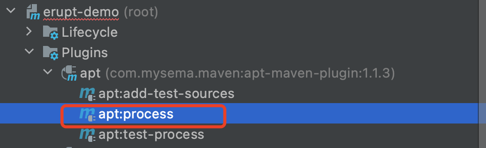

# ORM动态查询 erupt-dsl

QueryDSL仅仅是一个通用的查询框架，专注于通过 JavaAPI 构建类型安全的 Sql 查询，也可以说 QueryDSL 是基于各种 ORM 框架以及 Sql 之上的一个通用的查询框架，QueryDSL 的查询，类似于 SQL 查询，很全面只不过一个是用 SQL 一个是用代码来代替 SQL


## 使用方法

### 1、Maven配置
```xml
<!-- dependencies  配置 -->
<dependency>
  <groupId>com.github.wjw465150</groupId>
  <artifactId>erupt-dsl</artifactId>
  <version>1.7.3</version>
</dependency>
<dependency>
  <groupId>com.querydsl</groupId>
  <artifactId>querydsl-jpa</artifactId>
  <version>4.4.0</version>
</dependency>
<dependency>
  <groupId>com.querydsl</groupId>
  <artifactId>querydsl-apt</artifactId>
  <version>4.4.0</version>
  <scope>provided</scope>
</dependency>


<!-- build → plugins  配置 -->
<plugin>
  <groupId>com.mysema.maven</groupId>
  <artifactId>apt-maven-plugin</artifactId>
  <version>1.1.3</version>
  <executions>
    <execution>
      <goals>
        <goal>process</goal>
      </goals>
      <configuration>
        <outputDirectory>target/generated-sources/java</outputDirectory>  <!-- 设定生成的Q类存放的位置  -->
        <processor>com.querydsl.apt.jpa.JPAAnnotationProcessor</processor>
        <options>
          <querydsl.excludedPackages>xyz.erupt.upms,xyz.erupt.bi</querydsl.excludedPackages>  <!-- 设定QueryDsl要排除的包(逗号来分割) -->
        </options>
      </configuration>
    </execution>
  </executions>
</plugin>
```

### 2、Bean注入
```java
@PersistenceContext
private EntityManager entityManager;

@Bean
public JPAQueryFactory jpaQueryFactory() {
    return new JPAQueryFactory(entityManager);
}
```

### 3、Q 类生成
执行Maven，process命令，生成可调用的Q类
Q类：是以Q开始的Jpa实体类，用于 DSL 调用

### 

### 4、使用方式
```java
@Resource
private JPAQueryFactory jpaQueryFactory;

public void test(){
    // Q 开头的类为生成的快捷查询类
	List<String> qEruptUser = jpaQueryFactory.select(QEruptUser.eruptUser.name)
        .from(QEruptUser.eruptUser).fetch();
    for (String s : qEruptUser) {
        System.out.println(s);
    }
}

/**
输出结果：
	erupt
	guest
	test
**/
```

## 作者主页
[https://github.com/wjw465150](https://github.com/wjw465150)


## 开源地址
[https://github.com/wjw465150/erupt-dsl](https://github.com/wjw465150/erupt-dsl)


## 详细文档
[附件: SpringDataJPA配合QueryDSL玩转态动条件&投影查询.pdf](./attachments/e3B4qCStir8j6dWb/SpringDataJPA配合QueryDSL玩转态动条件&投影查询.pdf)


> 原文: <https://www.yuque.com/erupt/yf36yv>