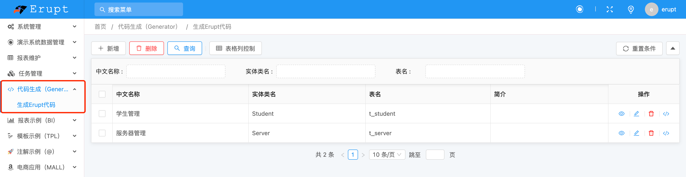
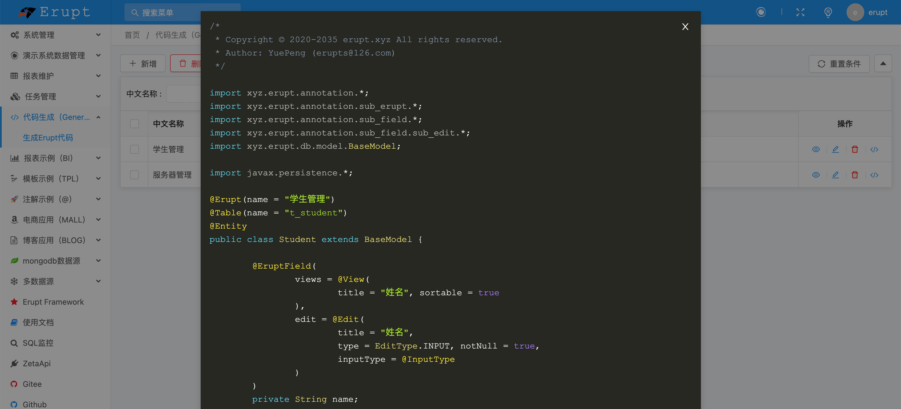

# 代码生成器 erupt-generator


## Generator
在导入erupt的前提下，pom.xml 加入如下依赖（1.6.1版本开始支持）
```xml
<!-- 代码生成器模块 -->
<dependency>
  <groupId>xyz.erupt</groupId>
  <artifactId>erupt-generator</artifactId>
  <version>${erupt.version}</version>
</dependency>
```
导入成功后重启即可看到代码生成相关菜单



将生成的代码，复制或下载添加到项目中，重启项目，将类添加到菜单即可！


## EZDML
从数据库快速生成代码可使用该数据管理工具辅助完成：[http://www.ezdml.com](http://www.ezdml.com/)


> 原文: <https://www.yuque.com/erupt/aehm3n>