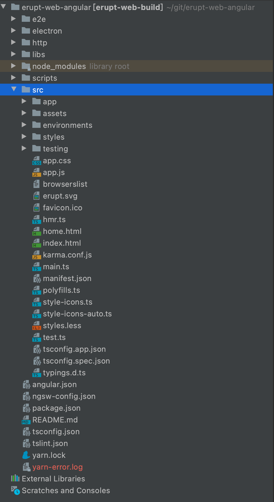

# 前端源码 erupt-web

本模块为 erupt 前端源码，使用 angular 编写，语言为 TypeScript + Less + HTML

如果有自定义页面或自定义弹出层的需求，直接使用 [erupt-tpl](https://www.yuque.com/erupts/gd8zod/wzmdu2) + [erupt-tpl-ui](https://www.yuque.com/erupts/gd8zod/ow6ewh) 模块即可，无需修改前端源码

如要修改 **logo** 标题等配置，可使用 [app.js](https://www.yuque.com/erupts/erupt/gtp7iw#eqee9) 进行配置

如果要修改 **css** 样式使用 [app.css](https://www.yuque.com/erupts/erupt/gtp7iw#ZrSVa) 覆盖原有样式即可

---

**仓库地址**

| Github | 码云 |
| --- | --- |
| [https://github.com/erupts/erupt-web](https://github.com/erupts/erupt-web) | [https://gitee.com/erupt/erupt-web](https://gitee.com/erupt/erupt-web) |

> 原文: <https://www.yuque.com/erupt/sqdd3r>