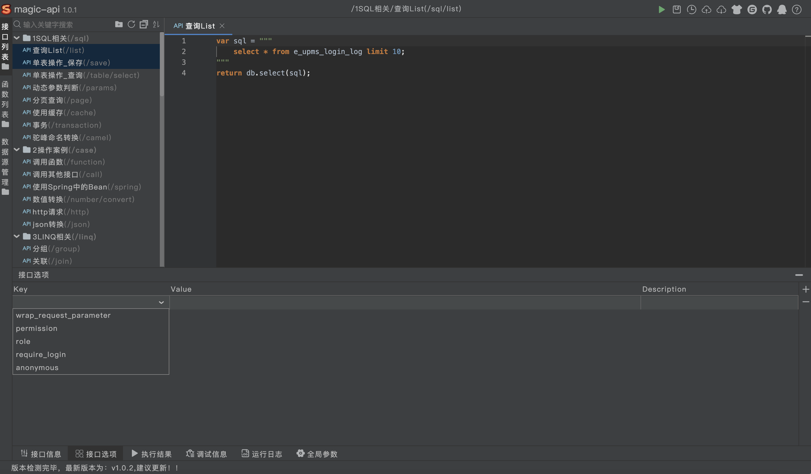

# 在线接口开发 erupt-magic-api


## 简介 
magic-api 是一个基于Java的接口快速开发框架，编写接口将通过magic-api提供的UI界面完成，自动映射为HTTP接口，无需定义Controller、Service、Dao、Mapper、XML、VO等Java对象即可完成常见的HTTP API接口开发

**在线IDE：**提供Web页面，在线编写脚本，在线DEBUG，脚本编辑之后无需重启，自动热更新！

**丰富功能：**热更新、代码生成、分页、Redis、MongoDB、各种函数库

**官网地址：**[https://ssssssss.org](https://ssssssss.org/)


## 使用方式

1、添加依赖
```xml
<dependency>
  <groupId>xyz.erupt</groupId>
  <artifactId>erupt-magic-api</artifactId>
  <version>${erupt.version}</version>
</dependency>
```
2、application.yml / application.properties 添加如下配置
```yaml
magic-api:
  web: /magic/web
  # 接口配置文件存放路径，可存储到数据库表或redis中，详见：https://www.ssssssss.org/magic-api/pages/config/spring-boot/#type
  resource.location: D:/erupt/magic-script
```
3、启动项目即可，左侧菜单新增 ‘接口配置’ 菜单
4、更多使用方法详见：[https://ssssssss.org](https://ssssssss.org/)


## 接口权限校验
使用erupt-magic-api可以融合erupt提供的权限校验功能，保证接口安全调用

使用方法：选中接口 → 点击接口选项 → 点击右侧添加按钮，即可看到下图配置，权限校验支持多个累加


| permission | 允许拥有菜单权限的访问（对应菜单类型值） |
| --- | --- |
| role | 允许拥有该角色的访问（对应角色编码） |
| require_login | 该接口需要登录才允许访问 |

注意：前端请求时要携带token，详见：[https://www.yuque.com/erupts/erupt/nitieg#MSJrc](https://www.yuque.com/erupts/erupt/nitieg#MSJrc)


> 原文: <https://www.yuque.com/erupt/knhqom>