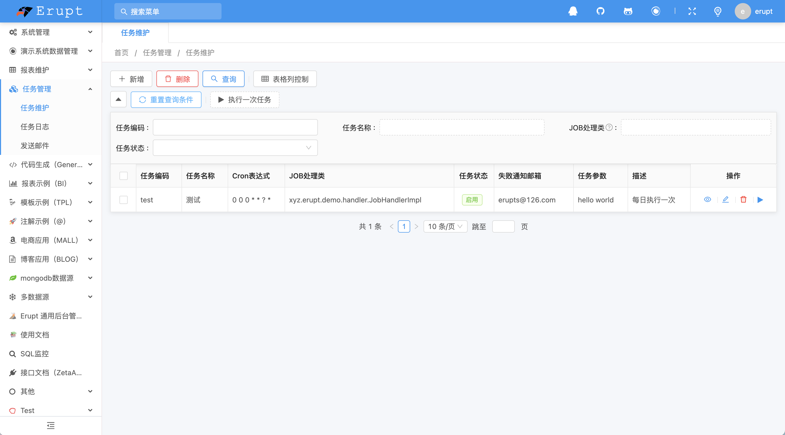
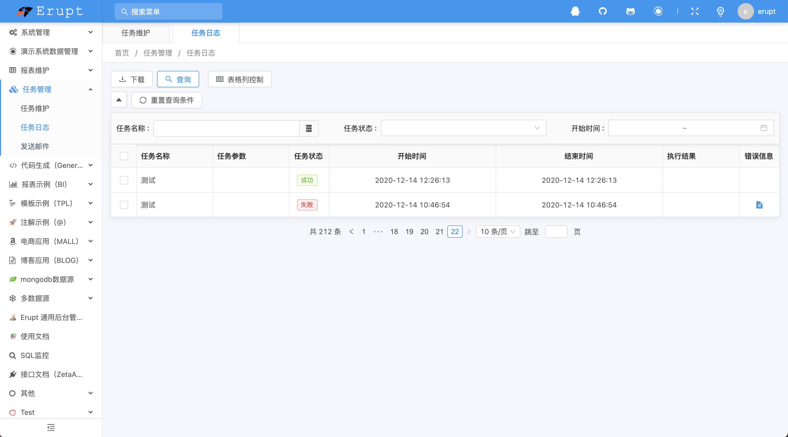
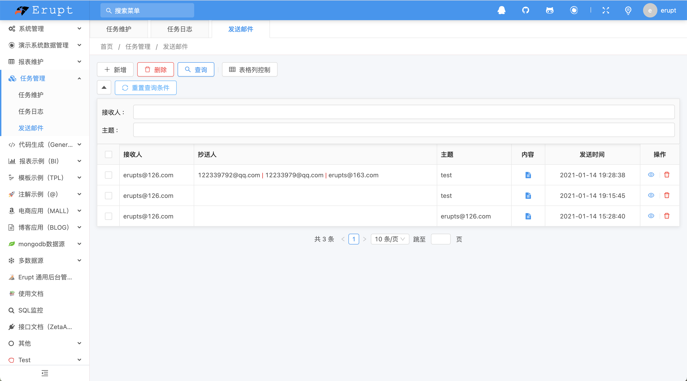
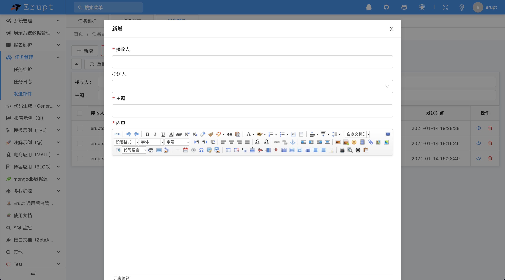
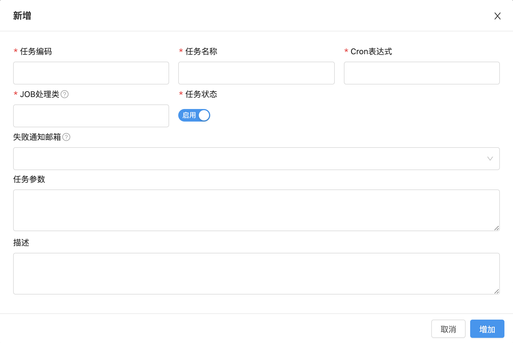

# 定时任务 erupt-job


## 使用方法
在导入erupt的前提下，导入erupt-job依赖
```xml
<dependency>
  <groupId>xyz.erupt</groupId>
  <artifactId>erupt-job</artifactId>
  <version>${erupt.version}</version>
</dependency>
```
application.yml中增加邮件配置（1.7.1 及以上版本，如不需要邮件发送功能可跳过该配置）
> 1.12.14 及以上版本，配置后任务维护会出现“失败通知邮箱配置”表单

```yaml
spring:
  mail:
    username: xxxxxx@qq.com
    password: 123456
    host: smtp.exmail.qq.com
    port: 465
    properties:
      mail.smtp.ssl.auth: true
      mail.smtp.ssl.enable: true
      mail.smtp.ssl.required: true
```
配置成功后启动后效果如下，自动增加了**任务维护、任务日志、发送邮件**菜单！

### 任务维护



### 任务日志
可查看任务的执行时间，执行参数，任务状态等重要信息


### 发送邮件
application.yml 中配置的邮箱作为发送者，支持发送富文本内容到指定邮箱。



## 配置定时任务

### 定义处理类
处理类必须实现 **EruptJobHandler** **接口**
```java
package xyz.erupt.demo.handler;

@Service
@EruptHandlerNaming("自定义任务")  // 如果不添加此配置，类名会作为前端展示依据
public class JobHandlerImpl implements EruptJobHandler {

    /**
     * @param code 任务编码
     * @param param 任务参数
     */
    @Override
    public String exec(String code, String param) throws Exception {
        // TODO
        return null;
    }
    
}

```

### 配置任务
**在任务维护页面，点击新增按钮，即可看到如下对话框：**

**配置项说明**

| 任务编码 | 任务唯一标识 |
| --- | --- |
| 任务名称 | 任务名称 |
| Cron表达式 | 控制任务执行周期，详见：[https://cron.qqe2.com](https://cron.qqe2.com/) |
| Job处理类 | 只需实现 **xyz.erupt.job.handler.EruptJobHandler **接口，job处理类就会自动获取到所有实现该接口的类 |
| 任务状态 | 设置任务的启停 |
| 失败通知邮箱 | 在任务执行失败时，发送给通知邮箱列表，可填写多个 |
| 任务参数 | 可在任务处理类中获取到该配置的值 |
| 描述 | 描述信息 |


## EruptJobHandler 接口说明
```java
public interface EruptJobHandler {

    /**
     * 任务处理类
     *
     * @param param 任务编码
     * @param param 页面配置参数
     * @return 执行结果
     * @throws Exception ex
     */
    String exec(String code, String param) throws Exception;

    /**
     * 成功事件回调
     *
     * @param result 执行结果
     * @param param  页面配置参数
     */
    default void success(String result, String param) {
    }

    /**
     * 失败事件回调
     *
     * @param throwable 异常对象
     * @param param     页面配置参数
     */
    default void error(Throwable throwable, String param) {
    }

}
```


> 原文: <https://www.yuque.com/erupt/dyx3r9>