# 工作流 erupt-flow

仓库地址：[https://github.com/hlhutu/erupt/tree/flow/erupt-extra/erupt-flow](https://github.com/hlhutu/erupt/tree/flow/erupt-extra/erupt-flow)
作者： **TOMDOG9527 (QQ:**749863487 **)**

# 插件简介
**完全零技术的自定义流程+自定义表单。无需技术，小白用户皆可使用。**
前端基于vue+elemntui开发，风格参考于钉钉的审批。
后端基于erupt框架的自研流程引擎，设计思路参考acvititi。

- 演示地址：[http://119.23.65.238:8080/](http://119.23.65.238:8080/)
- 账号密码：erupt/erupt123（请勿修改密码！）

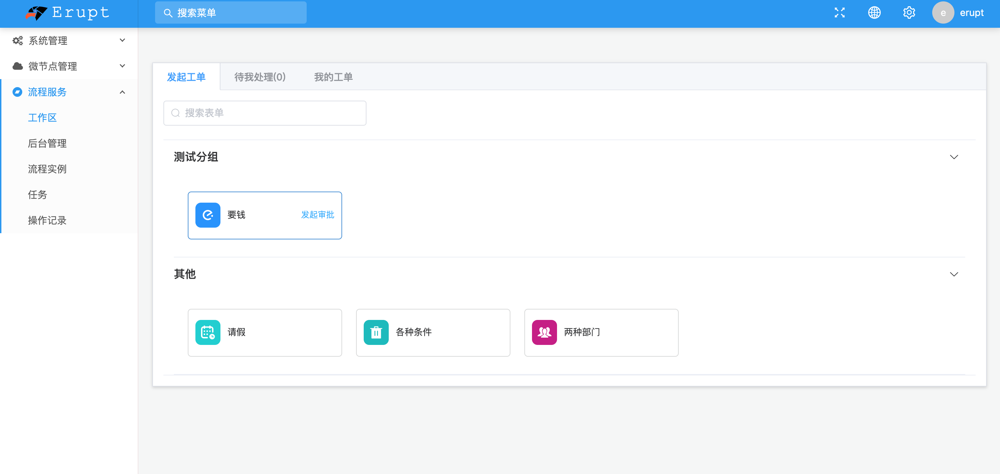
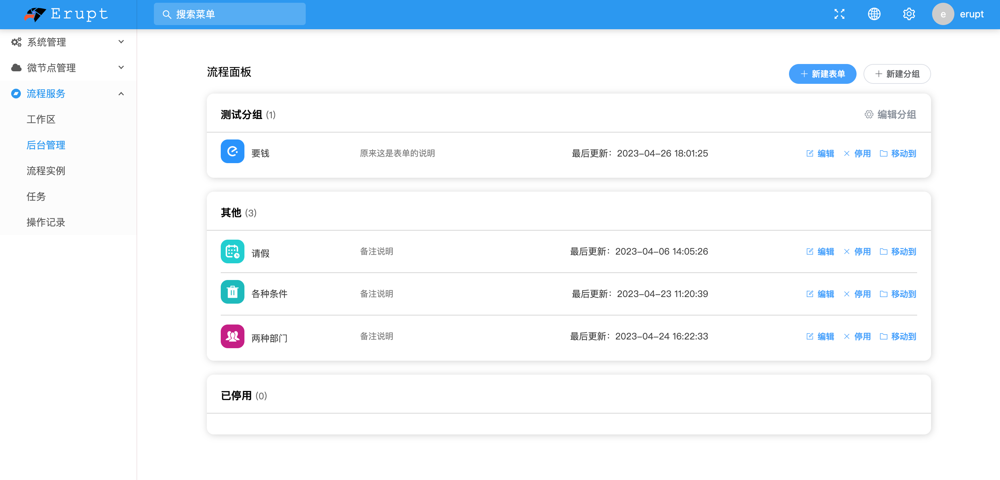
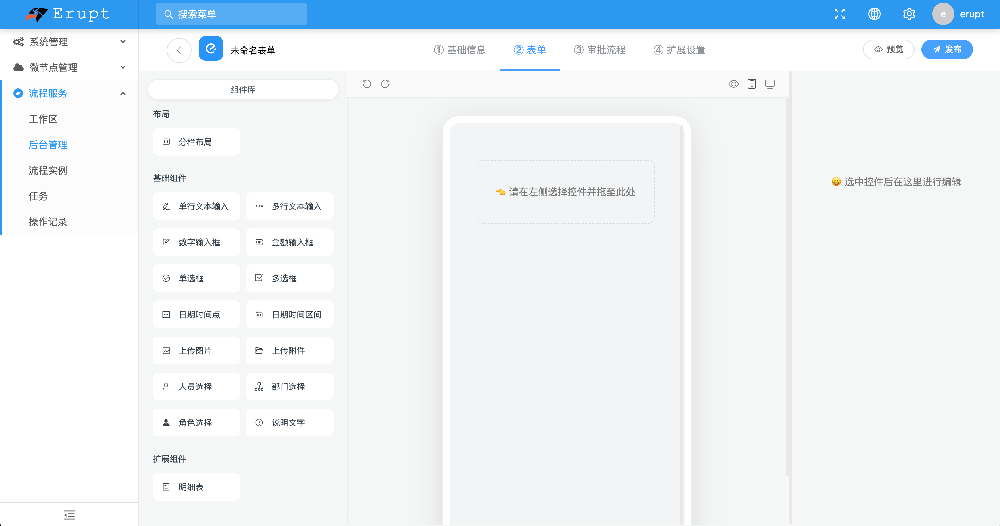
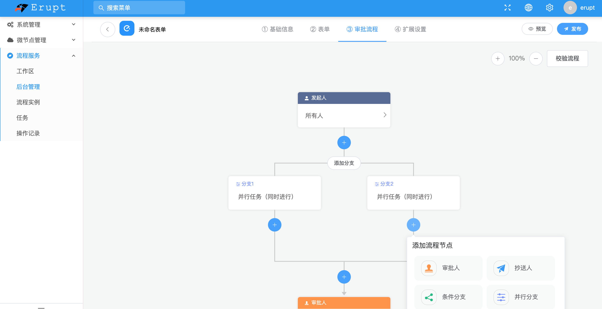

# 快速开始

## 导入依赖
```xml
<dependency>
  <groupId>xyz.erupt</groupId>
  <artifactId>erupt-flow</artifactId>
  <!-- 版本号与erupt同步 -->
  <version>${erupt.version}</version>
</dependency>
```

## 重启项目
登录之后，可以看到自动生成了几个菜单


## 绘制流程图
在“后台管理”绘制流程图
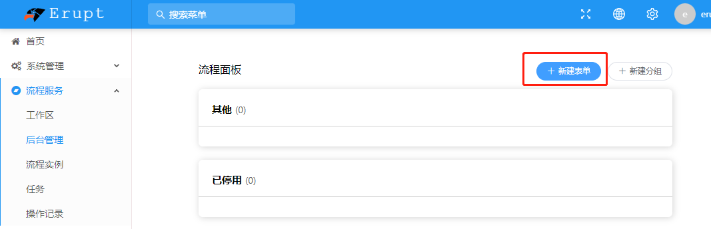
按步骤操作
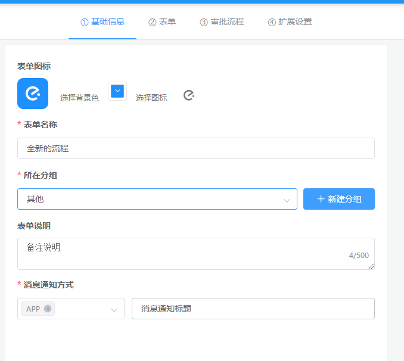
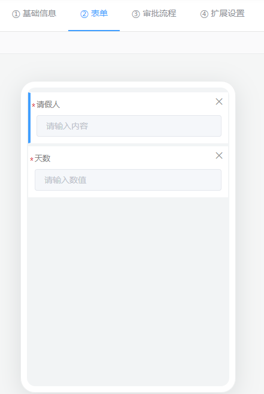
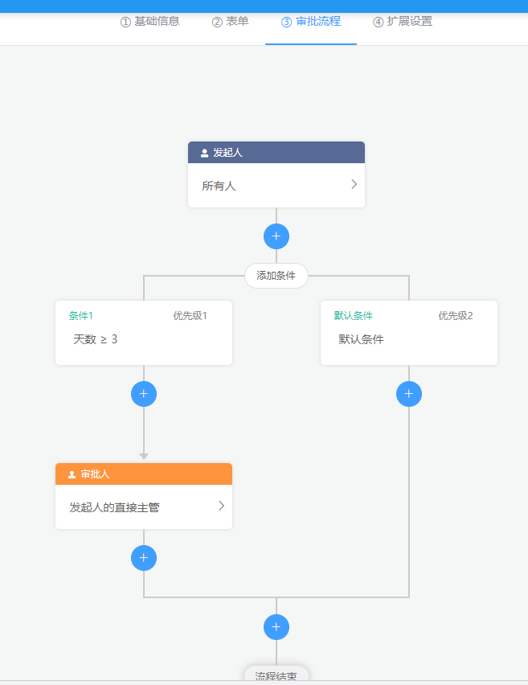
绘制完成点击右上角发布即可
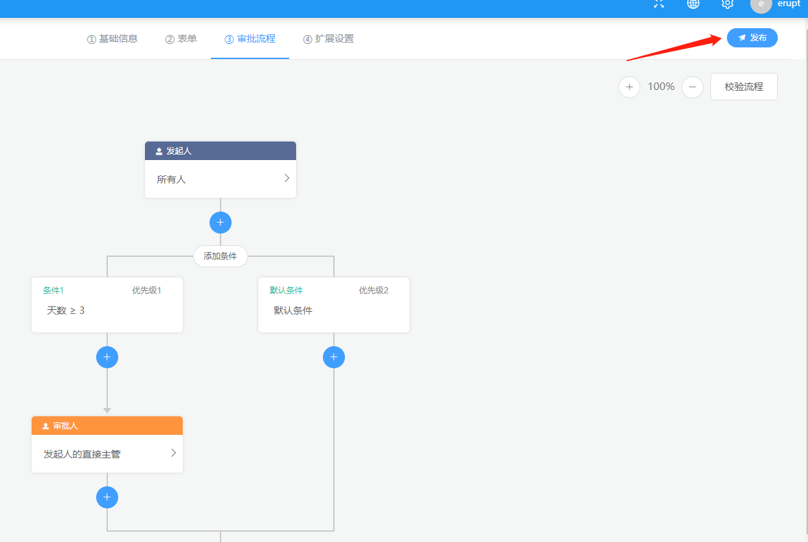


## 发起流程
发布成功后，在“工作区”发起工单

填写表单然后提交
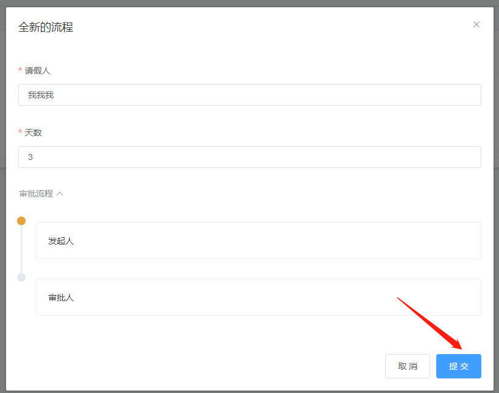
工作流会流转到下一个需要处理用户。在他的“待我处理”中可以进行处理
这里为了方便，我把审批人改成发起人自己。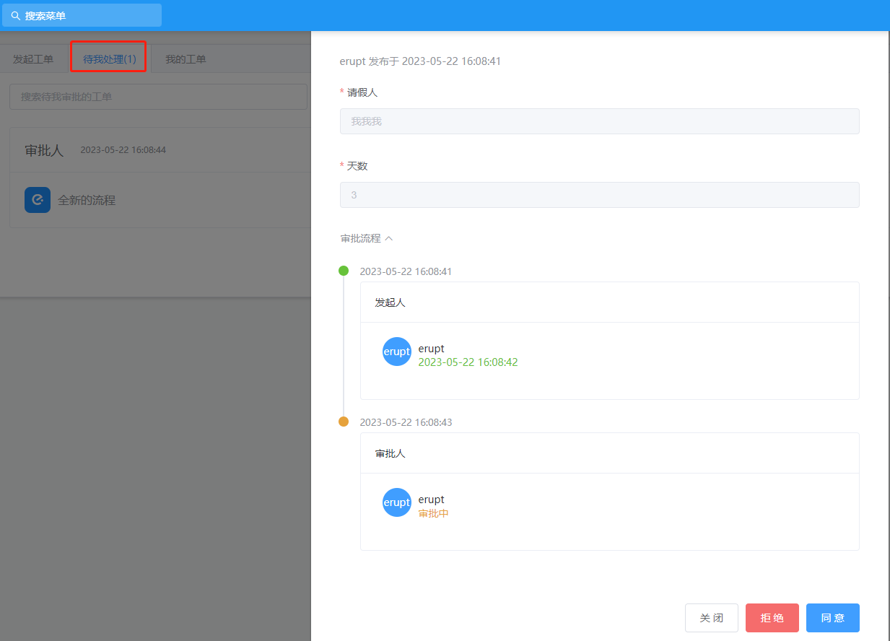
在“我的工单”下，可以看到自己发起或者处理过的所有工单
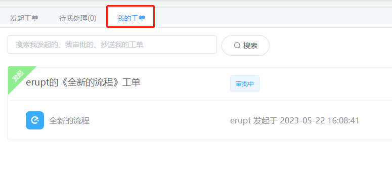

## @EruptFlowForm 注解
@EruptFLowForm注解，可以用于所有标记为@Erupt的实体类。用于将这个实体解析为erupt-flow中的表单

1. 标记注解
```java
//必须有@Erupt注解，才可以使用这个注解
@EruptFlowForm
@Erupt(name="请假")
@Entity
@Data
public class DemoLeave {

    //主键
    @Id
    @GeneratedValue(generator = "generator")
    @GenericGenerator(name = "generator", strategy = "native")
    @Column(name = "id")
    @EruptField
    private Long id; //如果继承BaseModel则不能再重复声明id

    @EruptField(
            views = @View(title = "请假人"),
            edit = @Edit(title = "请假人")
    )
    private String person;

    @EruptField(
            views = @View(title = "请假天数"),
            edit = @Edit(title = "请假天数")
    )
    private Integer days = 1;
}
```

2. 重启项目

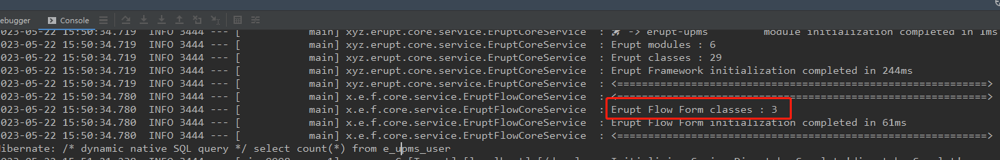
这里会打印有几个Erupt Flow Form 被识别

3. 绘制流程图

在“表单”界面，可以看到“Erupt表单”
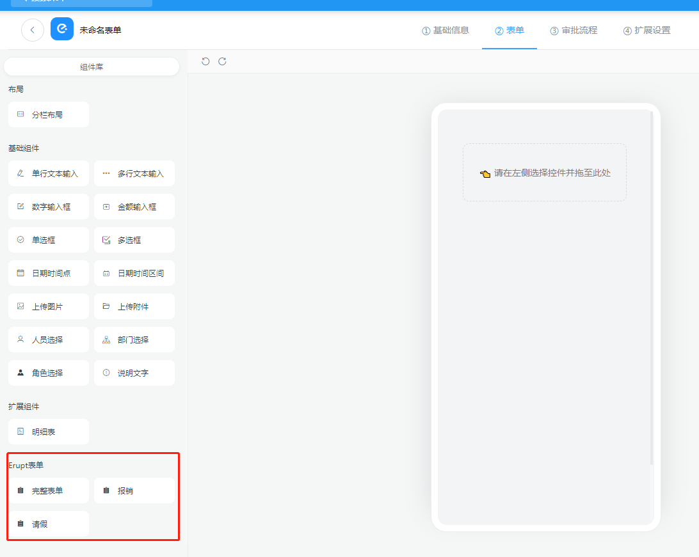
点击即可将实体类中的字段，解析到表单
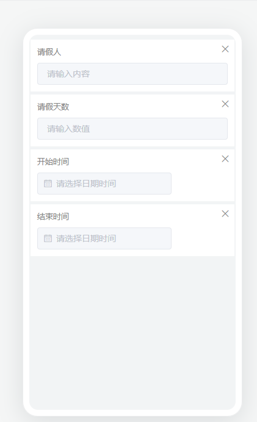
> 注意！！！@EruptFlowForm并未实现所有@Erupt的功能。解析完之后请检查一下字段。
> 你也可以手动调整任何字段。


# 已知的bug

## 1.12.0

1. 项目有context-path的情况下，flow上传图片显示404

解决办法：无解。只能不用context-path路径
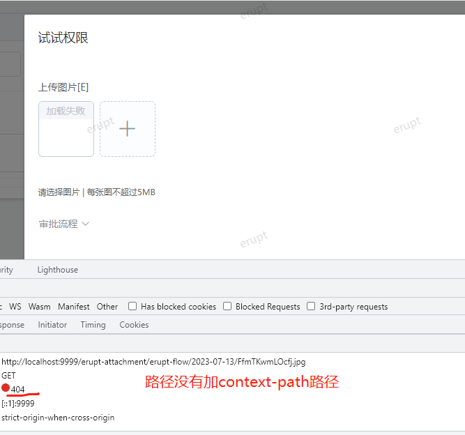

2. 表单字段后面，有诸如 [E]、[R]等字样。这是调试信息，不影响使用

## 1.11.7

1. **工作区和后台管理页面404**

系统管理 -> 菜单管理 中，找到这2个页面，去掉路径前缀的 erupt-api
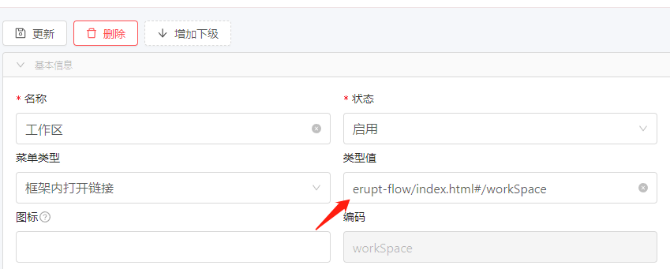

2. **流程发布报错**

添加OaProcessDefinition类的主键生成策略
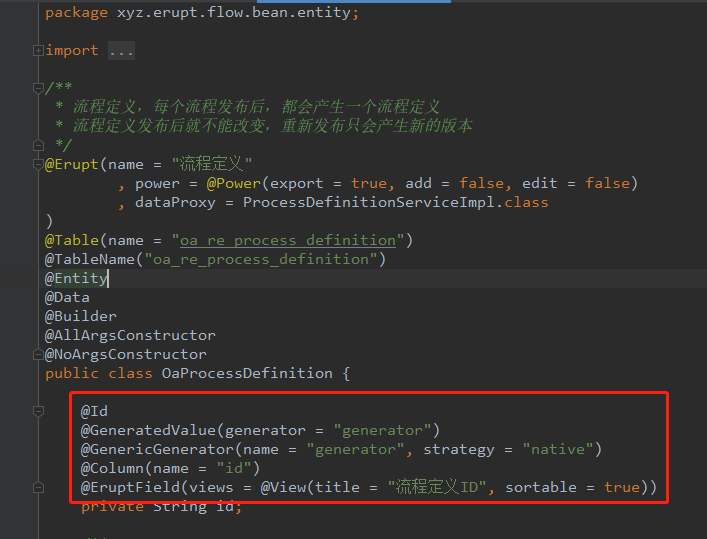

# 前后端分离
插件默认的菜单路径，仅支持前后端不分离部署。如需前后端分离部署，需要修改菜单路径
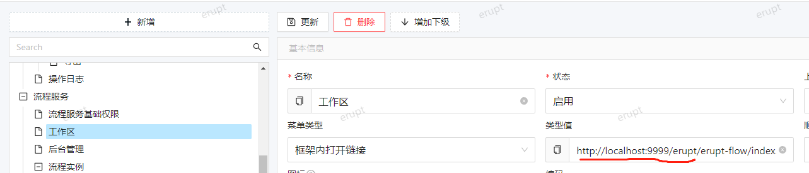


> 原文: <https://www.yuque.com/erupt/sd27r9o1pex1s5xn>