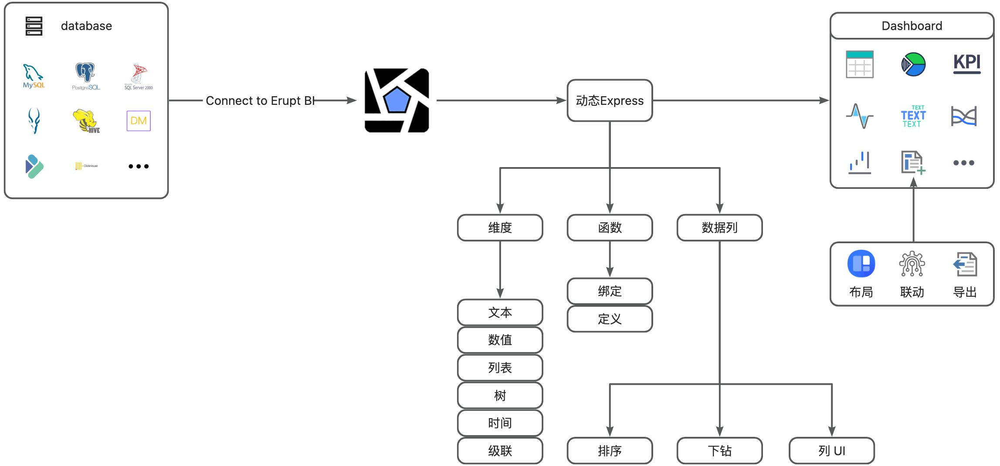
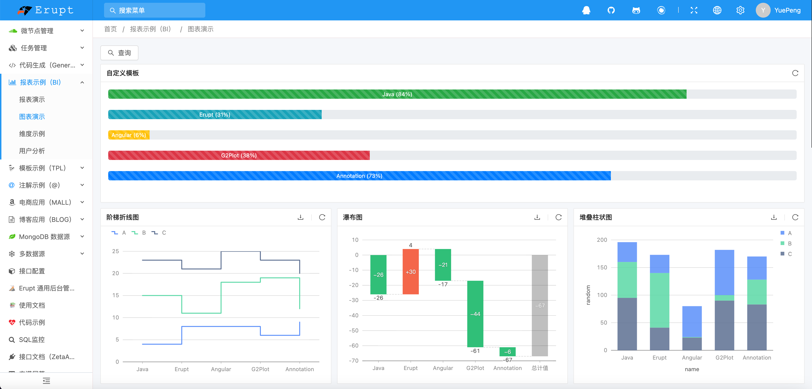
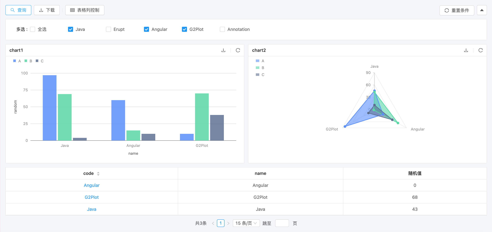
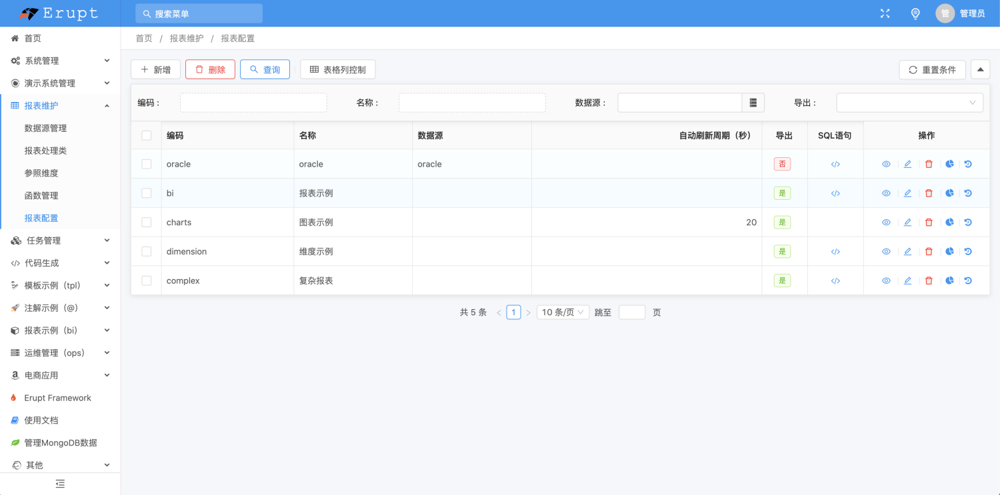

# 智能报表 erupt-bi

**未开源，bi 为 erupt 体系唯一付费模块，如需购买请联系作者**

### 模块介绍
数据分析相关功能，支持纯sql定义报表图表等功能，支持十几种查询维度，十几种图表组件，动态函数等能力
erupt-bi 本质上为数据库中间件协调与调度程序，几乎不占用资源，性能取决于已配置的SQL语句查询速度

### 演示地址
[https://www.erupt.xyz/demo](https://www.erupt.xyz/demo)
账号：bi
密码：bi

### 菜单配置项说明
| 菜单名称 | 功能说明 |
| --- | --- |
| 数据源管理 | 多数据源配置，需配置数据源的用户名密码等信息，特殊的数据源需要指定分页语句 |
| 报表处理类 | 需实现xyz.erupt.bi.fun.EruptBiHandler接口，可实现对报表sql的动态修改与查询结果的动态处理。 |
| 函数管理 | 配置函数脚本，用于报表中调用，提供了动态 SQL 的能力，有 and , like , In 等基础函数 |
| 参照维度 | 统一维护下拉列表下拉树等组件数据 |
| 报表配置 | 配置报表、图表、查询维度、动态列、缓存、分页、历史记录、菜单发布等 |

> 原文: <https://www.yuque.com/erupt/hstvzf>