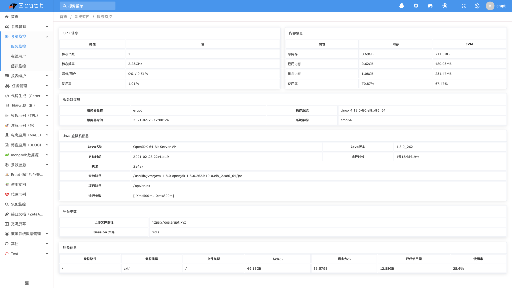
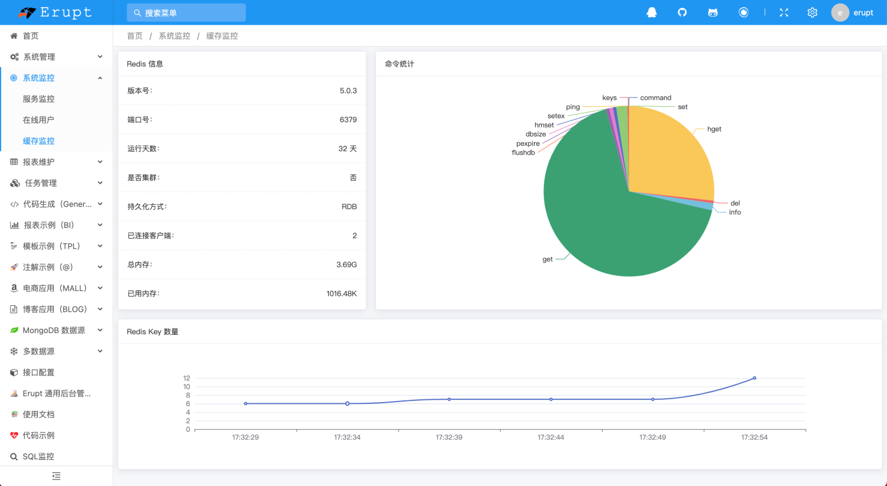
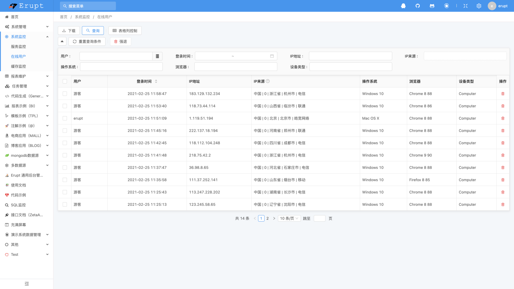

# 服务器监控 erupt-monitor

在导入erupt的前提下，pom.xml 加入如下依赖（1.6.7版本开始支持）
```xml
<!--服务监控模块-->
<dependency>
  <groupId>xyz.erupt</groupId>
  <artifactId>erupt-monitor</artifactId>
  <version>${erupt.version}</version>
</dependency>
```
导入成功后重启即可看到 **系统监控 **相关菜单


#### 服务监控


#### 缓存监控
```yaml
# 使用该功能前需增加redis连接配置
spring:
  redis:
    database: 0
    timeout: 10000
    host: 127.0.0.1
```



#### 在线用户
使用该功能前需要添加下配置 (application.yaml)
erupt.redisSession: true
spring:
  redis:
    database: 0
    timeout: 10000
    host: 127.0.0.1


上一篇

###### 代码生成器 erupt-generator
下一篇

###### NoSQL数据源 erupt-mongodb


> 原文: <https://www.yuque.com/erupt/bzcq6o>