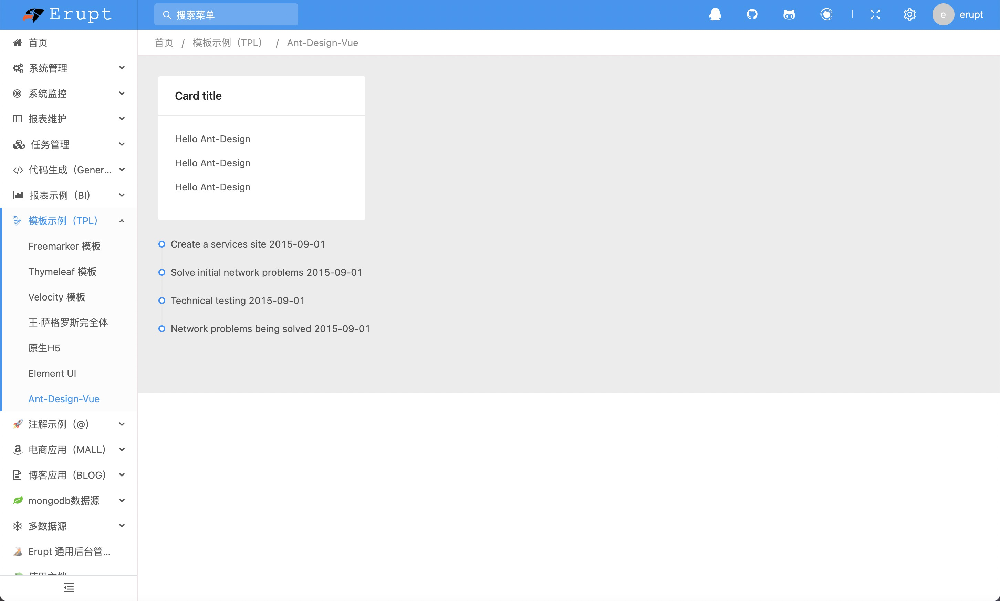
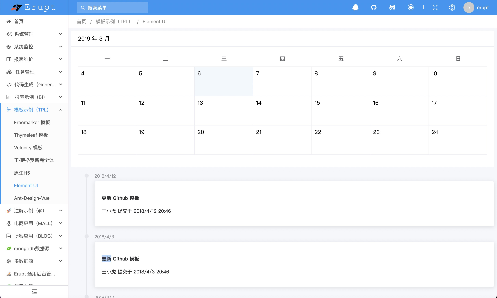
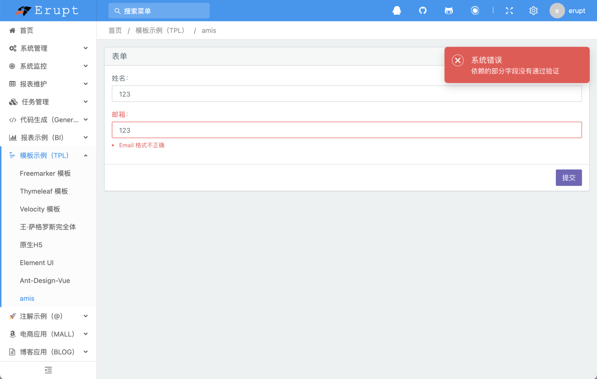

# 模板 UI 库 erupt-tpl-ui

**如果你希望在 tpl 模块中使用主流方式开发 web 页面，那么本模块一定会帮到你，提供 Ant-Design 与 Element 的UI风格，基于 VUE 很容易上手开发**


## Ant-Design-Vue 

**是 Ant Design 的 Vue 实现，开发和服务于企业级后台产品。**

erupt-web 使用 ng-zorro 开发，也是基于ant-design 规范，所以UI样式基本一致

使用文档：[https://www.antdv.com/components/timeline-cn/](https://www.antdv.com/components/timeline-cn/) （版本 1.7.2）

使用步骤如下：

1. 在pom.xml中增加如下依赖：
```xml
<dependency>
  <groupId>xyz.erupt</groupId>
  <artifactId>erupt-tpl</artifactId>
  <version>${erupt.version}</version>
</dependency>
<dependency>
  <groupId>xyz.erupt</groupId>
  <artifactId>erupt-tpl-ui.ant-design</artifactId>
  <version>${erupt.version}</version>
</dependency>
```

2. 在tpl目录下创建ant-design.html文件，内容如下：
```html
<html>
<head>
    <base href="${base}/">
    <meta charset="UTF-8">
    <link rel="stylesheet" href="ant-design/antd.min.css">
</head>
<body>
<div id="app">
    <template>
        <div style="background:#ECECEC; padding:30px">
            <a-card title="Card title" :bordered="false" style="width: 300px">
                <p v-for="i in 3">{{message}}</p>
            </a-card>
            <a-timeline style="margin-top: 30px">
                <a-timeline-item>Create a services site 2015-09-01</a-timeline-item>
                <a-timeline-item>Solve initial network problems 2015-09-01</a-timeline-item>
                <a-timeline-item>Technical testing 2015-09-01</a-timeline-item>
                <a-timeline-item>Network problems being solved 2015-09-01</a-timeline-item>
            </a-timeline>
        </div>
    </template>
</div>
<script src="ant-design/vue.min.js"></script>
<script src="ant-design/moment.min.js"></script>
<script src="ant-design/antd.min.js"></script>
<script src="ant-design/axios.min.js"></script>
<script>
    var vue = new Vue({
        el: '#app',
        data() {
            return {
                message: "Hello Ant-Design",
            };
        },
    });
</script>
</body>
</html>
```
注：如有其他需要导入的依赖，将资源放到 **public** 目录下，按照绝对路径导入即可

3. 将ant-design.html添加到菜单中
4. 运行效果如下




## 

## Element-UI 

**Element，一套为开发者、设计师和产品经理准备的基于 Vue 2.0 的桌面端组件库**

官方文档：[https://element.eleme.cn/#/zh-CN/component/installation](https://element.eleme.cn/#/zh-CN/component/installation) （版本 2.15.0）

1. 在pom.xml中增加如下依赖：
```xml
<dependency>
  <groupId>xyz.erupt</groupId>
  <artifactId>erupt-tpl</artifactId>
  <version>${erupt.version}</version>
</dependency>
<dependency>
  <groupId>xyz.erupt</groupId>
  <artifactId>erupt-tpl-ui.element-ui</artifactId>
  <version>${erupt.version}</version>
</dependency>
```

2. 在tpl目录下创建element-ui.html文件，内容如下：
```html
<!DOCTYPE html>
<html lang="en">
<head>
    <meta charset="UTF-8">
    <base href="${base}/">
    <link href="element/element.min.css" rel="stylesheet">
</head>
<body>
<div id="app">
    <template>
        <el-calendar :range="['2019-03-04', '2019-03-24']">
        </el-calendar>
        <div class="block" style="margin-top: 20px">
            <el-timeline>
                <el-timeline-item timestamp="2018/4/12" placement="top">
                    <el-card>
                        <h4>更新 Github 模板</h4>
                        <p>王小虎 提交于 2018/4/12 20:46</p>
                    </el-card>
                </el-timeline-item>
                <el-timeline-item timestamp="2018/4/3" placement="top">
                    <el-card>
                        <h4>更新 Github 模板</h4>
                        <p>王小虎 提交于 2018/4/3 20:46</p>
                    </el-card>
                </el-timeline-item>
                <el-timeline-item timestamp="2018/4/2" placement="top">
                    <el-card>
                        <h4>更新 Github 模板</h4>
                        <p>王小虎 提交于 2018/4/2 20:46</p>
                    </el-card>
                </el-timeline-item>
            </el-timeline>
        </div>
    </template>
</div>
<script src="element/vue.min.js"></script>
<script src="element/element.min.js"></script>
<script src="element/axios.min.js"></script>
<script>
    var vue = new Vue({
        el: '#app',
        data() {
            return {
                message: "Hello Element-UI",
            };
        },
    });
</script>
</body>
</html>
```
注：如有其他需要导入的依赖，将资源放到 **public** 目录下，按照绝对路径导入即可

3. 将element-ui.html添加到菜单中
4. 运行效果如下



## Element-Plus

**是 Element 的 Vue  3.0实现，开发和服务于企业级后台产品。**

官方文档：[https://element-plus.gitee.io](https://element-plus.gitee.io/)

1. 在pom.xml中增加如下依赖：
```xml
<dependency>
  <groupId>xyz.erupt</groupId>
  <artifactId>erupt-tpl</artifactId>
  <version>${erupt.version}</version>
</dependency>
 <dependency>
   <groupId>xyz.erupt</groupId>
   <artifactId>erupt-tpl-ui.element-plus</artifactId>
   <version>${erupt.version}</version>
</dependency>
```

2. 在tpl目录下创建element-plus.html文件，内容如下：
```html
<!DOCTYPE html>
<html lang="zh">
  <head>
    <base href="${base}/">
    <meta charset="UTF-8"/>
    <link href="element-plus/element.min.css" rel="stylesheet"/>
  </head>
  <body>
    <div id="app">
      <el-card class="box-card">
        <template #header>
          <div class="card-header">
            <span>Card name</span>
            <el-button class="button" text>Operation button</el-button>
          </div>
        </template>
        <div :key="o" class="text item" v-for="o in 4">{{ 'List item ' + o }}</div>
      </el-card>
    </div>
    
    <script src="element-plus/vue3.js"></script>
    <script src="element-plus/element.min.js"></script>
    <script>
      const app = Vue.createApp({
        data() {
          return {
            message: 'Hello Vue!!'
          }
        }
      })
      app.use(ElementPlus)
      app.mount('#app')
    </script>
  </body>
</html>
```


## Amis

amis 是一个低代码前端框架，它使用 JSON 配置来生成页面，可以减少页面开发工作量，极大提升效率。

使用文档：[https://baidu.gitee.io/amis/zh-CN/docs/index](https://baidu.gitee.io/amis/zh-CN/docs/index)（版本 1.4.0）

使用步骤如下：

1. 在pom.xml中增加如下依赖：
```xml
<dependency>
  <groupId>xyz.erupt</groupId>
  <artifactId>erupt-tpl</artifactId>
  <version>${erupt.version}</version>
</dependency>
<dependency>
  <groupId>xyz.erupt</groupId>
  <artifactId>erupt-tpl-ui.amis</artifactId>
  <version>${erupt.version}</version>
</dependency>
```

2. 在tpl目录下创建amis.html文件，内容如下：
```html
<!DOCTYPE html>
<html lang="zh">
<head>
    <base href="${base}/">
    <meta charset="UTF-8" />
    <title>amis demo</title>
    <meta http-equiv="Content-Type" content="text/html; charset=utf-8" />
    <meta name="viewport" content="width=device-width, initial-scale=1, maximum-scale=1"/>
    <meta http-equiv="X-UA-Compatible" content="IE=Edge" />
    <link rel="stylesheet" href="amis/sdk.css" />
    <!-- 从 1.1.0 开始 sdk.css 将不支持 IE 11，如果要支持 IE11 请引用这个 css，并把前面那个删了 -->
    <!-- <link rel="stylesheet" href="amis/sdk-ie11.css" /> -->
    <!-- 不过 amis 开发团队几乎没测试过 IE 11 下的效果，所以可能有细节功能用不了，如果发现请报 issue -->
  
    <!-- 百度云舍主题 -->
    <!-- <link href="amis/cxd.css" rel="stylesheet" /> -->
    <!-- 暗黑主题 -->
		<!-- <link href="amis/dark.css" rel="stylesheet" /> -->
    <!-- 仿 antd 主题 -->
		<!-- <link href="amis/antd.css" rel="stylesheet" /> -->
  
    <style>
        html, body, .app-wrapper {
            position: relative;
            width: 100%;
            height: 100%;
            margin: 0;
            padding: 0;
        }
    </style>
</head>
<body>
<div id="root" class="app-wrapper"></div>
<script src="amis/sdk.js"></script>
<script type="text/javascript">
    (function () {
        let amis = amisRequire('amis/embed');
        // 通过替换下面这个配置来生成不同页面
        let amisJSON = {
            "type": "page",
            "body": [
                {
                    "type": "form",
                    "api": "https://3xsw4ap8wah59.cfc-execute.bj.baidubce.com/api/amis-mock/mock2/form/saveForm",
                    "controls": [
                        {
                            "type": "text",
                            "name": "name",
                            "label": "姓名："
                        },
                        {
                            "name": "email",
                            "type": "email",
                            "label": "邮箱："
                        }
                    ]
                }
            ]
        };
        let amisScoped = amis.embed('#root', amisJSON);
    })();
</script>
</body>
</html>
```
注：如有其他需要导入的依赖，将资源放到 **public** 目录下，按照绝对路径导入即可

3. 将amis.html添加到菜单中
4. 运行效果如下




> 原文: <https://www.yuque.com/erupt/cmzox9>