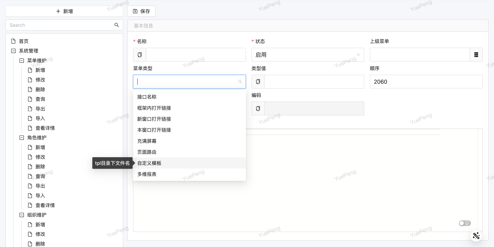
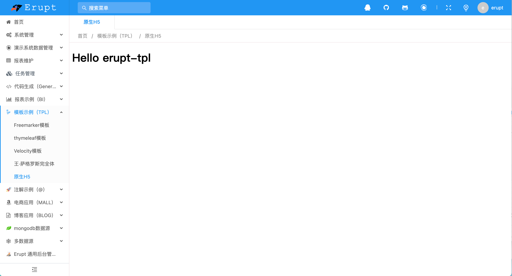
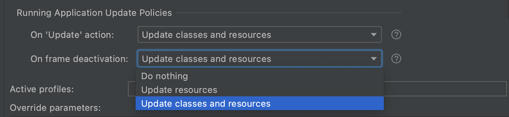
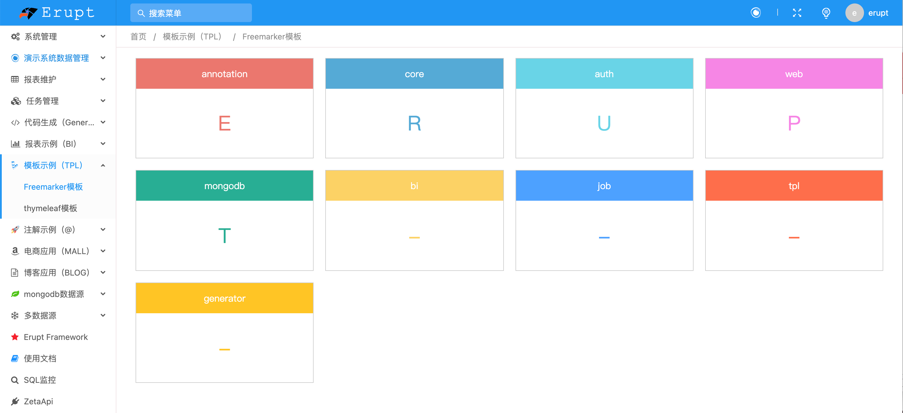
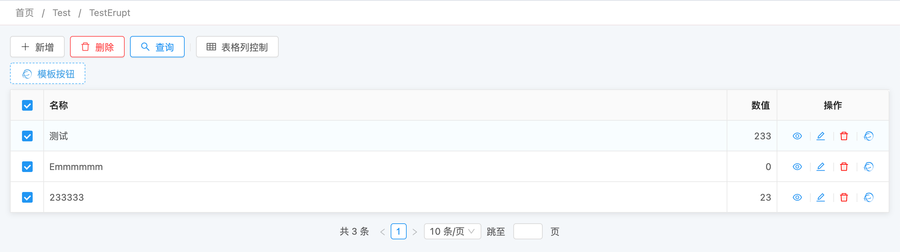
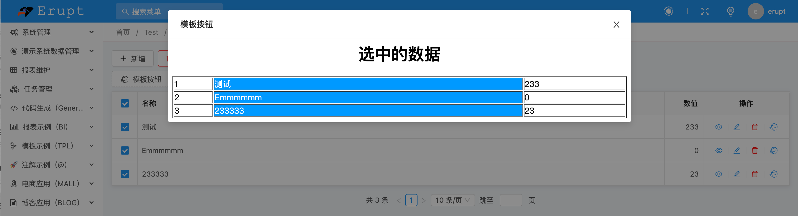

# 自定义页面 erupt-tpl

> 模板嵌入到erupt页面中，支持：**自定义页面、**自定义弹出层、自定义组件、自定义图表等！


模板页面通过菜单权限控制，支持：原生H5 / FreeMark / Thymeleaf / Velocity作为模板，可根据引入的 **Jar** 自动加载相关模板。


# 使用步骤 & 原生H5渲染
1、在导入erupt的前提下，pom.xml添加如下依赖（1.6.1版本开始支持）
```xml
<dependency>
  <groupId>xyz.erupt</groupId>
  <artifactId>erupt-tpl</artifactId>
  <version>${erupt.version}</version>
</dependency>
```
2、在 resources 目录下创建 tpl 文件夹，用于存放模板文件

3、创建模板文件，在 tpl 目录下创建 erupt.html

> **如果想引入js，css，请将文件放到 public 或 static 目录下，确保资源可被外界访问**
> **注意：spring boot 规定 public 目录与 static 目录为项目根路径**
> 
后端交互：你的controller只要能通过http访问到，那么用 jquery 或者 axios 直接 post 或者 get 即可
开发有登录权限与菜单权限的接口详见：[https://www.yuque.com/erupts/erupt/nitieg](https://www.yuque.com/erupts/erupt/nitieg)

```html
<!DOCTYPE html>
<html lang="en" style="background: #fff">
<head>
    <meta charset="UTF-8">
    <title>Title</title>
</head>
<body>
	<h1>Hello erupt-tpl</h1>
</body>
</html>
```
4、将erupt.html添加到菜单，菜单类型选择自定义模板，类型值为erupt.html，刷新后访问菜该单即可



建议开启静态资源热更新的功能，修改模板文件无需重启服务，idea开启方式如下：



# 服务端渲染（ Freemark / Thymeleaf / Velocity / Beetl / Enjoy）

> **如果你想使用服务端渲染的方式开发页面，可采用如下方法，支持Thymeleaf / Velocity / Freemarker 等方式开发模板**
> 
> **注意：使用指定模板引擎前，请检查是否导入了模板引擎的 jar**


## 使用方式

1. 创建数据绑定类
```java
@EruptTpl(engine = Tpl.Engine.FreeMarker) //注解值表示要使用的模板引擎
@Component //必须添加否则会影响包扫描
public class FreemarkerAction {

    // 返回值表示要绑定的数据。必须返回 Map<String, Object>
    @TplAction("dashboard.ftl") //注解值表示要绑定的页面
    public Map<String, Object> dashboard() {
        Map<String, Object> map = new HashMap<>();
        Map<String, Object> mp = new LinkedHashMap<>();
        mp.put("annotation", 'E');
        mp.put("core", 'R');
        mp.put("auth", 'U');
        mp.put("web", 'P');
        mp.put("mongodb", 'T');
        mp.put("bi", '-');
        mp.put("job", '-');
        mp.put("tpl", '-');
        mp.put("generator", '-');
        map.put("color", new String[]{
                "#eb776e", "#56aad6", "#69d5e7", "#f686e5", "#29ae94", "#fbd364",
                "#4da1ff", "#ff6e4b", "#ffc524", "#e07de9", "#42e9e1", "#a9f", "#a90",
                "#09f", "#928bff"
        });
        map.put("map", mp);
        return map;
    }

}
```

2. 在 **resources/tpl **目录下定义模板文件页面结构，**dashboard.ftl **页面代码：
```html
<!DOCTYPE html>
<html lang="en" style="background: #fff">
<head>
    <meta charset="UTF-8">
    <title>Title</title>
    <style>
        .card {
            float: left;
            width: 25%;
            box-sizing: border-box;
        }

        .card > .item {
            transition: .5s all;
            cursor: pointer;
            margin: 10px;
            border: 1px solid #ccc;
        }

        .card > .item .title {
            margin: 0;
            padding: 15px 0;
            text-align: center;
            color: #fff;
            transition: 1s all;
        }

        .card > .item:hover {
            transform: translateY(-8px);
            transition: all .25s ease-in-out;
            box-shadow: 0 25px 60px -20px rgba(155, 165, 163, .45);
        }

        .card > .item:hover .title {
            background: #333;
            color: #fff;
        }
    </style>
</head>
<body>
<div>
    <div style="margin:0 15px">
        <#list map?keys as key>
            <div class="card">
                <div class="item">
                    <p class="title" style="background: ${color[key_index]}">${key}</p>
                    <p style="text-align: center;font-size: 2.2em;color: ${color[key_index]}">${map[key]}</p>
                </div>
            </div>
        </#list>
    </div>
</div>
</body>
</html>
```
模板内置对象：

| request | request对象 |
| --- | --- |
| response | response对象 |
| base | 同：request.getContextPath_()_ |


3. 添加到菜单，将dashboard.ftl添加到菜单，效果如下：


> 如果你想使用其他模板引擎，修改 @EruptTpl 配置即可，当然模板语法也会存在差异

```java
//Thymeleaf
@EruptTpl(engine = Tpl.Engine.Thymeleaf)
//Velocity
@EruptTpl(engine = Tpl.Engine.Velocity)
```

**Maven方式导入各模板引擎Jar （依据实际情况引入）**
```xml
<!--velocity-->
<dependency>
    <groupId>org.apache.velocity</groupId>
    <artifactId>velocity-engine-core</artifactId>
    <version>2.3</version>
</dependency>

<!--thymeleaf-->
<dependency>
  <groupId>org.thymeleaf</groupId>
  <artifactId>thymeleaf</artifactId>
</dependency>

<!--freemarker-->
<dependency>
  <groupId>org.freemarker</groupId>
  <artifactId>freemarker</artifactId>
</dependency>

<!--beetl-->
<dependency>
  <groupId>com.ibeetl</groupId>
  <artifactId>beetl</artifactId>
  <version>3.3.2.RELEASE</version>
</dependency>

<!--enjoy-->
<dependency>
  <groupId>com.jfinal</groupId>
  <artifactId>enjoy</artifactId>
  <version>4.9.16</version>
</dependency>

```

## 模板路径映射
缺省映射为在 tpl 的一级目录下的模板文件，可以直接用 value 映射，其他路径的文件需要使用path配置，使用方法如下：
```java
@EruptTpl(engine = Tpl.Engine.Thymeleaf)
@Service
public class ThymeleafAction {

    //value 值与 "菜单维护" 里的 "类型值" 要一致
    //path 值为模板文件完整路径
    @TplAction(value="dashboard.html",path="/tpl/thymeleaf/dashboard.html") 
    public Map<String, Object> dashboard2() {
        return null;
    }

}
```


## 路径模糊匹配
```java
@EruptTpl
@Service
public class MatchAction {

    @Resource
    private HttpServletRequest request;

    /**
     * 访问路径匹配
     * /path/aaa
     * /path/aaa/bbb
     * /path/aaa/bbb/ccc
     **/
    @TplAction(value = "/path/**",path = "tpl/xxx.html")
    public void match() {
        //TODO 根据request对象获取通配符部分数据
    }
    
}
```

## @TplAction 注解定义
```java
@Comment("修饰方法必须返回Map<String,Object>类型")
public @interface TplAction {

    @Comment("tpl目录下文件名称，该值也作为权限特征使用，支持模糊匹配")
    String value();

    @Comment("文件路径，为空则以value值作为文件路径")
    String path() default "";

}
```


# 自定义按钮弹出层模板

## 开始使用
> 使用前需确保导入了erupt-tpl模块

```java
@Erupt(
        name = "按钮打开模板",
        rowOperation = @RowOperation(
                code = "tpl", title = "模板按钮", type = RowOperation.Type.TPL,
                tpl = @Tpl(
                        path = "/tpl/operator.ftl",     //模板文件路径
                        tplHandler = TestErupt.class,  //数据绑定到模板，可不设置
                        engine = Tpl.Engine.FreeMarker //缺省值
                )
        )
)
@Entity
@Getter
public class TestErupt extends BaseModel implements Tpl.TplHandler {

    @EruptField(
            views = @View(title = "名称"),
            edit = @Edit(title = "名称")
    )
    private String name;

    @EruptField(
            views = @View(title = "数值"),
            edit = @Edit(title = "数值")
    )
    private Integer number;

    @Override
    public void bindTplData(Map<String, Object> binding, String[] params) {
        binding.put("title", "选中的数据");
    }
}
```
模板文件预注入变量
> engine为 native 时不支持获取 rows

| request | request对象 |
| --- | --- |
| response | response对象 （1.6.12及以上版本支持） |
| rows | 选中行的数据，类型：数组 |

```html
<div>
  	<#-- title 为 bindTplData 返回的绑定数据 -->
    <h1 align="center">${title}</h1>
    <table border="1" cellpadding="0" style="width: 100%">
        <#list rows as row>
            <tr>
                <td>${row.id}</td>
                <td style="background: #09f;color: #fff">${row.name}</td>
                <td>${row.number}</td>
            </tr>
        </#list>
    </table>
</div>
```
效果展示




## 关闭弹出层
在弹出层前端代码文件调用如下 js 代码
```javascript
parent.document.querySelector(".ant-modal-close-x").click()
```

## 

## 弹出层修改后,触发Query按钮
在弹出层前端代码文件调用如下 js 代码
```javascript
parent.document.querySelector("#erupt-btn-query").click()
```

## 弹出层宽高
高度：随自定义页面高度自适应
宽度：RowOperation → tplWidth配置，配置时需要指定具体单位如：500px 、80% （1.10.13及以上版本支持）

# 

# UI 库（Element UI、Ant Design、Amis）

[模板UI库 erupt-tpl-ui](https://www.yuque.com/erupts/erupt/cmzox9?view=doc_embed)


> 原文: <https://www.yuque.com/erupt/sgx66o>