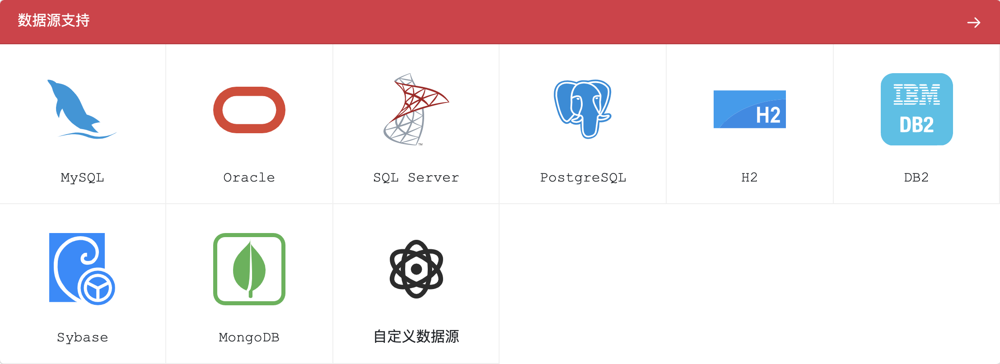

# 💾 数据源支持

erupt 支持市面上所有主流数据库，甚至支持 MongoDB，也可自定义数据源


**以下示例仅提供基础的使用模板，具体参数值需通过实际情况修改，各数据库在 application.yml 中的配置如下：**

注意：使用前需导入数据库所依赖的JDBC包！


## MySQL
```yaml
spring:
  datasource:
    url: jdbc:mysql://127.0.0.1:3306/erupt
    username: root
    password: 123456
  jpa:
    show-sql: true
    generate-ddl: true
    database-platform: org.hibernate.dialect.MySQL5InnoDBDialect
    database: mysql
```

## Oracle
```yaml
spring:
  datasource:
    url: jdbc:oracle:thin:@//127.0.0.1:1521/erupt
    username: sys
    password: 123456
  jpa:
    show-sql: true
    database-platform: org.hibernate.dialect.Oracle10gDialect
    generate-ddl: true
    database: oracle
```

## SQL Server
```yaml
spring:
  datasource:
    url: jdbc:sqlserver://127.0.0.1:1443;database=erupt
    username: sa
    password: 123456
  jpa:
    show-sql: true
    database-platform: org.hibernate.dialect.SQLServer2008Dialect
    generate-ddl: true
    database: sql_server
```

## PostgreSQL
```yaml
spring:
  datasource:
    url: jdbc:postgresql://127.0.0.1:5432/erupt
    username: postgres
    password: 123456
  jpa:
    show-sql: true
    database-platform: org.hibernate.dialect.PostgreSQL9Dialect
    generate-ddl: true
    database: postgresql
```

## H2
```yaml
spring:
  datasource:
    url: jdbc:h2:file:./erupt;AUTO_SERVER=TRUE
    platform: h2
    username: sa
    password:
    driverClassName: org.h2.Driver
  jpa:
    show-sql: true
    database-platform: org.hibernate.dialect.H2Dialect
    generate-ddl: true
    database: h2
```

## DB2
```yaml
spring:
  datasource:
    url: jdbc:db2://127.0.0.1:50000/erupt
    username: admin
    password: 123456
  jpa:
    show-sql: true
    database-platform: org.hibernate.dialect.DB2Dialect
    generate-ddl: true
    database: db2
```

## 达梦
```yaml
spring:
  datasource:
    url: jdbc:dm://127.0.0.1:6236/erupt
    username: SYSDBA
    password: SYSDBA
  jpa:
    show-sql: true
    generate-ddl: true
    database-platform: org.hibernate.dialect.DmDialect
```
```xml
<dependency>
  <groupId>com.dameng</groupId>
  <artifactId>DmJdbcDriver18</artifactId>
  <version>8.1.3.140</version>
</dependency>
<!-- 这个依赖与当前 erupt 依赖的 jpa 版本有关，如果版本有变动请参考：https://central.sonatype.com/search?q=DmDialect-for-hibernate&smo=true -->
<dependency>
  <groupId>com.dameng</groupId>
  <artifactId>DmDialect-for-hibernate5.6</artifactId>
  <version>8.1.3.140</version>
</dependency>
```
[Spring boot +Jpa 项目适配达梦8数据库_cas 达梦 jpa-CSDN博客](https://blog.csdn.net/qq_45217886/article/details/126193683)


## MongoDB
erupt 作为通用数据管理框架，不限于仅支持关系型数据库，也支持MongoDB
[NoSQL数据源 erupt-mongodb](https://www.yuque.com/erupts/erupt/kf6ruk?view=doc_embed)

## 自定义数据源
erupt 定位是通用数据管理框架，所以将自定义数据源能力开放，希望此功能能为 erupt 生态创建无限可能！
[自定义数据源 @EruptDataProcessor](https://www.yuque.com/erupts/erupt/giw1e5?view=doc_embed)


## 其他数据库
erupt 关系型数据库管理是通过 hibernate 实现的，hibernate 所支持的数据库众多，以上几种数据库我实际验证过没有问题，其他的数据库应该也可以兼容。


## 方言对照表
以下数据来自：[https://blog.csdn.net/weixin_44333359/article/details/90664577](https://blog.csdn.net/weixin_44333359/article/details/90664577)

| RDBMS | 方言 |
| --- | --- |
| DB2 | org.hibernate.dialect.DB2Dialect |
| DB2 AS/400 | org.hibernate.dialect.DB2400Dialect |
| DB2 OS390 | org.hibernate.dialect.DB2390Dialect |
| PostgreSQL | org.hibernate.dialect.PostgreSQLDialect |
| MySQL | org.hibernate.dialect.MySQLDialect |
| MySQL with InnoDB | org.hibernate.dialect.MySQLInnoDBDialect |
| MySQL with MyISAM | org.hibernate.dialect.MySQLMyISAMDialect |
| Oracle (any version) | org.hibernate.dialect.OracleDialect |
| Oracle 9i/10g | org.hibernate.dialect.Oracle9Dialect |
| Sybase | org.hibernate.dialect.SybaseDialect |
| Sybase Anywhere | org.hibernate.dialect.SybaseAnywhereDialect |
| Microsoft SQL Server | org.hibernate.dialect.SQLServerDialect |
| SAP DB | org.hibernate.dialect.SAPDBDialect |
| Informix | org.hibernate.dialect.InformixDialect |
| HypersonicSQL | org.hibernate.dialect.HSQLDialect |
| Ingres | org.hibernate.dialect.IngresDialect |
| Progress | org.hibernate.dialect.ProgressDialect |
| Mckoi SQL | org.hibernate.dialect.MckoiDialect |
| Interbase | org.hibernate.dialect.InterbaseDialect |
| Pointbase | org.hibernate.dialect.PointbaseDialect |
| FrontBase | org.hibernate.dialect.FrontbaseDialect |
| Firebird | org.hibernate.dialect.FirebirdDialect |


> 原文: <https://www.yuque.com/erupt/ku7vx4>