# 🎯 权限管理

|  | 菜单名称 | 描述 | 对应实体类 |
| --- | --- | --- | --- |
| [#](#4OyYF) | 菜单维护 | 菜单配置 | EruptMenu.java |
| [#](#gUm11) | 组织维护 | 用户组织维护 | EruptOrg.java |
| [#](https://www.yuque.com/erupts/erupt/isqy9x/edit#Xkg5n) | 岗位维护 | 用户岗位管理 | EruptPost.java |
| [#](#9DvXQ) | 角色维护 | 角色菜单权限 | EruptRole.java |
| [#](#ITcwW) | 用户维护 | 配置系统登录用户相关信息 | EruptUser.java |
| [#](#zBcHq) | 字典维护 | 数据字典 | EruptDict.java |
| [#](#F3JvU) | 登录日志 | 登录历史日志 | EruptLoginLog.java |
| [#](#9zKKf) | 操作日志 | 增删改相关的操作日志 | EruptOperateLog.java |

权限管理类功能扩展：复制源文件到工程内部，保证包名与类名和jar内完全一致，就可以覆盖jar内文件，自定义字段逻辑

# 菜单维护
用于管理系统中菜单列表与接口权限
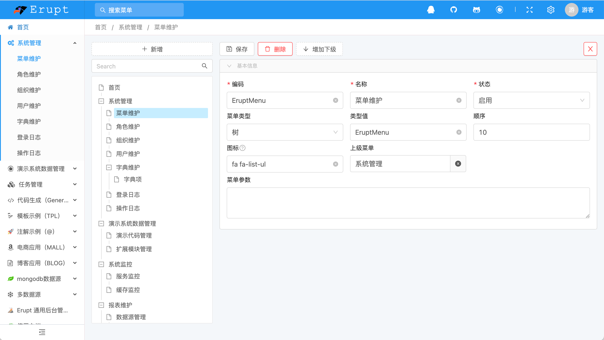
菜单类型与类型值说明：

| 菜单类型 | 类型值 | 说明 |
| --- | --- | --- |
| 树 | erupt类名，不区分大小写 | 树视图展示 |
| 表格 | erupt类名，不区分大小写 | 表格视图展示 |
| 链接 | 互联网地址 | 在菜单右侧视图容器中打开 |
| 新页签 | 互联网地址 | 在新TAB页中打开 |
| 页面路由 | 路由地址 | 路由hash值 |
| 按钮 | 按钮权限字符串 | 详见： [通过菜单控制按钮的显示与隐藏](https://www.yuque.com/erupts/erupt/gaing7#HaZs4) |
| 接口名称 | 接口名 | 接口权限字符串，详见：[接口权限](https://www.yuque.com/erupts/erupt/nitieg) |
| 报表 | 报表编码 | 需导入erupt-bi模块 |
| 模板 | 模板文件名称（需在tpl目录下） | 需导入erupt-tpl模块 |
| 充满屏幕 | 需要全屏展示的路由地址 | 页面将全屏幕显示，有些不需要登录权限的页面，可以通过此方式对外传播链接 |

图标参考：[https://www.thinkcmf.com/font/search/index.html](https://www.thinkcmf.com/font/search/index.html)
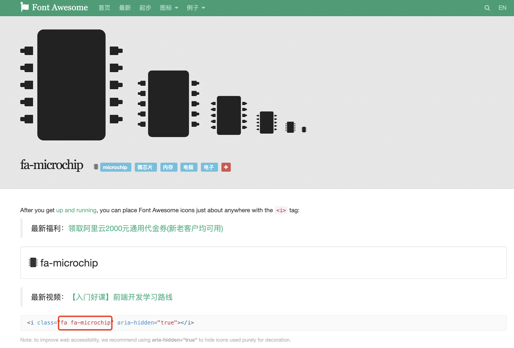

# 组织维护
通过树形结构管理组织信息
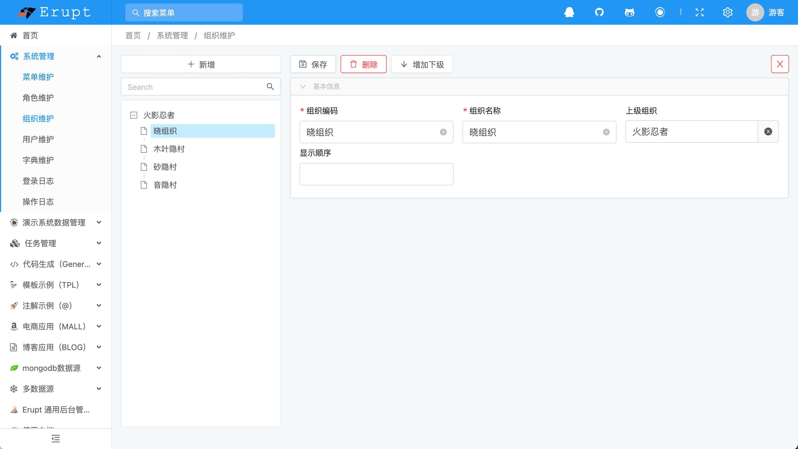

# 岗位维护
管理用户岗位信息
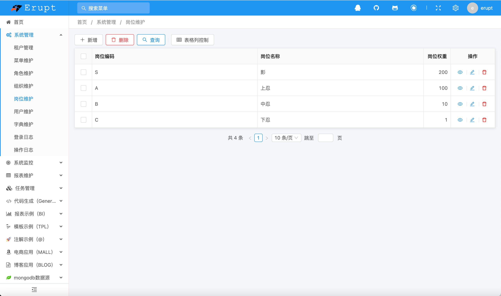

# 角色维护
用来分配菜单权限
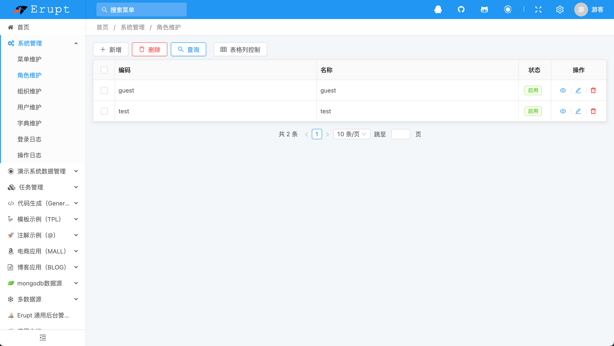
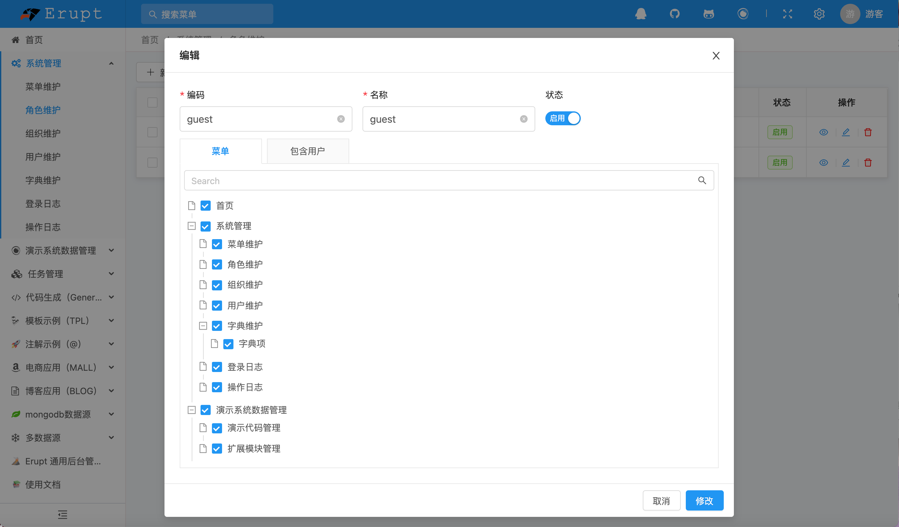

# 用户维护
左侧窗口为组织树；右侧为系统用户信息，可以通过分配的用户名与密码登录erupt后台
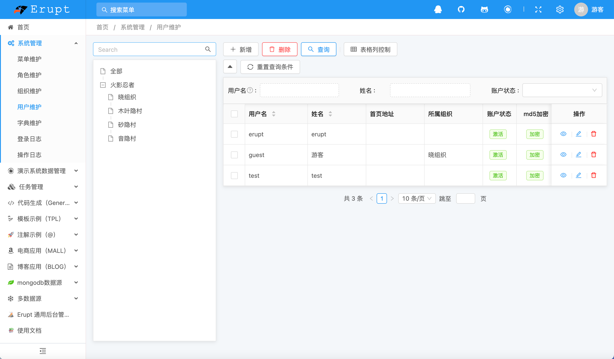
配置项目说明：
首页地址：用户登录后将会跳转到首页地址（需确认用户是否有该地址的访问权限）
账户状态：激活：可正常登录，锁定：禁止登录
md5加密：更安全的存储密码数据
所属角色：用户可使用角色内所配置菜单
IP白名单：登录时需验证IP是是否允许登录，为空表示不进行校验
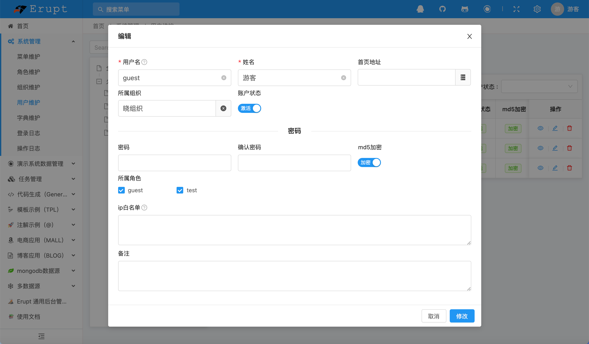

# 字典维护
通常用于管理结构简单（key-value）的平台数据，例如：民族、国家、HTTP请求类型、协议类型等。
字典编码为字典表查询标识，应该唯一，规定通过字典编码查找相对应的数据。
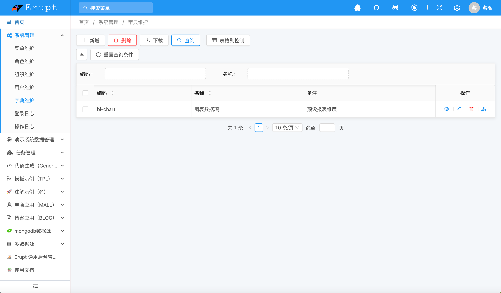
点击字典项按钮即可管理字典项数据
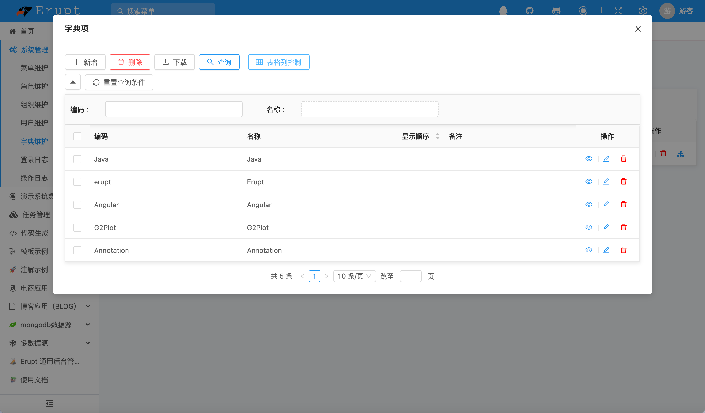

# 登录日志
记录用户登录信息，包括登录时间，登录IP，操作系统，浏览器等数据。
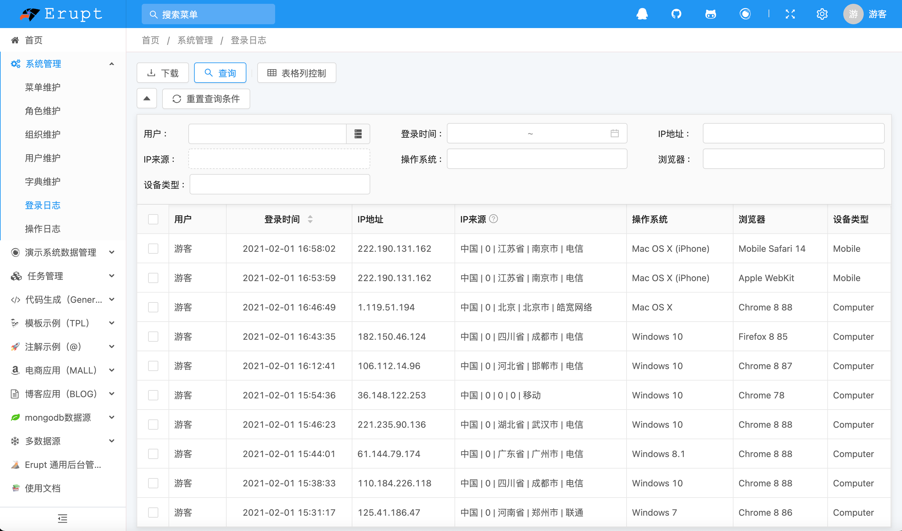

# 操作日志
记录用户操作行为

> 原文: <https://www.yuque.com/erupt/isqy9x>