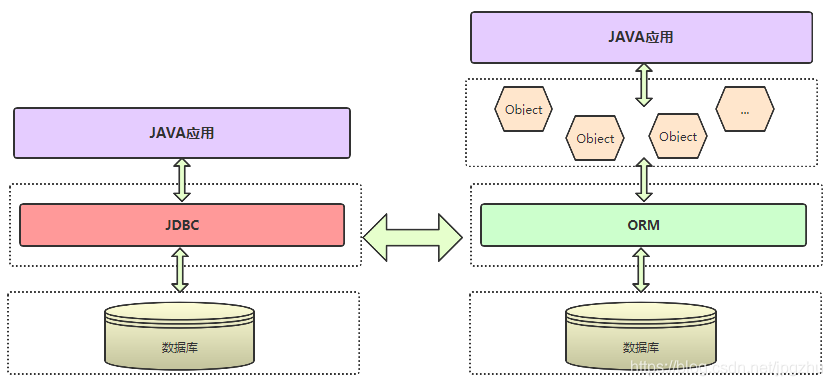

# 🔍 EruptDao 实现 JDBC 数据库查询


## 基础使用
EruptDao 是基于 **SpringDataJPA **实现的一个工具类，帮助您通过erupt对象或者sql语句管理数据
```java
@Service
public class EruptJdbc {
    
    @Resource
    private EruptDao eruptDao;

    //通过对象查询
    public void query() {
        List<Student> students = eruptDao.lambdaQuery(Student.class)
            .in(EruptUser::getId, 1, 2, 3, 4)
            .ge(EruptUser::getCreateTime, "2023-01-01")
            .isNull(EruptUser::getWhiteIp)
            .list();
    }

    //原生sql查询
    public void navtiveQuery(Goods goods){
        List<Map<String, Object>> list = eruptDao.getJdbcTemplate()
            .queryForList("select * from t_table");
    }

    //通过id获取数据
    public void findById(Long id){
        Student student = eruptDao.findById(Student.class, id)
    }

    //新增
    public void add(Student student){
        eruptDao.persist(student);
        // 使用 flush 方法可以在线程结束前入库，如果批处理数据建议每千次（新增、更新、删除）调用一次 flush
        eruptDao.flush();
    }

    //修改
    public void modify(Student student){
        student.setName("xxx")
        eruptDao.merge(student);
    }

    //删除
    public void delete(Student student){
        eruptDao.delete(student);
    }

   
}
```


## LambdaQuery
> 可通过 lambda 写法操作 erupt 对象，强类型限制，代码简洁明了

```java
@Service
public class EruptLambdaQuery {
    
    @Resource
    private EruptDao eruptDao;

    public void select() {
        List<EruptUser> list = eruptDao.lambdaQuery(EruptUser.class)
                .like(EruptUser::getName, "e")
                .isNull(EruptUser::getWhiteIp)
                .in(EruptUser::getId, 1, 2, 3, 4)
                .ge(EruptUser::getCreateTime, "2023-01-01")
                .list();
    }

    public void one() {
         EruptUser eruptUser = eruptDao.lambdaQuery(EruptUser.class)
                .isNull(EruptUser::getWhiteIp)
                .one();
    }

    public void orderBy(){
        List<EruptUser> eruptUser = eruptDao.lambdaQuery(EruptUser.class)
                .addCondition("whiteIp is null")
                .isNotNull(EruptUser::getCreateTime)
                .offset(1).limit(2)
                .orderBy(EruptUser::getCreateTime)
                .orderByDesc(EruptUser::getCreateTime)
                .list();
    }

    // 1.12.13 及以上版本支持
    public void aggr(){
        Long count = eruptDao.lambdaQuery(EruptUser.class)
                .count();

        Object max = eruptDao.lambdaQuery(EruptUser.class)
                .like(EruptUser::getName, "e")
                .max(EruptUser::getCreateTime);
    }
    
}
```


## 通过EruptDao操作多数据源
```java
@Service
public class EruptJdbc {
    
    @Resource
    private EruptDao eruptDao;
    
    public void dbs(){
        EntityManager entityManager = eruptDao.getEntityManager("数据源名称");

        //1.12.13 及以上版本支持
        eruptDao.lambdaQuery(entityManager, EruptUser.class)
                .like(EruptUser::getName, "e")
                .min(EruptUser::getCreateTime)
            
        //注意：多数据源操作时，每次sql执行完成后需要手动调用关闭方法，否则会导致连接池溢出
        entityManager.close();
    }
    
}
```


## MyBatis
Erupt 类同时支持 LambdaQuery 查询 + 动态建表的能力，mybatis plus 的能力可以通过 EruptLambdaQuery 完全代替，请勿使用该依赖，这会让 erupt 注解看起来很混乱，让阅读者看起来也会很割裂。

如果你的服务中需要复杂的 SQL 定义，可以引入 MyBatis 执行复杂的 XML 拼接，MyBatis 是一个 jdbc 工具，Jpa 是 ORM 工具，共存不会有任何问题。两个框架其实都不重，在  SpringBoot 的加持下，引入几行配置就可以实现两者共存了。

本质上 ORM 框架并没有性能的区分度，因为最终都是转换成 SQL 交给数据库引擎去执行，ORM 层面那层性能损耗几乎可以忽略不计。从实际出发，MyBatis 提供给了开发者更高的 SQL 自由度，所以在一些需要 SQL 调优的场景下会更加灵活。



> 原文: <https://www.yuque.com/erupt/wgc30d>