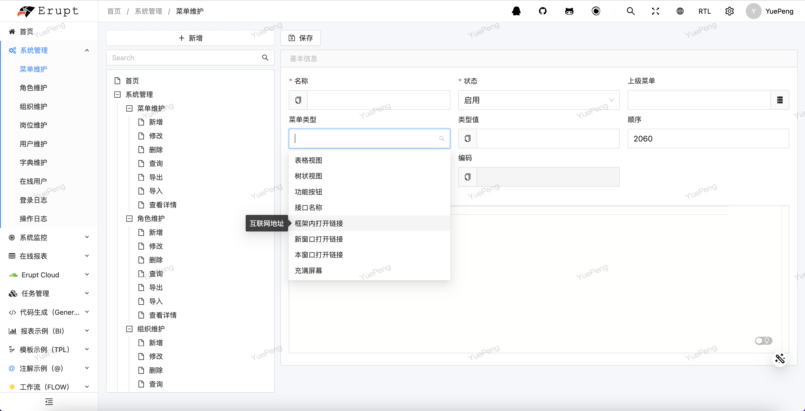
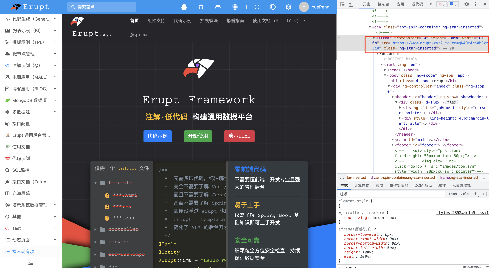

# 🥽 现有项目接入 & Vue / React / jquery

1. **前往菜单管理，****菜单类型****选择：框架内打开链接，****类型值****填写：待接入项目地址，保存此配置。**



2. **嵌入页面可以获取当前登录用户的token，url中会使用_token参数体现**

**例：**[https://www.erupt.xyz?_token=gK4Ot4rs0h3xzJi0](https://www.erupt.xyz?_token=gK4Ot4rs0h3xzJi0)
**使用token和换取当前登录用户基本信息，与菜单权限等能力，前端请求接口时携带该token即可**

3. **开启RedisSession**
```yaml
erupt:
  redisSession: true

spring:
  redis:
    database: 0
    timeout: 10000
    host: 127.0.0.1
```

4. **根据 token 获取 erupt 用户数据**
```http
GET {{host}}/erupt-api/userinfo
token: {{token}}
---
result: >
{
  "nickname": "xxx", 		   // 昵称
  "indexMenuType": "xxx",  // 首页菜单类型
  "indexMenuValue": "xxx", // 首页菜单类型值
  "resetPwd": false,   		 // 是否重置密码
  "org": "org code",	     // 所在组织的编码 1.12.11 及以上版本支持
  "post": "post code",     // 所在职位的编码 1.12.11 及以上版本支持
  "roles": ["code1", "code2", "code3"] // 角色列表 1.12.11 及以上版本支持
}
```
```http
GET {{host}}/erupt-api/erupt-permission/{{菜单类型值}}
token: {{token}}
---
result > true | false
```
获取用户的其他信息（如用户 ID，当前菜单），暴漏新接口且传递 token即可，代码中通过上下文获取
[🧲 工具类（util）](https://www.yuque.com/erupts/erupt/plk783?view=doc_embed&inner=d142a6f98edd2815ccdcec4148e1dfa6)


> 原文: <https://www.yuque.com/erupt/sa673z>