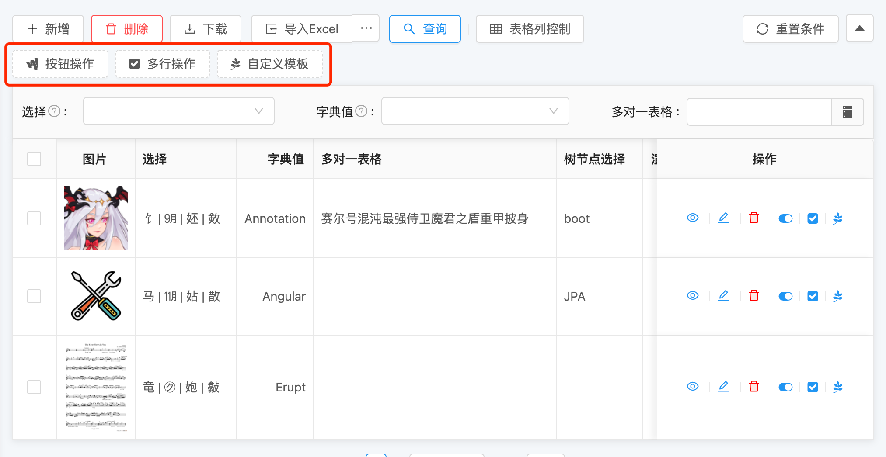
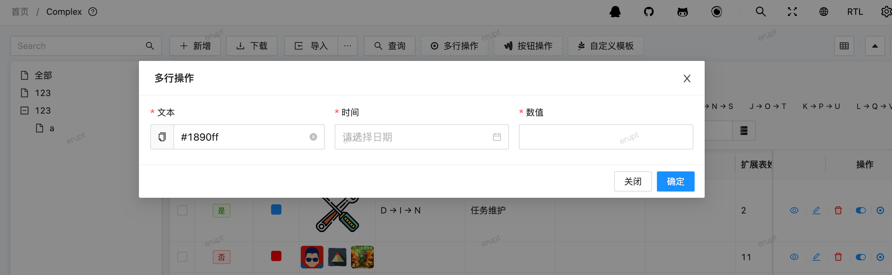
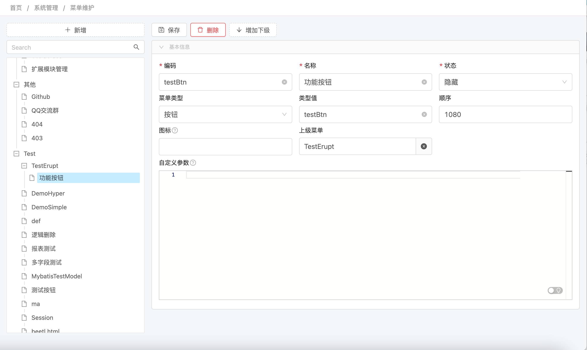
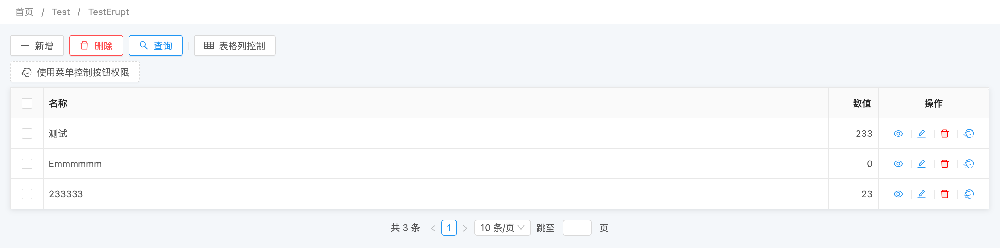
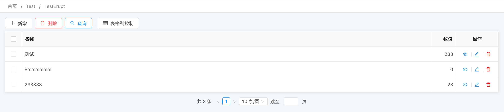

# 👑 自定义按钮（ RowOperation ）


## 使用方法
```java
@Erupt(
       name = "Erupt",
       rowOperation = {
                @RowOperation(
                    title = "单行操作", 
                    code = "SINGLE", 
                    mode = RowOperation.Mode.SINGLE, 
                    operationHandler = OperationHandlerImpl.class),
                @RowOperation(
                    title = "多行操作",
                    code = "MULTI", 
                    operationHandler = OperationHandlerImpl.class),
                @RowOperation( 
                    title = "按钮操作", 
                    code = "BUTTON", 
                    operationHandler = OperationHandlerImpl.class,
                    mode = RowOperation.Mode.BUTTON, 
                    tip = "不依赖任何数据即可执行"),
        },
)
public class EruptTest extends BaseModel {
    
}
```
按钮事件实现类
```java
/** 泛型说明
 * <EruptTest>  为目标数据的类型
 */<Void>       可使用另一个erupt类作为表单输入框而存在，因为此演示代码并未涉及，所以使用Void来占位
 *           	非 Void 的情况：如需自定义弹出表单指定eruptClass即可，表示eruptClass前端传递过来的值
 **/
public class OperationHandlerImpl implements OperationHandler<EruptTest, Void> {

    //返回值由前端浏览器执行
    @Override
    public String exec(List<EruptTest> data, Void vo, String[] param) {
        //TODO your logic

        // return "alert(23333)"
		return null;

        // ✨ 通过顶部消息块展示消息
        // return "msg.info('提示信息')"
        // return "msg.error('错误信息')"
        // return "msg.success('成功信息')";

        // ✨ 自定义按钮返回结果用代码编辑器展示，参数 1 语言，参数 2 代码
        // return "codeModal('sql',`select * from xxx`)"


        // ✨ 使用自定义按钮执行下载操作
        // return "window.open('https://xxxxx')"

        //注： 1.11.x 及以下版本需要增加this关键字调用msg: return "this.msg.success('成功信息')";
    }

}

```


## 配置项注解定义
```java
public @interface RowOperation {

    String code(); //编码，按钮的唯一标识

    String title(); //展示名称

    String tip() default ""; //额外提示信息

    //调用时的文本提示，空则不提示，1.12.11 及以上版本支持
    String callHint() default "erupt.operation.call_hint";

    //动态控制按钮的显示与隐藏 1.5.4 及以上版本支持
    ExprBool show() default @ExprBool;

    //按钮图标，请参考font awesome
    String icon() default "fa fa-ravelry";

    Mode mode() default Mode.MULTI; //按钮触发模式

    Type type() default Type.ERUPT; //按钮类型

    //如果操作按钮需要用户录入一些数据后触发，则可用此配置关联一个erupt类，就可使用该类中所定义的表单了！
    Class<?> eruptClass() default void.class;

    //供operationHandler接收使用
    String[] operationParam() default {};

    //操作按钮点击后，后台处理方法逻辑
    Class<? extends OperationHandler> operationHandler() default OperationHandler.class;
    
    /**
     * 需导入erupt-tpl模块才可支持
     * type为tpl时使用，可指定一个模板文件，做服务器端渲染
     * 模板文件预注入变量为：rows 代表选中行的数据
     */
    Tpl tpl() default @Tpl(path = "");

    // 1.12.0以上版本已废弃，请使用 @RowOperation → @tpl → width 代替
    // tpl模板弹出层宽度，需指定具体单位，如： 500px || 80%
    String tplWidth() default "";
    
    
    /**
     * 控制按钮可用与禁用（JS表达式）
     * 参考变量 → item
     * 例如status值1时显示操作按钮则可以为：item.status == 1
     */
    String ifExpr() default "";
    
    // 控制 ifExpr 的结果是控制按钮的 显示与隐藏 还是 能否点击
    IfExprBehavior ifExprBehavior() default IfExprBehavior.DISABLE;

    enum Mode {
        //依赖一条数据来执行
        SINGLE,
        //依赖多条数据来执行
        MULTI,
        //可不依赖任何数据直接执行
        BUTTON
    }

    enum Type {
        ERUPT, //配合operationHandler与eruptClass使用
        TPL //配合tpl使用
    }
    
     enum IfExprBehavior {
        // IfExpr处理按钮显示或隐藏
        HIDE,
        // IfExpr处理按钮可否点击
        DISABLE
    }
    
}
```


## 表单弹出层（Form）
```java
@Erupt(
       name = "Erupt",
       rowOperation = @RowOperation(
            title = "表单按钮",
            eruptClass = DialogForm.class, //点击按钮时弹出的表单定义
            operationHandler = DialogFormHandler.class //按钮处理类
       ),
)
public class EruptTest extends BaseModel {
    
}
```
```java
@Erupt(name = "Form Dialog")
@Getter
@Setter
public class SimpleDialog extends BaseModel {

    @EruptField(
            edit = @Edit(title = "文本", notNull = true)
    )
    private String text;

    @EruptField(
            edit = @Edit(title = "时间", notNull = true)
    )
    private Date date;

    @EruptField(
            edit = @Edit(title = "数值", notNull = true)
    )
    private Long number;

}

```
根据行数据渲染表单的初始值
```java
public class DialogFormHandler implements OperationHandler<EruptTest, SimpleDialog> {
    
    @Override
    public String exec(List<Complex> data, SimpleDialog simpleDialog, String[] param) {
        return "";
    }

    // eruptClass 表单值初始化方法（按需重写）1.12.13 及以上版本支持
    @Override
    public SimpleDialog eruptFormValue(List<EruptTest> data, SimpleDialog simpleDialog, String[] param) {
        simpleDialog.setText(data.get(0).getColor());
        return simpleDialog;
    }
}

```


## 自定义弹出层（TPL）
[🗽 自定义页面（ Vue, Template ）](https://www.yuque.com/erupts/erupt/sgx66o?view=doc_embed&inner=xdxys)


## 按钮权限
```java
@Erupt(
        name = "使用菜单控制按钮权限",
        rowOperation = {
                @RowOperation(
                        code = "btn", 
                    	title = "使用菜单控制按钮权限",
	                    operationHandler = OperationHandlerImpl.class, //自定义按钮触发事件
                        show = @ExprBool(
                             	exprHandler = ViaMenuValueCtrl.class, //根据菜单类型值控制是否显示的实现类
                                params = "testBtn"  //权限标识，菜单类型为按钮，类型值为testBtn即可控制该按钮
                        )
                )
        }
)
@Entity
@Getter
public class TestErupt extends BaseModel {
    
    @EruptField(
            views = @View(title = "名称"),
            edit = @Edit(title = "名称")
    )
    private String name;
    
}
```
添加菜单，将params的值填入菜单类型值位置，菜单类型选择按钮

有按钮权限效果

无按钮权限效果


当然你也可以自定义功能按钮的显示与隐藏逻辑，仅需实现 show 参数对应的 exprHandler 即可！


> 原文: <https://www.yuque.com/erupt/gaing7>