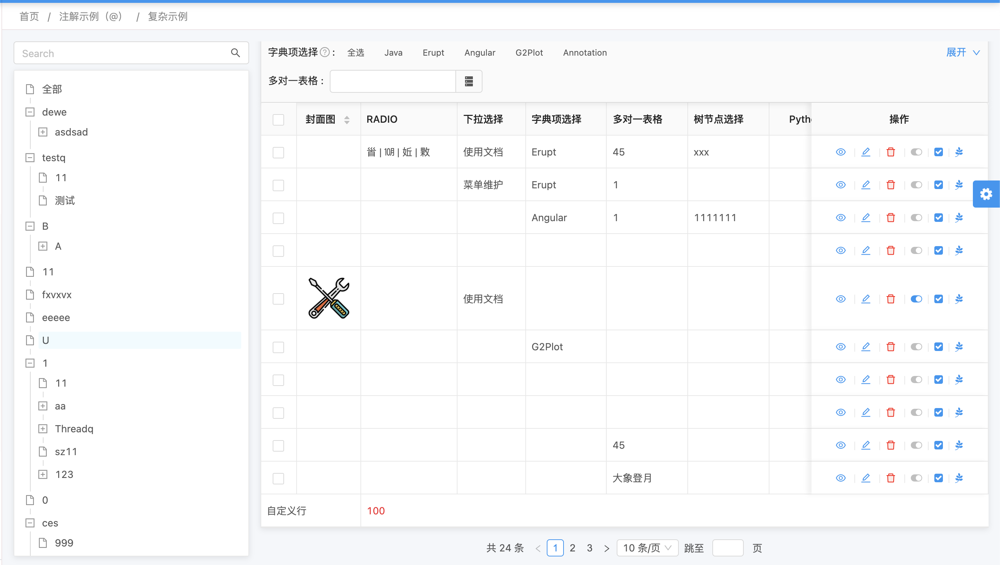

# 🔖 自定义行（合计行）


### 绑定DataProxy接口
```java
@Erupt(name = "Erupt", dataProxy = ExtraRowHandler.class)
public class EruptTest extends BaseModel{
    
		@EruptField(
            views = @View(title = "名称"),
            edit = @Edit(title = "名称")
    )
    private String name;
    
}
```

### 自定义行代码实现
```java
@Component
public class ExtraRowHandler implements DataProxy<EruptTest> {

    @Override
    public List<Row> extraRow(List<Condition> conditions) {
        //行对象
        List<Row> rows = new ArrayList<>();
        //列对象
        List<Column> columns = new ArrayList<>();

        columns.add(Column.builder().value("自定义行").colspan(2).build());
        columns.add(Column.builder().value(100 + "").colspan(6).className("text-red").build());

        rows.add(Row.builder().columns(columns).build());
        return rows;
    }	

}
```

### 行列对象结构
```java
public class Row {

    private List<Column> columns;

    private String className;	//样式类名，可在app.css中定义

}

public class Column {

    private String value;		 //表格展示值

    private int colspan = 1;	 //跨列数量

    private String className;    //样式类名，可在app.css中定义

}


```

### 效果预览



> 原文: <https://www.yuque.com/erupt/yi6gl3>