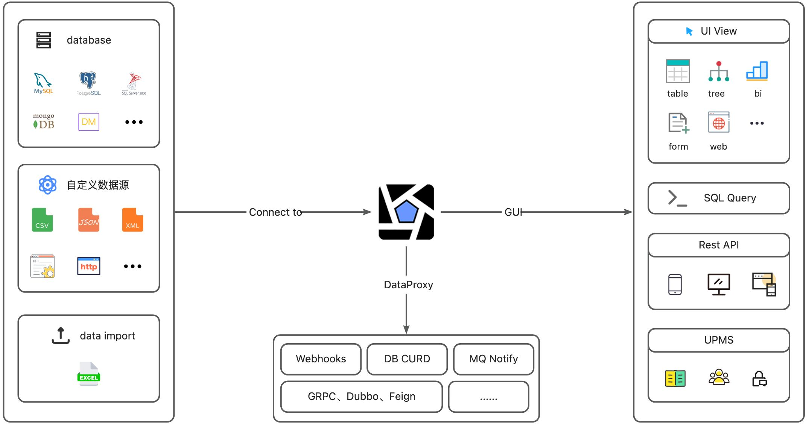
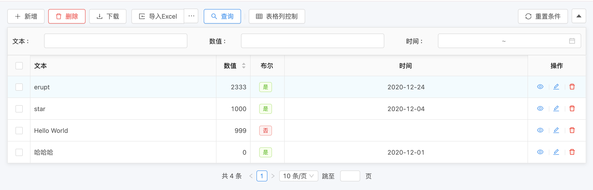

# 🚀 框架介绍


**Erupt 🚀 通用数据管理框架**

---

[环境部署](https://www.yuque.com/erupts/erupt/tpq1l9)   |    [快速上手](https://www.yuque.com/erupts/erupt/waztcb)   |    [@Erupt ](https://www.yuque.com/erupts/erupt/mzi9ry)  |    [@EruptFIeld   ](https://www.yuque.com/erupts/erupt/gec455)|   [扩展模块](https://www.yuque.com/erupts/erupt/dyx3r9)   |   [常见问题Q&A](https://www.yuque.com/erupts/erupt/vr4md2)   |   [版本历史](https://www.yuque.com/erupts/erupt/wdic2w)

---

[](https://mvnrepository.com/search?q=erupt) [](https://www.oracle.com/technetwork/java/javase/downloads/index.html) [](https://gitee.com/erupt/erupt/blob/master/LICENSE) [](https://gitee.com/erupt/erupt) [](https://gitee.com/erupt/erupt) [](https://github.com/erupts/erupt) [](https://github.com/erupts/erupt)

---




## 🚀 简介 | Intro
Erupt 是一个低代码 **全栈类** 框架，它使用 **Java 注解** 动态生成页面以及增、删、改、查、权限控制等后台功能。
零前端代码、零 CURD、自动建表，仅需 **一个类文件** + 简洁的注解配置，快速开发企业级 Admin 管理后台。
提供企业级中后台管理系统的全栈解决方案，大幅压缩研发周期，专注核心业务。

| 操作系统支持 | window、linux、mac |
| --- | --- |
| JDK支持 | 8+ |
| Spring Boot 支持 | 2.x |
| 数据源支持 | MySQL、PostgreSQL、SQL Server、Oracle、H2等，支持NoSQL数据源 |
| 启动速度 | 2s ~ 5s |
| 支持语言 | 中文、繁体中文、英语、韩语、日语、法语、俄语、意大利语 |
| 接口总数 | 20 ~ 30 |
| 终端适配 | PC、平板、手机 |
| 扩展模块 | 10+ |
| 组件支持 | 22个 |
| OSS支持 | ✅ |
| 分布式支持 | erupt-cloud |


## 🌈 特性 | Features

- **易于上手**：会简单的 **Spring Boot** 基础知识即可
- **使用简单**：仅需了解 **@Erupt** 与 **@EruptField** 两个注解即可上手开发
- **代码简洁**：前端零代码，后端 template、controller、service、dao 都不需要，**仅需一个类文件**即可
- **敏捷开发**：仅单个`.java`文件即可实现后台管理功能，专注业务与核心功能的研发
- **快速迭代**：需求变更仅需修改或添加注解配置即可，迭代速度比需求讨论速度还快
- **功能强大**：动态条件处理，支持增删改查等功能代理接口，Session存储机制选择，行为日志记录等
- **自动建表**：依托于JPA可自动帮你完成数据库建表相关工作
- **低侵入性**：几乎所有功能都围绕注解而展开，不影响Spring Boot其他功能或三方库库的使用
- **多数据源**：支持：MySQL、Oracle、SQL Server、**PostgreSQL**、H2，甚至支持 **MongoDB**
- **大量组件**：滑动输入、时间选择、**一对多**、图片上传、代码编辑器、自动完成、树、**多对多**、地图等23类组件
- **丰富展示**：普通文本、**二维码**、链接、图片、HTML、代码段、iframe、swf等
- **代码生成**：erupt代码已经足够简洁，代码生成器可进一步提升开发效率
- **高扩展性**：支持自定义数据源实现、自定义页面、动态权限管理、生命周期函数、**自定义OSS**等
- **界面美观**：每个交互都精心设计，产品思维打磨，只为了更好的操作体验
- **权限管理**：用户管理、角色管理、组织管理、菜单管理、登录日志、操作日志等
- **高安全性**：可靠的安全机制，登录白名单，权限验证，注解项检查，细颗粒度权限控制，为你的数据保驾护航
- **前后端分离**：后端与前端可分开部署
- **响应式布局**：支持PC端手机端等各种规格的设备中使用
- **无需二次开发**：仅需引用 jar 包即可 ！
- **支持扩展页面**：可开发自定义页面，自定义弹出层，且支持：原生H5 / Freemarker / Thymeleaf等方式渲染


## ⚙️ 环境部署
配置简单，引用 jar 简单几步就可搭建完成
[🌋 快速开始](https://www.yuque.com/erupts/erupt/tpq1l9?view=doc_embed)


## 🧐 为什么要做 Erupt ?
无论开发怎样的系统，都需要配套的管理后台做数据支撑，是软件开发中必不可少的一环，但实际开发中存这无法规避的痛点，如：开发效率低下、接口对接繁琐、界面差强人意、代码重复、有安全漏洞，导致开发成本极高。
虽然近些年来 **代码生成器** 成了后台开发的新宠，但它真的是后台开发的最优解吗？
代码生成器的本质还是生成繁琐的前端与后台代码，一旦修改后期生成的代码很难合并，想想 Mybatis-Generator，基本上就是一次性的东西，虽然减轻了部分工作，可解决方式并非最佳。
开发后台管理系统大部分情况下只想做个普通的增删改查界面，用于数据管理，类似下面这种：
 
```java
@Erupt(
       name = "简单的例子",
       power = @Power(importable = true, export = true)
)
@Table(name = "t_simple")   //数据库表名
@Entity
public class Simple extends BaseModel {
    @EruptField(
            views = @View(title = "文本"),
            edit = @Edit(title = "文本", notNull = true, search = @Search)
    )
    private String input;
    @EruptField(
            views = @View(title = "数值", sortable = true),
            edit = @Edit(title = "数值", search = @Search)
    )
    private Float number;
    @EruptField(
            views = @View(title = "布尔"),
            edit = @Edit(title = "布尔")
    )
    private Boolean bool;
    @EruptField(
            views = @View(title = "时间"),
            edit = @Edit(title = "时间", search = @Search(vague = true))
    )
    private Date date;
}
```
[功能体验](https://www.erupt.xyz/#!/contrast)

这个界面虽然用 Vue + Ant Design + SSM 也能做出个大概，但仔细观察会发现它有大量细节功能如：

- 有按钮可以查询、新增、批量删除、excel 导入导出
- 可以对数据做筛选、隐藏某列、按某列排序
- 表格有分页与汇总，可预览单行数据
- 多种组件、有校验规则

全部实现这些仅前端就需要大量的代码，后端的接口与业务逻辑更不在少数。
但可以看到，用 erupt 只需要 **30几行** 代码就能完成，

> 完全不需要了解 **Angular / React / Vue / Jquery**
> 而且不需要了解 **JavaScript / HTML / CSS**
> 甚至不需要了解 **Spring MVC / Mybatis / SQL**


即便没学过 erupt 也能猜到大部分配置的作用，只需要简单配置就能完成所有后台页面开发。
这正是建立 erupt 的初衷，对于大部分常用页面，应该使用最简单的方法来实现，甚至不需要学习各种框架和工具，专注核心业务，告别 996，省下的时间做自己喜欢做的事，从此不再因为繁琐的后台开发而焦头烂额。


## 📟 技术体系 | Technology system
**后端：** Java 8、 Spring Boot、 SPEL、 Annotation、 JDBC、 Reflect、 JPA、 Gson、 Lombok ...
**前端：** JavaScript、 H5、 MVVM、 Router、 Angular CLI、 Angular、 NG-ZORRO、 NG-ALAIN、 G2Plot、 RxJS、 TypeScript、 Less ...


## 🌕 在线体验 | Demo
演示地址：[https://www.erupt.xyz/demo](https://www.erupt.xyz/demo)
账号密码：`guest / guest`
**支持主流 4 款现代浏览器，以及 Internet Explorer 11+，可直接运行在 Electron 等基于 Web 标准的环境上**

| 
 

 Edge / IE  | 
 Firefox  | 
 

 Chrome  | 
 

 Safari  | 
 

 Opera  | 
 

 Electron  |
| --- | --- | --- | --- | --- | --- |
| Edge 16 / IE 11+ | 522 | 57 | 11 | 44 | Chromium 57 |


## 🔭 开源推荐 | Recommend
`[zeta-api](https://github.com/erupts/zeta-api)`[：通过XML配置快速创建api接口与文档，安全且高效，快速开发必备！](https://github.com/erupts/zeta-api)


## ⛽️ 捐赠 | Donate
此框架服务器，域名，空间，人工等费用一直由作者本人自掏腰包并持续维护，开源不易，一杯咖啡也是爱 🙏
点击以下链接，将页面拉到最下方点击 "捐赠" 即可。
[前往捐赠](https://gitee.com/erupt/erupt)

**Erupt 使用 **[**Apache License 2.0**](http://www.apache.org/licenses/LICENSE-2.0)** 协议，源代码完全开源，无商业限制。 开源不易如果喜欢请给作者 Star 鼓励 👇**
[**Github**](https://github.com/erupts/erupt)**   /   **[**Gitee**](https://gitee.com/erupt/erupt)

---

[Github 仓库](https://github.com/erupts/erupt)   |   [Gitee 仓库](https://gitee.com/erupt/erupt)   |   [官方网站](https://www.erupt.xyz/)   |   [贡献指南](https://www.yuque.com/yuepeng/erupt/bdiq6o)   |   [在线体验](https://www.erupt.xyz/demo)   |   [扩展模块](https://www.yuque.com/yuepeng/erupt/fpg96g)   |  [多数据源](https://www.yuque.com/yuepeng/erupt/bgn4gg)   |   [版本历史](https://www.yuque.com/yuepeng/erupt/wdic2w)

---

Copyright © 2019-2035 [erupt.xyz](https://erupt.xyz) All rights reserved.

**作者**：YuePeng / [erupts@126.com](mailto:erupts@126.com)


> 原文: <https://www.yuque.com/erupt/foa2bt>