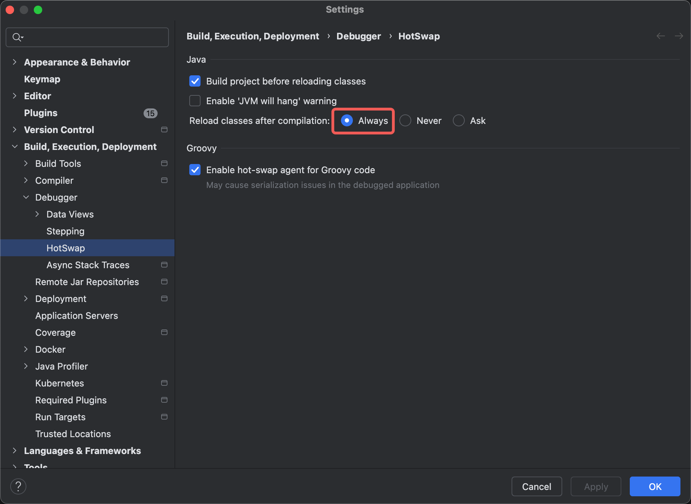
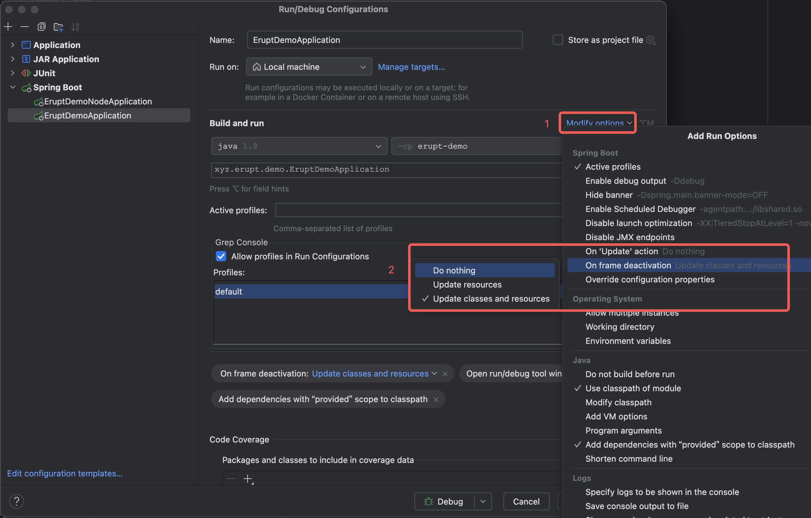
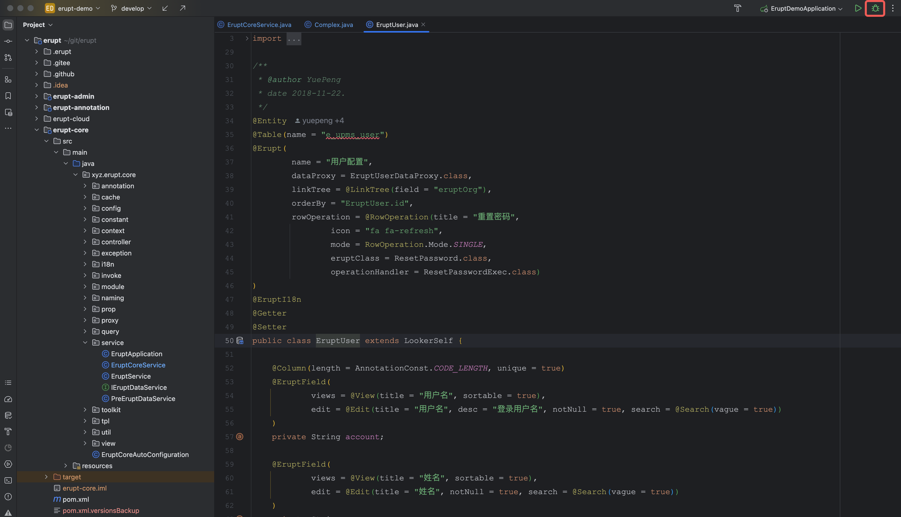

# 🤖 热构建（修改注解无需重启）

**开启热部署后修改erupt注解内容无需重启项目，刷新页面即可看到调整后的效果**
注意：1.12.14及以上版本支持

# 限制

1. 开发工具目前仅支持**IntelliJ IDEA **，其他工具需自行探索
2. 添加**类**与添加**字段**不支持热部署，仅支持 erupt 注解的调整

# 使用步骤

1. 前往 Settings 开启 Reload Class after compilation



2. 开启 On Frame deactivation → Update Classes and resources 
> On Update action : 当代码改变的时候，需要IDEA为你做什么
> On Frame deactivation : 当失去焦点（比如你最小化了IDEA窗口），需要IDEA为你做什么
> Update Classes and resources  : 失去焦点后，修改的 resources 文件与 class 文件都会立刻生效



3. 开启热构建配置
```properties
# 生产环境请勿开启
erupt:
  hot-build: true
```

4. 使用debug方式启动（**必须**，run启动不生效）



5. 调整注解值（如修改名称，添加排序），刷新页面即可看到效果（热部署生效时间通常 2~6 左右，mac 系统 idea 的图标中会有热部署进度条显示）


> 原文: <https://www.yuque.com/erupt/cuviefw0cq90hclm>