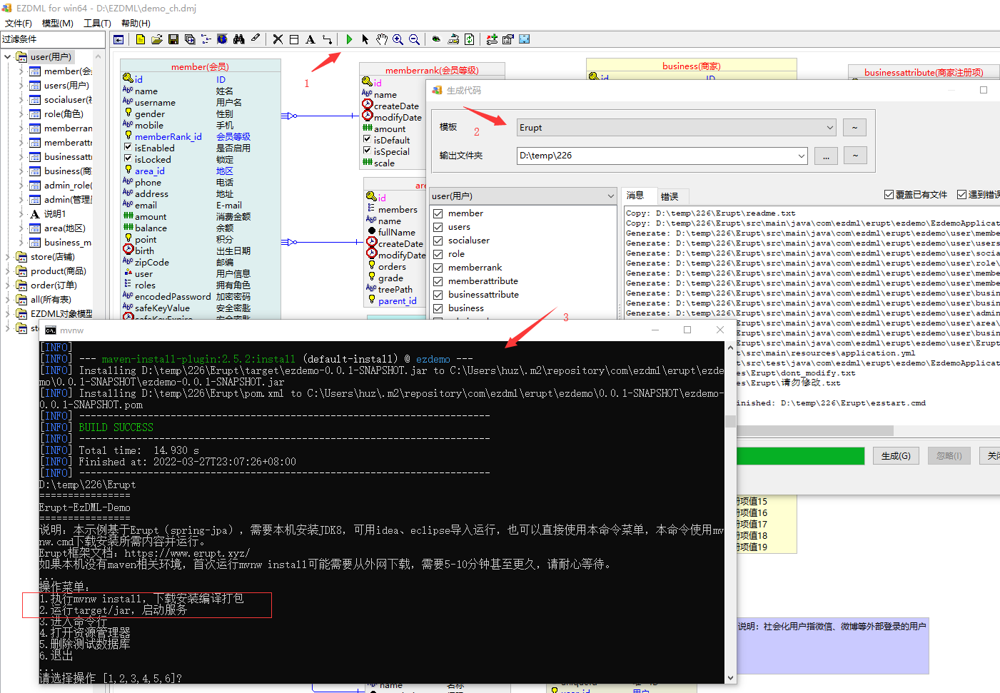
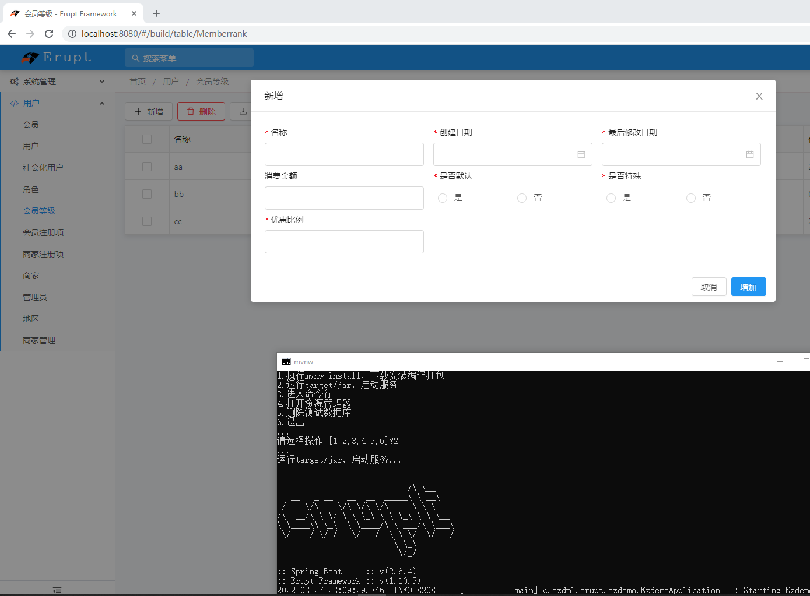
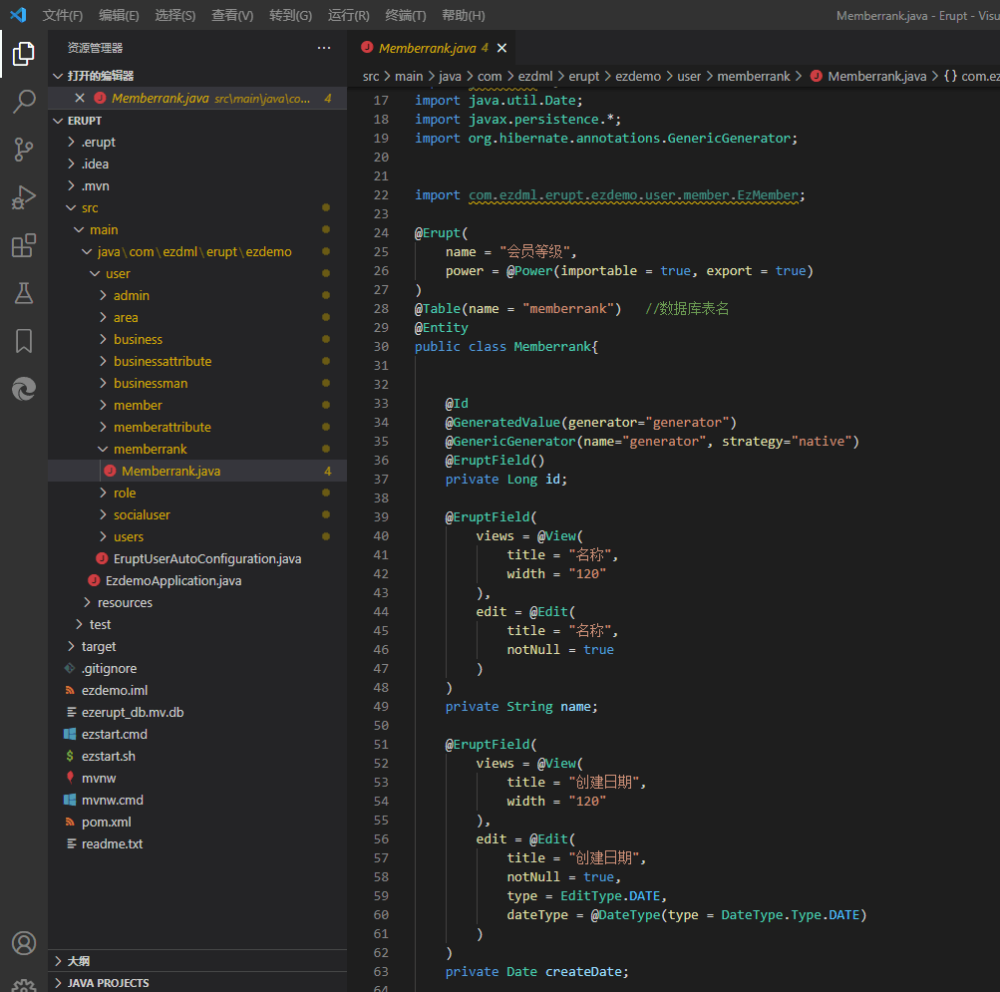

# EZDML（生成Erupt代码）

EZDML是一款国产免费的轻量级数据建模工具，具有轻巧、快速、简便而功能强大的特点，可轻松地进行数据库表结构设计，建立界面数据模型，支持通过自定义脚本模板生成测试数据、界面原型和前后端代码文件。
官网地址：[http://www.ezdml.com/](http://www.ezdml.com/)

**生成Erupt代码**

EZDML v3.32生成可运行的Erupt代码模板（使用JDK8和maven）。Bugs修复.简单的可以增删改查，复杂的还是要自己动手改

> 原文: <https://www.yuque.com/erupt/blrpm5>