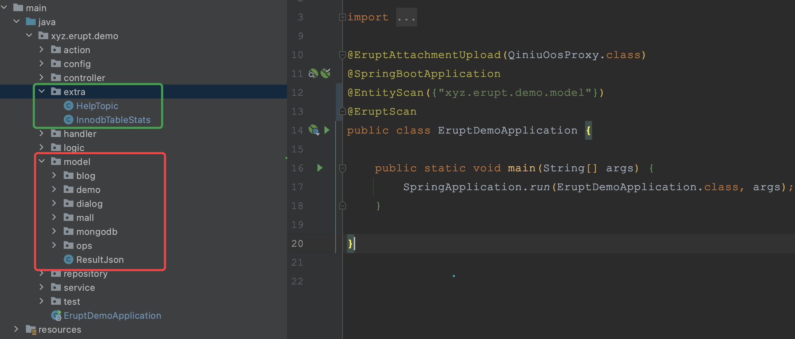

# 多数据源 @EruptDataSource


### 使用方法
1、在application.yml / applicatoin.properties 中增加数据源的连接信息 （原有主数据源的配置需要保留）

支持hikari连接池配置
```yaml
# datasource节点也可增加连接池的配置
# 注意 ‘-’ 不要忘记写，这是yml文件中数组的重要标识，且注意格式与缩进
erupt:
  	dbs:
    	# mysql
      - datasource:
      			# name属性必须有，是区不同数据源的标识
            name: mysql_test
            url: jdbc:mysql://127.0.0.1:3306/mysql?useUnicode=true&characterEncoding=UTF-8&serverTimezone=Asia/Shanghai
            username: root
            password: 123456
            # hikari some ting
            hikari:
          		pool-name: erupt-mysql
              minimum-idle: 10
      				maximum-pool-size: 100
        jpa:
            show-sql: true
            database-platform: org.hibernate.dialect.MySQL5InnoDBDialect
            open-in-view: true
            database: mysql
        scanPackages: com.abc.xxx
      # oracle 
      - datasource:
          name: oracle_test
          url: jdbc:oracle:thin:@//127.0.0.1:1521/erupt
          username: root
          password: 123456
        jpa:
          show-sql: true
          database-platform: org.hibernate.dialect.Oracle10gDialect
        scanPackages: com.def.xxx
	    # sqlServer
      - datasource:
          name: sqlServer
          url: jdbc:sqlserver://127.0.0.1\erupt:14433;sendStringParametersAsUnicode=false
          username: sa
          password: 123456
        jpa:
          show-sql: true
          database-platform: org.hibernate.dialect.SQLServer2008Dialect
        scanPackages: com.hig.xxx
      # h2
      - datasource:
          name: h2
          url: jdbc:h2:file:./erupt;AUTO_SERVER=TRUE
          platform: h2
          username: sa
          password:
          driverClassName: org.h2.Driver
        jpa:
          show-sql: true
          database-platform: org.hibernate.dialect.H2Dialect
        scanPackages: com.lmn.xxx
```
注：scanPackages 为必填项，该配置在1.7.3及以上版本受支持，该配置必填且需要注意包扫描路径不要与主数据源的包扫描路径发生冲突，否则会出现多个数据源建表混乱的问题


2、修改入口类 @EntityScan 配置，细化包扫描路径，防止扫描到多数据源实体类，导致自动建表混乱
```java
@EntityScan({"xyz.erupt.demo.model"})
@SpringBootApplication
@EruptScan
public class EruptDemoApplication {

    public static void main(String[] args) {
        SpringApplication.run(EruptDemoApplication.class, args);
    }

}
```
目录结构参考：

注：xyz.erupt.demo.extra 为多数据源的表


3、增加对应数据源的 JDBC 驱动依赖


4、将实体类中增加**@EruptDataSource**注解
```java
@EruptDataSource("xxxx") //注解值应该配置文件中 erupt.dbs.datasource.name 的值
@Erupt(name = "其他数据源表", 
       power = @Power(add = false, delete = false, edit = false))
@Table(name = "help_topic")
@Entity
public class HelpTopic {

    @Id
    @Column(name = "help_topic_id")
    @EruptField
    private String id;

    @EruptField(
            views = @View(title = "名称")
    )
    private String name;

    @EruptField(
            views = @View(title = "描述", type = ViewType.HTML)
    )
    private String description;

    @EruptField(
            views = @View(title = "实例", type = ViewType.HTML)
    )
    private String example;
    
}
```


### 显式调用多数据源对象进行JDBC查询

[使用 EruptDao 实现简单的 JDBC 查询](https://www.yuque.com/erupts/erupt/wgc30d?view=doc_embed&inner=ZiSx5)


> 原文: <https://www.yuque.com/erupt/bgn4gg>