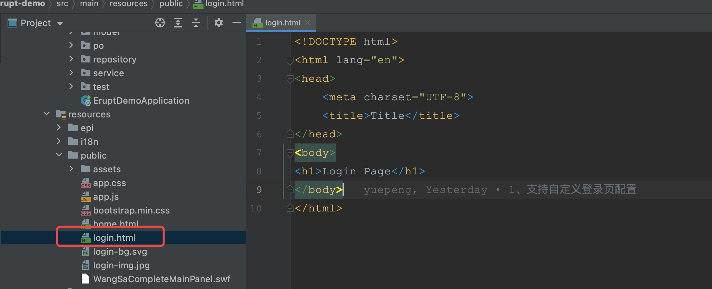

# 自定义登录页 | 短信登录 | 微信扫码登录

> 自定义登录页，可实现验证码登录与微扫码登录等个性化登录场景


## 1. 自定义登录页
创建登录页，页面结构与逻辑根据业务情况来定义（也可存在于非项目路径下，可通过http路径发现即可）

配置自定义登录页路径
```properties
# 配置自定义登录页面路径，支持http路径或相对路径
erupt-app.loginPagePath: /xxx.html
```


## 2. 在页面内调用登录接口获取 token（ 通过axios 或 XHR ）
```http
POST {{host}}/erupt-api/login?account={{用户名}}&pwd={{密码}}&verifyCode={{验证码}}

result >
{
  pass: true
  reason: null
  token: "jRP2ChJz8surtU2g"
  useVerifyCode: false
}
```
注：

- 如果不希望接入验证码，可在application.yml中调整 [erupt-app.verifyCodeCount](https://www.yuque.com/erupts/erupt/gtp7iw) 配置
- 如果密码不希望加密传输，可在application.yml中调整 [erupt-app.pwdTransferEncrypt](https://www.yuque.com/erupts/erupt/gtp7iw) 配置
- 如果需要传递额外参数，通过自定义 [@EruptLogin ](https://www.yuque.com/erupts/erupt/cgg9af) 解析即可
- 登录时密码加密规则：

[ 🔭 常见问题 FAQ](https://www.yuque.com/erupts/erupt/vr4md2?view=doc_embed&inner=jgebi)

## 3. 访问授权转发页面
1.11.1 及以上版本，仅需传递token参数即可

注意：跳转域名与erupt应用如果不在已经域名下，请开启[redisSession](https://www.yuque.com/erupts/erupt/gtp7iw#h3nEy)配置
```javascript
// 如果登录成功，pass值为 true 使用如下JS伪代码跳转到授权页面，授权成功后会自动跳转到首页
window.open("{{host}}/auth.html?token=" + token))
```


1.11.1 以下版本
```javascript
// 如果登录成功，pass值为 true 使用如下JS伪代码跳转到授权页面，授权成功后会自动跳转到首页
window.open("{{host}}/auth.html?" + window.encodeURIComponent(window.btoa({{登录接口返回的JSON串}})))


// 例:
window.open("http://localhost:8080/auth.html?" + btoa(encodeURIComponent(JSON.stringify({"useVerifyCode":false,"pass":true,"resetPwd":false,"reason":null,"token":"Hy6TpBCbHHPJeAcc","userName":"Guest"}))))
```


## 4.自定义参数解析
如果需要检验手机验证码等参数，建议重写登录逻辑，详见：
[自定义登录逻辑 @EruptLogin](https://www.yuque.com/erupts/erupt/cgg9af?view=doc_embed)


> 原文: <https://www.yuque.com/erupt/sdivf2>